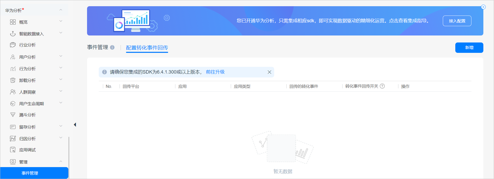

# HA归因

## 概述

华为分析服务（Analytics Kit）是针对移动应用、Web等产品的一站式用户行为分析平台，贴合业务场景，提供数据采集、数据管理、数据分析、数据应用的一体化解决方案。您可以通过将推广的应用接入华为分析服务同时配置将数据回传给鲸鸿动能广告平台，实现广告效果的监测，帮助您实现广告优化。

## 操作流程

## 操作步骤

1. 开通华为分析服务并集成华为分析SDK。
   - 开通华为分析服务：详情请参考[启动分析服务](https://developer.huawei.com/consumer/cn/doc/development/HMSCore-Guides/android-config-agc-0000001050163815)。
   - 集成华为分析SDK：华为分析服务根据不同的归因方式，支持的SDK版本如下，集成方法请参见[集成SDK](https://developer.huawei.com/consumer/cn/doc/development/HMSCore-Guides/android-integrating-sdk-0000001050161876)：
     - OAID归因支持的SDK版本为6.4.1.300或以上版本
     - Referrer归因支持的SDK版本为6.6.0.300或以上版本。
2. 在鲸鸿动能广告平台新建关联。

   需要为您希望跟踪的每一个应用使用指定的监测工具创建关联，详细请参考[在鲸鸿动能广告平台创建关联](https://developer.huawei.com/consumer/cn/doc/promotion/bpos-functions-tripartite-attribution-overview-0000001328677546)。
3. 在转化跟踪平台设置数据回传。

   为了将转化跟踪平台跟踪到的转化结果传递给鲸鸿动能广告平台，以便鲸鸿动能广告可以将转化结果用于报表统计和投放优化，您需要在转化跟踪平台上配置数据回传给鲸鸿动能广告平台（“次日留存、3日留存、7日留存” 相关数据默认回传至鲸鸿动能广告）。配置流程如下：
   1. 您可以使用任意实名华为帐号登录[AppGallery Connect](https://developer.huawei.com/consumer/cn/service/josp/agc/index.html#/)，点击“我的项目”图标，进入“项目接入设置”页面，确认您项目的数据处理位置。
      1. 如果您的数据处理地为“新加坡/俄罗斯”，请直接前往“标记转化事件”。
      2. 如果您的数据处理地为“中国”，您需要单独开通[非中国大陆区域站点的存储功能](https://developer.huawei.com/consumer/cn/doc/development/HMSCore-Guides/multi-storage-0000001206082423#section13754201756)。
      3. 如果您的数据处理地为“德国”，需要手动开启“上报广告标识符”开关。
         - 如果您还未开通分析服务，在AppGallery Connect首页底部，找到“华为分析”，进入“项目概览”，点击“启动分析服务”，将“上报广告标识符”开关设置为开启状态。

           
         - 如果您已经开通过分析服务，但是您未开启上报广告标识开关，您可以选择“华为分析 &gt; 管理 &gt; 分析设置”，进入分析设置页面，将“上报广告标识符”开关设置为开启状态。

           
   2. 标记转化事件。

      选择“华为分析 &gt; 管理 &gt; 事件管理”进入事件管理页面。在“事件管理”页签中，将想要回传的事件标记为转化事件。

      
   3. 配置回传转化事件。

      选择“华为分析 &gt; 管理 &gt; 事件管理”，在“配置转化事件回传”页签中，配置回传转化事件。

      
      1. 点击页面右侧的“新增”，弹出配置回传转化事件页面。
      2. 配置回传转化事件相关信息。

         
         - 选择平台：选择“鲸鸿动能广告”。
         - 选择应用：选择需要配置回传事件的应用的名称。
         - 选择回传事件：展示该应用下所有的转化事件列表，以及对应的广告事件和描述。勾选需要回传至鲸鸿动能广告的事件前面的复选框。

            

           如果默认[映射关系](https://developer.huawei.com/consumer/cn/doc/distribution/promotion/tracking-shu-0000001139892541)的转化事件不能满足您的需求，您可以在配置转化事件回传的“配置广告事件”列选择广告事件，将鼠标移至事件名称上，点击进行手动配置。
      3. 点击“保存”，完成配置。
   4. 关闭转化事件回传开关。

      配置完回传转化事件后，已配置的应用转化事件回传开关默认开启，如果您不想回传转化事件，可以手动关闭转化事件回传开关。

      “转化事件回传开关”关闭后，转化事件将不再同步到鲸鸿动能广告。

      1. 选择“配置转化事件回传”页签。
      2. 点击应用所在行的“转化事件回传开关”，开启或关闭该应用下转化事件回传功能。
4. 在鲸鸿动能广告平台创建任务。
5. 在鲸鸿动能广告平台[转化数据](https://developer.huawei.com/consumer/cn/doc/promotion/bpos-functions-tripartite-attribution-data-0000001379958197)。

   鲸鸿动能广告平台收到转化数据后，转化指标的转化状态会自动变为”已启用“（一般需要3-10分钟），您可以在报表中查看应用的相关转化数据。

   如果您在鲸鸿动能广告平台没有看到相应的转化数据，您需要检查应用跟踪回传配置是否正确。
