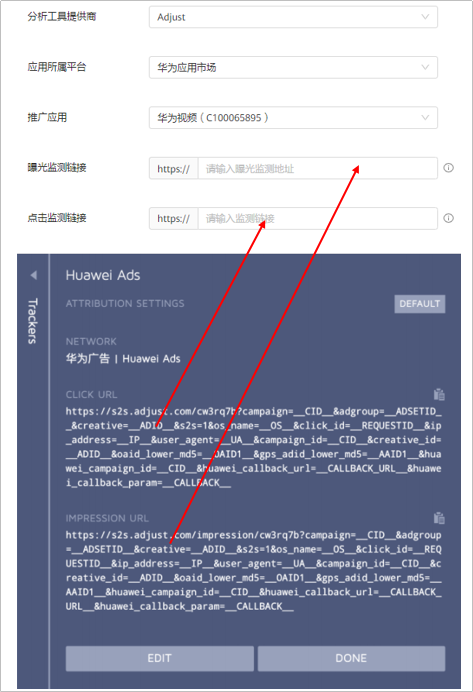

# Adjust

## 概述

Adjust根据不同的归因方式，支持的SDK版本如下，详情请参考[官网链接](https://www.adjust.com)：

- OAID归因支持的SDK版本为4.2.2以上版本；
- Referrer归因支持的SDK版本为4.28.6及以上版本。

## 操作流程

## Adjust操作步骤

1. 集成Adjust SDK并采集OAID。
   - 集成：详细操作请参照[Adjust SDK集成](https://github.com/adjust/android_sdk)；若已集成，可跳过此步。
   - 采集OAID：三方监测事件必须使用OAID跟踪归因，请确保您的应用已加入OAID采集代码，否则可能将无法正确的跟踪。
     - 如果您跟踪的应用是华为应用市场的应用，请按照Adjust的开发指南[采集OAID](https://dev.adjust.com/en/sdk/android/plugins/oaid-plugin)。
2. 在鲸鸿动能广告平台新建关联。

   需要为您希望跟踪的每一个应用使用指定的监测工具创建关联。

   填写曝光监测链接、点击监测链接：监测链接获取请参考[在三方监测平台获取曝光和点击监测链接](https://developer.huawei.com/consumer/cn/doc/promotion/bpos-functions-tripartite-attribution-overview-0000001328677546#ZH-CN_TOPIC_0000001328677546__li4759172141612)。

   

    

   - 如果您后期修改了关联分析工具中的曝光/点击监测链接，您需要重新对任意一个指标进行手动测试，测试成功后新的曝光/点击监测链接才生效，其他的指标启用状态，与修改链接前保持一致。
   - 如果您想在广告投放前对您创建的转化指标进行测试，那您可以进行手动测试。
   - 如果您使用的监测链接未包含Referrer参数（external\_click\_id=\_\_REFERRER\_\_），请重新在三方监测平台拷贝监测链接并填入鲸鸿动能广告。
3. 在Adjust上设置数据回传。

   为了将Adjust上跟踪到的转化结果传递给鲸鸿动能广告平台，以便鲸鸿动能广告可以将转化结果用于报表统计和投放优化，需要在<strong>Adjust</strong>上配置数据回传给鲸鸿动能广告平台。

   - 如何配置转化事件回传给鲸鸿动能广告：详情请参考[Adjust操作指南](https://communityfile-drcn.op.dbankcloud.cn/FileServer/getFile/cmtyPub/011/111/111/0000000000011111111.20250123103532.79227832457883332296542683028194:50001231000000:2800:814622B4164C622E7CCC3C110A9A549851BCB705479AB3E4ABA7A9330B9C9B37.pdf?needInitFileName=true)。

4. 在鲸鸿动能广告平台创建广告任务。

   您在上传广告创意时，系统将会自动关联到创意中的曝光/点击监测链接（自动关联的链接不要修改，避免影响跟踪数据）。

5. 在鲸鸿动能广告平台[查看转化数据](https://developer.huawei.com/consumer/cn/doc/promotion/bpos-functions-tripartite-attribution-data-0000001379958197)。

   鲸鸿动能广告平台收到转化数据后，转化指标的转化状态会自动变为”已启用“（一般需要3-10分钟），您可以在报表中查看应用的相关转化数据。

   如果您在鲸鸿动能广告平台没有看到相应的转化数据，您需要检查应用跟踪回传配置是否正确。
