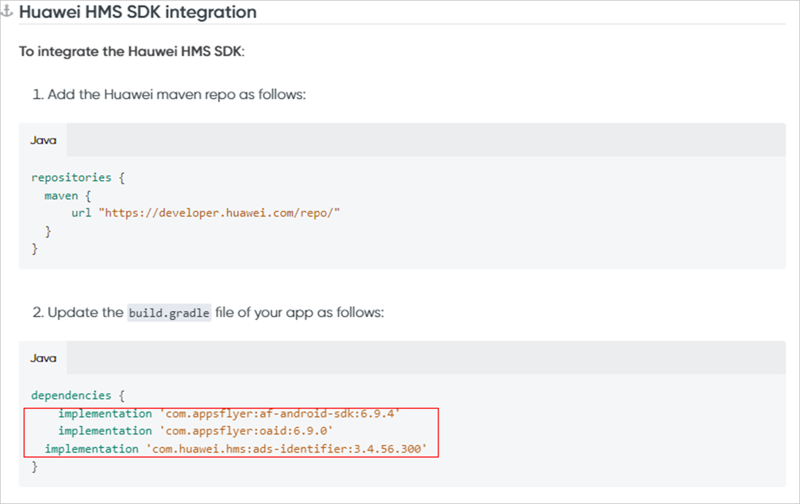
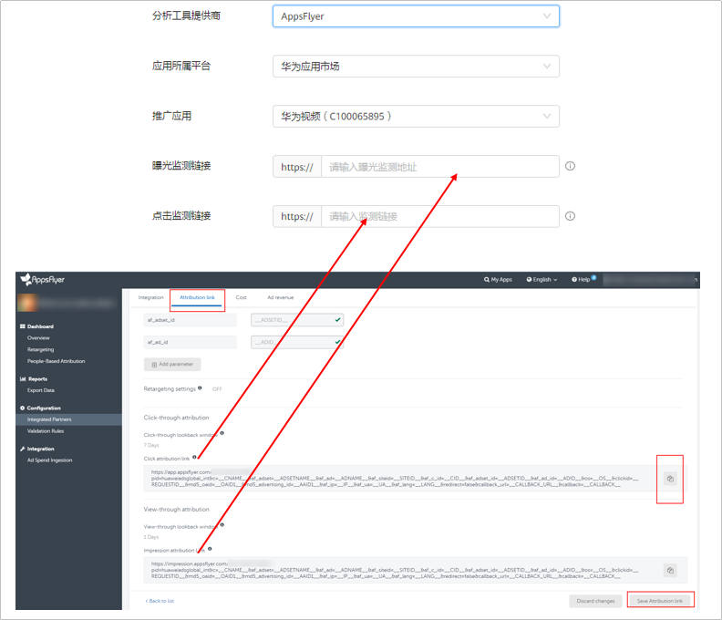

# AppsFlyer

## 概述

AppsFlyer根据不同的归因方式，支持的SDK版本如下，详情请参考[官网链接](https://www.appsflyer.com/cn/)：

- OAID归因支持的SDK版本为5.4.0以上；
- Referrer归因支持的SDK版本为6.1.1以上版本。

## 操作流程

## AppsFlyer操作步骤

1. 集成AppsFlyer SDK并采集OAID。
   - 集成：详细操作请参照[AppsFlyer SDK集成指导](``https://support.appsflyer.com/hc/zh-cn/articles/207032126-适用于开发人员的Android-SDK集``成)；若已集成，可跳过此步。
   - 采集OAID：三方监测事件必须使用OAID跟踪归因，请确保您的应用已加入OAID采集代码，否则可能将无法正确的跟踪。
     - 如果您跟踪的应用是华为应用市场的应用，且您使用的<strong>AppsFlyerSDK</strong>是6.2.3版本以下，您需要按照AppsFlyer的开发指南手动采集OAID，具体请参考[OAID采集](https://support.appsflyer.com/hc/zh-cn/articles/360006278797)。
     - 如果您跟踪的应用是华为应用市场的应用，且使用的<strong>AppsFlyerSDK</strong>是6.2.3及以上版本，6.2.3及以上版本已包含部分OAID的集成，您只需要补充以下图片中的代码即可。

       
2. 在鲸鸿动能广告平台新建关联。

   需要为您希望跟踪的每一个应用使用指定的监测工具创建关联。

   填写曝光监测链接、点击监测链接：监测链接获取请参考[在三方监测平台获取曝光和点击监测链接](https://developer.huawei.com/consumer/cn/doc/promotion/bpos-functions-tripartite-attribution-overview-0000001328677546#ZH-CN_TOPIC_0000001328677546__li4759172141612)。

   

    

   - 如果您后期修改了关联分析工具中的曝光/点击监测链接，您需要重新对任意一个指标进行手动测试，测试成功后新的曝光/点击监测链接才生效，其他的指标启用状态，与修改链接前保持一致。
   - 如果您想在广告投放前对您创建的转化指标进行测试，那您可以进行手动测试。
   - 如果您使用的监测链接未包含Referrer参数（af\_ref=\_\_REFERRER\_\_），请重新在三方监测平台拷贝监测链接并填入鲸鸿动能广告。

3. 在AppsFlyer上设置数据回传。

   为了将AppsFlyer上跟踪到的转化结果传递给鲸鸿动能广告平台，以便鲸鸿动能广告可以将转化结果用于报表统计和投放优化，需要在AppsFlyer上配置数据回传给鲸鸿动能广告平台。

   - 如何配置转化事件回传给鲸鸿动能广告：详情请参考[AppsFlyer操作指导](https://communityfile-drcn.op.dbankcloud.cn/FileServer/getFile/cmtyPub/011/111/111/0000000000011111111.20250123103532.09817384850602733293151426311103:50001231000000:2800:EDB4EA5E63D8365E790603B5F04593EC074FC3FB5C8C8D2C48BEE7E924407769.pdf?needInitFileName=true)。

4. 在鲸鸿动能广告平台创建广告任务。

   您在上传广告创意时，系统将会自动关联到创意中的曝光/点击监测链接（自动关联的链接不要修改，避免影响跟踪数据）。

5. 在鲸鸿动能广告平台[转化数据](https://developer.huawei.com/consumer/cn/doc/promotion/bpos-functions-tripartite-attribution-data-0000001379958197)。

   鲸鸿动能广告平台收到转化数据后，转化指标的转化状态会自动变为”已启用“（一般需要3-10分钟），您可以在报表中查看应用的相关转化数据。

   如果您在鲸鸿动能广告平台没有看到相应的转化数据，您需要检查应用跟踪回传配置是否正确。
