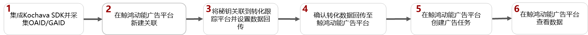
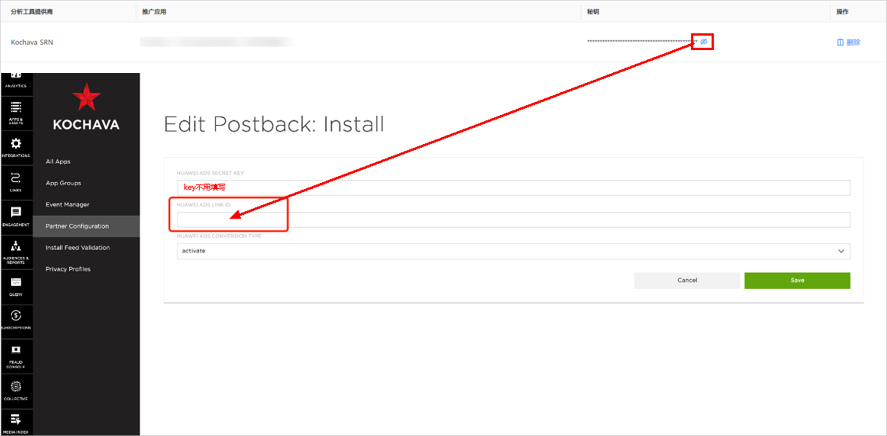

# Kochava

## 概述

Kochava支持3.8.0及以上版本，详情请参考[官网链接](https://www.kochava.com)。

## 操作流程

## Kochava操作步骤

1. 集成Kochava SDK并采集OAID。
   - 集成：详细操作请参照[Kochava SDK集成](https://support.kochava.com/sdk-integration/android-sdk-integration/)；若已集成，可跳过此步。
   - 采集OAID：三方监测事件必须使用OAID跟踪归因，请确保您的应用已加入OAID采集代码，否则可能将无法正确跟踪。
     - 如果您跟踪的应用是华为应用市场的应用，请按照Kochava的开发指南[采集OAID](https://support.kochava.com/sdk-integration/android-sdk-integration/)中的“2.添加依赖关系&gt;华为App Gallery依赖项”进行集成。
2. 在鲸鸿动能广告平台新建关联。

   需要为您希望跟踪的每一个应用使用指定的监测工具创建关联。

3. 将密钥关联到转化跟踪平台并设置数据回传。

   为了将转化跟踪平台跟踪到的转化结果传递给鲸鸿动能广告平台，以便鲸鸿动能广告可以将转化结果用于报表统计和投放优化，您需要将获取的密钥复制到转化跟踪平台并在转化跟踪平台上配置数据回传给鲸鸿动能广告平台。

   - 如何获取密钥：关联创建成功后，在已有关联列表中点击“”查看密钥并点击“”，将获取的密钥复制到Kochava。

     
   - 如何配置转化事件回传给鲸鸿动能广告：详情请参考[Kochava操作文档](https://alliance-communityfile-drcn.dbankcdn.com/FileServer/getFile/cmtyPub/011/111/111/0000000000011111111.20250909115212.81487787914858833892861262314026:50001231000000:2800:9C5B8E2D6521CFD35BB300B95CF7CB367E387FE50F686A31331469A9294C9F47.pdf?needInitFileName=true)。

4. 在鲸鸿动能广告平台创建任务。

5. 在鲸鸿动能广告平台[转化数据](https://developer.huawei.com/consumer/cn/doc/promotion/bpos-functions-tripartite-attribution-data-0000001379958197)。

   鲸鸿动能广告平台收到转化数据后，转化指标的转化状态会自动变为”已启用“（一般需要3-10分钟），您可以在报表中查看应用的相关转化数据。

   如果您在鲸鸿动能广告平台没有看到相应的转化数据，您需要检查应用跟踪回传配置是否正确。
