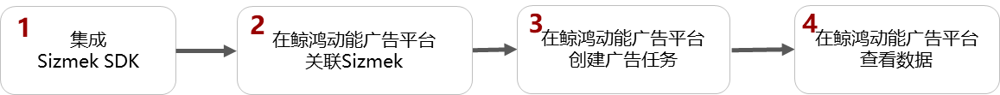

# Sizmek

## 概述

Sizmek仅支持监测曝光、点击的数据，详情请参考[官网链接](https://advertising.amazon.com/en-us/solutions/products/sizmek-ad-suite?ref_=a20m_us_hnav_lng_en_us)。

## 操作流程

## Sizmek操作步骤

1. 集成Sizmek SDK<strong>。</strong>

   详细操作请参照[Sizmek 官网](https://advertising.amazon.com/en-us/solutions/products/sizmek-ad-suite?ref_=a20m_us_hnav_lng_en_us)；若已集成，可跳过此步。

2. 在鲸鸿动能广告平台新建关联。

   需要为您希望跟踪的每一个应用使用指定的监测工具创建关联。

   填写曝光监测链接、点击监测链接：监测链接获取请参考[在三方监测平台获取曝光和点击监测链接](/docs/monetize/promotion/bpos-functions-tripartite-attribution-overview-0000001328677546#ZH-CN_TOPIC_0000001328677546__li4759172141612)。

3. 在鲸鸿动能广告平台创建广告任务。

   您在上传广告创意时，系统将会自动关联到创意中的曝光/点击监测链接（自动关联的链接不要修改，避免影响跟踪数据）。

4. 在鲸鸿动能广告平台中[转化数据](/docs/monetize/promotion/bpos-functions-tripartite-attribution-data-0000001379958197)。
