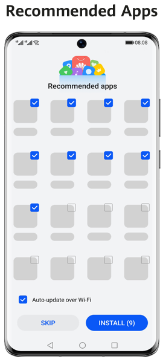
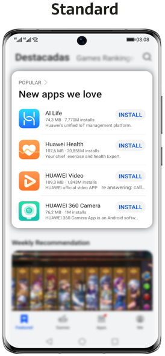
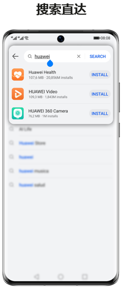
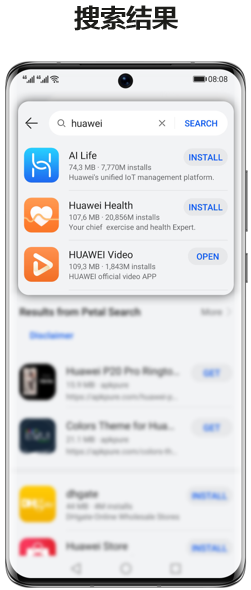
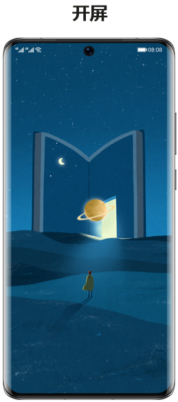
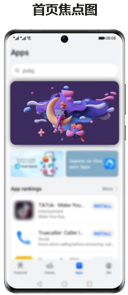

# 业务介绍

## 业务概述

 

HUAWEI AppGallery非中国大陆广告主需通过鲸鸿动能广告端投放。

请使用新的华为账号注册鲸鸿动能广告进行投放（未在中国大陆华为应用市场使用过的华为账号即可）。

应用市场应用推广面向合作伙伴，提供精准、优质、高效的推广服务，涵盖流量场景、产品功能、赋能权益及营销方案。开发者可以根据业务需求，自主设定推广形式及推广时间，通过推广投放可快速提升应用精准曝光，帮助优秀应用被更合适的用户发现和使用，快速实现获量增长与商业成功。

## 优势特点

非中国大陆区域应用推广有四大优势特点：

### 流量大，转化高，即刻推广

亿级月活优质用户、千亿级年分发量，海量投放资源，高效直达客户。通过平台精准推荐算法，提高推广效率，达到投放高转化率的目的。应用通过推广评测，完成充值开发票之后，即可创建任务，开启推广之旅，与亿万优质华为用户紧密接触。

### 管理方式灵活，自管/托管随需选择

华为应用市场应用推广支持直客模式和服务商模式投放管理。直客模式即直接管理推广自有应用，深度管理掌控全局；服务商即为委托给客户投放伙伴负责推广，获取收益。

### 计费方式简单灵活，成本可控

以CPD计费方式为主，即按实际下载量计费，无需研究每个资源位的价值，您只要选择被推广应用和出价，系统就会根据应用的受欢迎程度、出价、与展示位置的匹配度等因素自动推广您的应用。

### 数据透明，支持归因分析

推广产生的消耗、下载等数据随时在后台查看，账目清晰准确。华为应用市场应用推广提供归因分析，洞察自家应用优劣势，随时调整推广策略。

## 计费方式

当前应用市场非中国大陆区域应用推广有两大计费方式：

### CPD

CPD（Cost per Download）：即按单次下载计费，根据实际下载量收费。

消耗费用 = 单个下载出价\*下载量

<strong>竞价CPD：</strong>华为应用市场将根据您的ECPM参数，在推荐榜单进行排序展示，CPD竞价排序规则：按ECPM=pCTR\*CPD出价\*1000排序。CPD出价即为您在任务创建时设定的价格，pCTR由平台推荐算法根据大数据特征计算判定，为您找到匹配的用户群，为应用提供精准投放。

<strong>合约CPD：</strong>固定版位、合约价格、与您线下商定固定活动位置，按单次下载计费，根据实际下载量收费。详情请[与我们联系](https://developer.huawei.com/consumer/cn/doc/promotion/bpos-contact-0000001379837569)。

### CPT

CPT（Cost per Time）即按时长付费，仅支持合约模式销售。

消耗费用 = 竞得资源位金额

适用范围：品效资源、搜索、推荐

合约CPT合作模式由广告主联系[平台](https://developer.huawei.com/consumer/cn/doc/promotion/bpos-contact-0000001379837569)，通过线下邮件下单方式锁定排期。

## 推广资源位

应用市场非中国大陆应用推广共有三类推广资源：推荐资源、搜索资源、品效资源。

### 推荐资源

华为应用市场应用推广推荐资源覆盖以下场景：Recommended apps、Standard。

- 采买模式：竞价、合约
- 版位：Recommended apps，Standard
- 支持推广能力：应用下载
- 广告样式：应用图标（App Icon）
- 广告尺寸：216x216

### 搜索资源

华为应用市场应用推广搜索资源覆盖搜索中、搜索后两大围绕搜索框产生搜索行为的场景。覆盖以下场景：搜索中-搜索直达、搜索后-搜索结果等。

- 采买模式：竞价、合约
- 版位：App search
- 支持推广能力：应用下载
- 广告样式：图片
- 广告尺寸：216x216

### 品效资源

品牌效果类资源，满足合作伙伴拉新、促活、成交等多种推广投放需求，提升用户对品牌的认可度和美誉度，进一步提高品牌价值及影响力。覆盖以下场景：开屏、首页焦点图等。

## 推广角色

### 直客

如果您只推广自己企业的产品和服务，请选择直客类型，支持投放广告、充值账户等，直客账户属于单独的账户，与其他账户类型无关联。

### 服务商

如果您是广告代理商，代理其他企业投放广告，请注册成服务商账户。服务商是鲸鸿动能广告为服务商提供的用于管理子客服务商及子客的系统。
