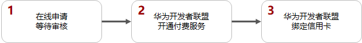
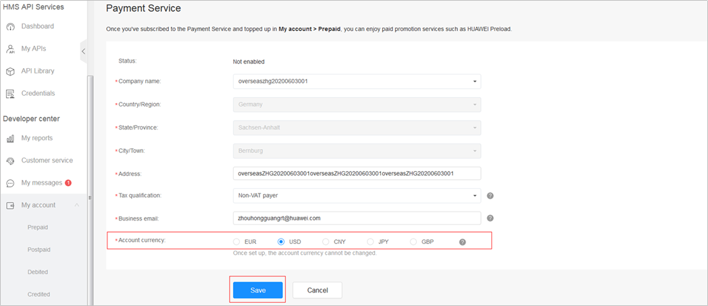
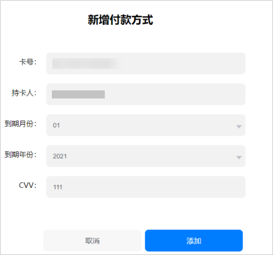
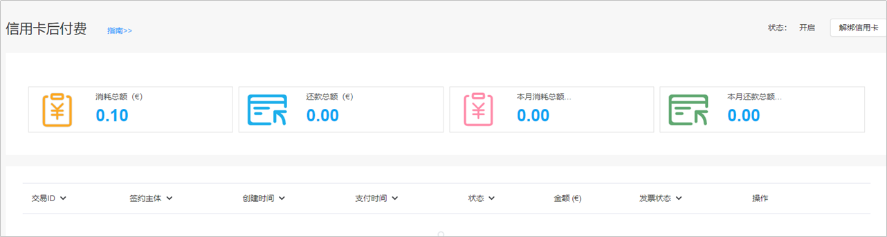
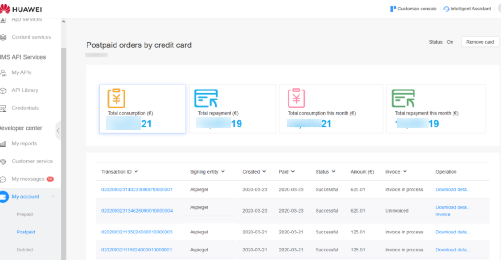
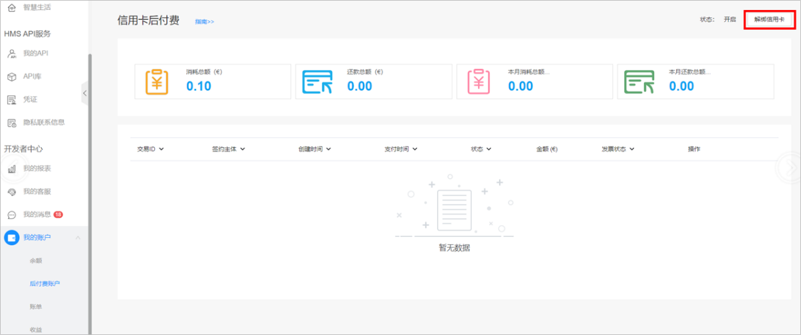

# 企业信用卡后付费

## 概述

为了更好的服务广告主，避免出现因充值不及时而影响广告投放的情况，您可以使用信用卡后付费功能。当您的广告费用满500美金（或等值币种）或达7个自然日（两者时间在先者）时，系统将会从您的信用卡中扣费。

## 申请条件

- 只支持注册地为下述国家/地区的账户使用企业信用卡后付费功能：

  德国、英国、爱尔兰、以色列、法国、意大利、西班牙、波兰、罗马尼亚、捷克、芬兰、土耳其、乌克兰，新加坡、马来西亚、荷兰、泰国、印度尼西亚、中国香港、菲律宾、沙特阿拉伯、埃及、南非、印度、墨西哥、智利、秘鲁、哥伦比亚。
- 已完成实名认证的直客广告主可以使用信用卡功能，如果您的账户还未完成实名认证，请参考[实名认证](https://developer.huawei.com/consumer/cn/doc/promotion/bpos-delivery-task-account-manage-information-0000001328357938#ZH-CN_TOPIC_0000001328357938__d0e16595)。服务商及子客账户无法使用企业信用卡支付功能。
- 企业信用卡账户名称必须和鲸鸿动能广告账户企业名称一致，且美元币种的账户不支持企业信用卡后付费功能。
- 如果您开通了华为开发者联盟提供的团队账号或者鲸鸿动能广告平台提供的团队账号功能，使用企业信用卡功能时，请使用账号持有者的华为账号登录并完成操作，不能使用团队成员账号登录。

## 操作流程

## 操作步骤

1. 在线申请并等待审核。

   请通过[在线提单](https://developer.huawei.com/consumer/cn/doc/promotion/bpos-contact-0000001379837569)提供以下信息：

   您的企业名称、广告投放区域、企业信用卡卡号、企业信用卡发卡国、应用ID或者应用包名；

   提交工单后请等待审核，审核结果将通过工单反馈给您，审核通过后即可进行信用卡的绑定。

2. 在华为开发者联盟管理中心开通付费服务。如果您已经开通付费服务，可跳过此步骤。

   如果您是新注册的企业开发者，在您未开通付费服务时，系统会提示签署付费服务协议。完成协议签署后补充付费服务相关信息并保存。

   

   - <strong>企业名称</strong>：请填写与您鲸鸿动能广告账户一致的企业名称。
   - <strong>地址</strong>：请填写与您鲸鸿动能广告账户一致的企业地址。
   - <strong>账户币种</strong>：此处币种需要与您鲸鸿动能广告账户币种保持一致；当前企业信用卡后付费功能只支持EUR、CNY、JPY、GBP，暂不支持USD币种。

3. 在华为开发者联盟管理中心绑定企业信用卡。
   1. 付费服务开通后，点击“<strong>我的账户</strong>”&gt;“<strong>后付费账户</strong>”&gt;“<strong>添加信用卡</strong>”，跳转至支付平台。
   2. 点击“<strong>授权并登录</strong>”，进入银行卡管理页面，点击“<strong>添加付款方式</strong>”，填写您的企业信用卡信息。

      若出现添加失败的提示，请再次点击“添加付款方式”重新添加。

      

      - <strong>卡号</strong>：请填写您的企业信用卡卡号。
      - <strong>持卡人</strong>：请填写与您鲸鸿动能广告账户一致的企业名称。
   3. 返回[华为开发者联盟管理中心](https://developer.huawei.com/consumer/cn/console#/serviceCards/)，此时您在界面上看到的“<strong>开启</strong>”，即为已成功绑定信用卡，即可登录[鲸鸿动能广告平台](https://ads.huawei.com/ppsdspportal/index.html#/home)进行广告投放。

      

## 查看信用卡扣费详情

登录[华为开发者联盟管理中心](https://developer.huawei.com/consumer/cn/console#/serviceCards/)&gt;“<strong>我的账户</strong>”&gt;“<strong>后付费账户</strong>”，选择一条交易ID，点击“<strong>下载</strong>”后会出现弹窗展示密码，复制密码，查看下载的订单详情时需输入方可查看。

## 解绑信用卡

1. 登录[华为开发者联盟管理中心](https://developer.huawei.com/consumer/cn/console#/serviceCards/)&gt;“<strong>我的账户</strong>”&gt;“<strong>后付费账户</strong>”，点击右上角的“<strong>解绑信用卡</strong>”。

   

2. 跳转至支付界面，点击<strong>“授权并登录”，</strong>进入银行卡管理页面，点击“<strong>解绑</strong>”。
3. 解绑成功后，返回[华为开发者联盟管理中心](https://developer.huawei.com/consumer/cn/console#/serviceCards/)，可以看到右上角的卡片状态为：“<strong>失效</strong>”。
