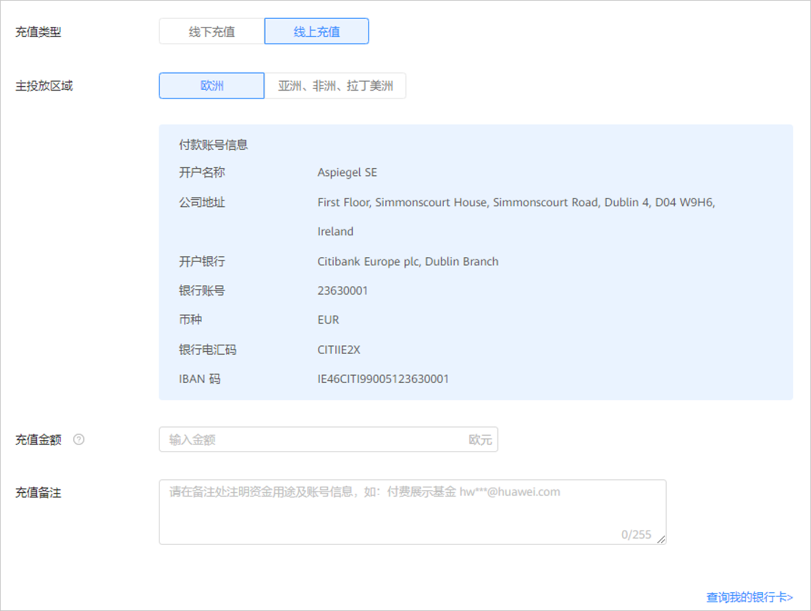

# 线上充值

## 概述

为了更好的服务广告主，避免出现因充值不及时而影响广告投放的情况，您可以使用线上充值功能，线上充值完成后，现金实时到账。

 

如果您需要使用此功能，需要申请[特性](https://developer.huawei.com/consumer/cn/doc/distribution/promotion/addtongxing-0000001128278195)。

如果您开通了鲸鸿动能广告的[团队管理](https://developer.huawei.com/consumer/cn/doc/promotion/bpos-delivery-task-account-management-team-0000001328677534)功能，仅团队主账号能使用线上充值功能。

## 申请条件

- 只支持注册地为下述国家/地区的广告账户使用银行卡线上充值功能：

  德国、英国、爱尔兰、以色列、法国、意大利、西班牙、波兰、罗马尼亚、捷克、芬兰、土耳其、乌克兰，新加坡、马来西亚、泰国、印度尼西亚、中国香港、菲律宾、沙特阿拉伯、埃及、南非、印度、墨西哥、智利、秘鲁、哥伦比亚。
- 已通过实名认证的直客可以使用线上充值方式进行现金账户充值。

  如果您的账户尚未完成实名认证，您需要完成[实名认证](https://developer.huawei.com/consumer/cn/doc/promotion/bpos-delivery-task-account-manage-information-0000001328357938#ZH-CN_TOPIC_0000001328357938__d0e16595)之后再使用此功能。
- 当前仅支持以下币种的广告账户使用线上充值功能：EUR、CNY、JPY、GBP。
- 如果您修改了鲸鸿动能广告账户注册企业名称，您需要重新申请线上充值的使用功能，企业名称变更请参考[企业名称修改](https://developer.huawei.com/consumer/cn/doc/promotion/bpos-delivery-task-account-manage-information-0000001328357938)。
- 充充值的银行卡户名需与鲸鸿动能广告账户注册名称保持一致，不支持绑定个人银行卡。
- 您即将绑定的银行卡必须未被任何其它鲸鸿动能广告账户使用过。
- 您即将绑定的银行卡暂时仅支持借记卡。

## 操作步骤

1. 申请线上充值功能。

   您可以通过[在线提单](https://developer.huawei.com/consumer/cn/doc/promotion/bpos-contact-0000001379837569)的方式向鲸鸿动能广告提交申请，申请时需包含以下内容：

2. 提供公司信息：您需要将您的鲸鸿动能广告账户ID、企业名称、银行卡账号补充在工单中：

   |  |  |
   | --- | --- |
   | <strong>字段名称</strong> | <strong>字段说明</strong> |
   | 鲸鸿动能广告账户 | 申请鲸鸿动能广告账户ID |
   | 企业名称 | 申请鲸鸿动能广告账户的企业名称，需要与鲸鸿动能广告账户注册填充的企业名称保持一致 |
   | 银行卡账号 | 申请使用线上充值的银行卡，仅包含银行卡<strong>号起始4位和最后4位，中间其它部分以“X”代替。</strong> |
3. 提供盖章后的扫描件或者照片：您需要按照模板进行填写内容、盖章，并将已盖章的附件放到工单，模板请参考[线上充值功能申请模板](https://alliance-communityfile-drcn.dbankcdn.com/FileServer/getFile/cmtyPub/011/111/111/0000000000011111111.20250909115211.51440077598124392565859715017508:50001231000000:2800:A46680923FC8152EFA21D200D3FADBD505E5FD329F61ACE843F535FE7D3F7FD6.docx?needInitFileName=true)。
4. 银行卡正反面照片。

   提交工单后请等待审核，审核结果将通过工单向您反馈，审核通过后即可使用线上充值功能。
5. 线上充值功能申请成功后，您需要在鲸鸿动能广告进行充值。
   1. 点击“”&gt;“<strong>充值</strong>”。

      

      - 充值类型：选择“线上充值“。
      - 主要投放区域：选择“主要投放区域“。
      - 充值金额：输入“充值金额“。
      - 充值备注：例如：华为广告应用推广，付款企业：ABC，广告账户ID：12345678。
   2. 填写完成后，点击“确认”，跳转支付页面：
      - 若您未绑定银行卡，根据弹框提示，添加支付方式，完成绑卡操作并完成支付。
      - 若您已经绑定银行卡，在支付页面选择扣款的银行卡并完成支付。

6. 充值完成后，查看账户<strong>余额</strong>/<strong>充值记录</strong>，确认充值到账。

## 银行卡管理

- <strong>添加银行卡</strong>：点击&gt;“<strong>充值</strong>”，选择“<strong>线上充值</strong>“，点击页面右下角“<strong>查询我的银行卡</strong>“即可进入银行卡管理页面。点击“<strong>添加付款方式</strong>“并设置银行卡信息。注意：充值的银行卡名称必须和账户实名认证的企业名称相同。
- <strong>查询银行卡</strong>：点击&gt;“<strong>充值</strong>”，选择<strong>“线上充值“</strong>，点击页面右下角“<strong>查询我的银行卡</strong>“即可进入银行卡管理页面，查看银行卡。
- <strong>解绑银行卡</strong>：点击&gt;“<strong>充值</strong>”，选择“<strong>线上充值</strong>“，点击页面右下角“<strong>查询我的银行卡</strong>“即可进入银行卡管理页面，点击某张银行卡对应的“<strong>解除</strong>”。
