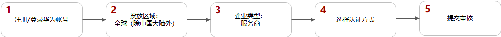
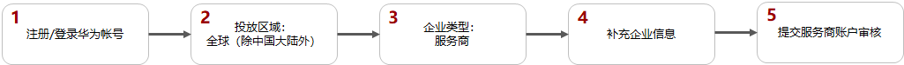
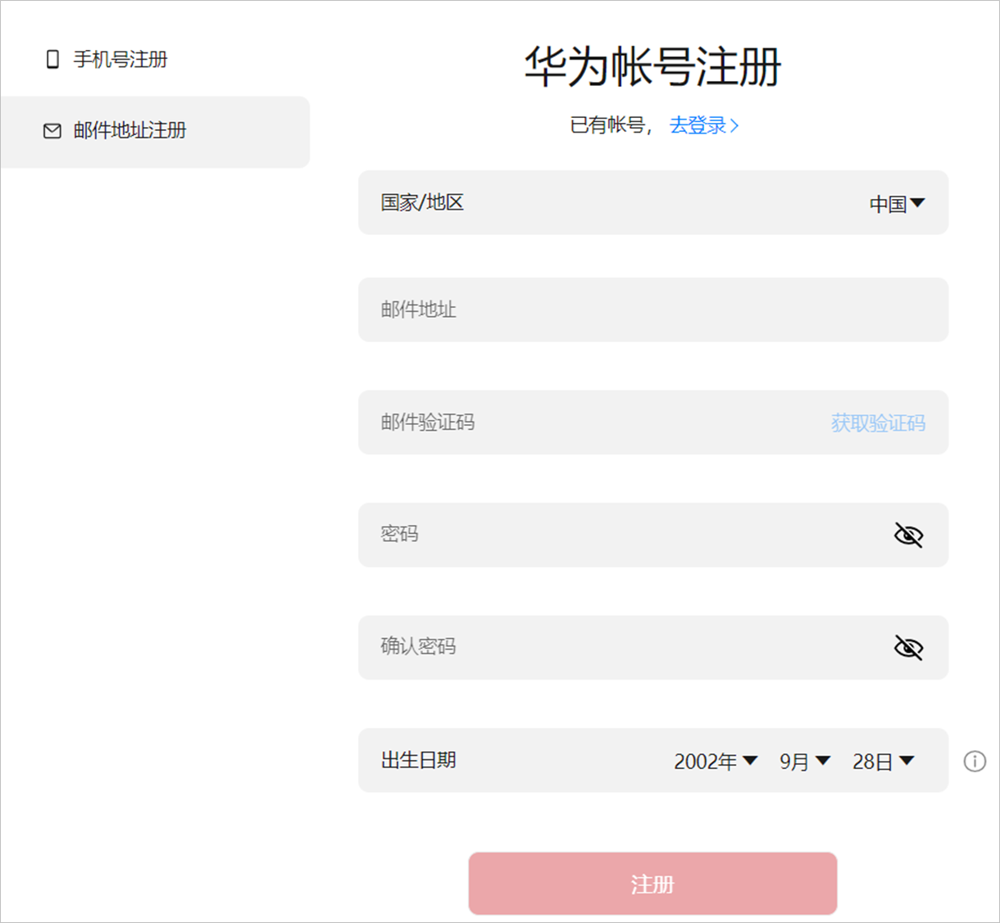
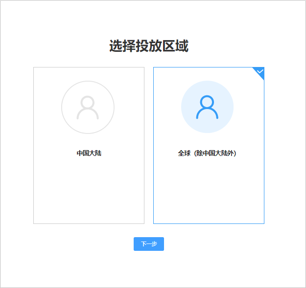
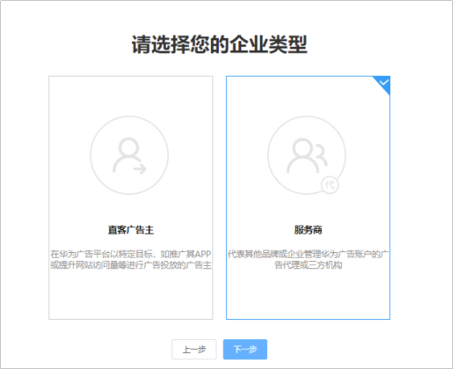
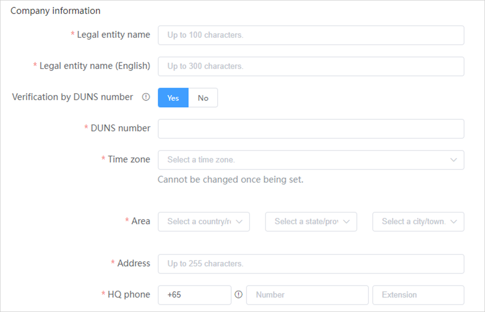
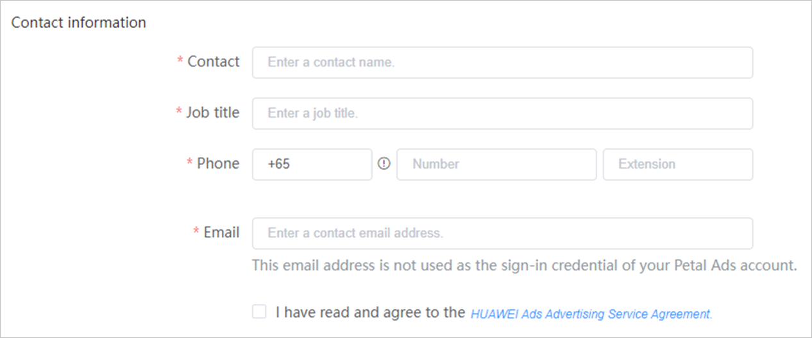
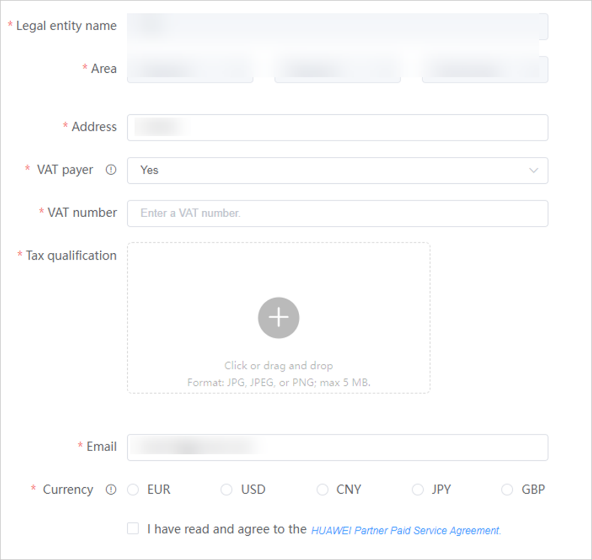

# 服务商账户注册

## 概述

鲸鸿动能广告服务商管理平台是鲸鸿动能广告为服务商提供的用于管理子客服务商及子客的系统。该账户分为三个层级：<strong>服务商、子客服务商、子客</strong>，如下图：

- 每个服务商可以新增多个子客服务商或者子客，子客服务商可以新增多个子客。
- 服务商和子客服务商账户只用于管理，不能创建投放任务，只有子客账户可以创建投放任务。
- 只有服务商账户可以进行充值，子客服务商、子客均不可进行充值，子客服务商、子客需要由他的上一级进行转账。
- 每一个鲸鸿动能广告账户需使用不同的华为账号注册。

 

如果您的企业注册地为中国大陆地区，且广告投放区域为非中国大陆地区时，需要进行实名认证，实名认证方式分为“<strong>对公银行打款认证</strong>”或“[企业资料人工审核认证](https://developer.huawei.com/consumer/cn/doc/start/mracoei-0000001062678404)”，建议您优先选择“<strong>企业资料人工审核认证</strong>”方式。非中国大陆注册流程请参考[非中国大陆区域服务商注册流程](https://developer.huawei.com/consumer/en/doc/distribution/promotion/partnerregister-0000001058922348)。

## 企业注册地为中国大陆区域时的服务商注册流程

## 企业注册地为中国大陆区域时的服务商注册步骤

1. 注册/登录华为账号。
   - 如果您<strong>没有华为账号</strong>，点击<strong>注册</strong>，使用手机号或邮箱注册<strong>华为账号</strong>：
     - 如果您使用手机号/邮箱注册，登录的时候必须使用这个手机号/邮箱登录。
     - 如果您想灵活使用手机号或邮箱登录，需要在[华为账号管理界面](https://id7.cloud.huawei.com/AMW/portal/userCenter/index.html?themeName=red&loginChannel=7000000&countryCode=de&loginUrl=https%253A%252F%252Fid7.cloud.huawei.com%252FCAS%252FcommonLogin.html&reqClientType=7&lang=zh-cn)完成邮箱或手机号关联。

       
     - 请注意以下参数，如果配置不正确<strong>，</strong>否则会导致鲸鸿动能广告账户注册失败。
       - <strong>国家/地区</strong>：请选择“中国“，需要和您企业注册国家/地区保持一致。
       - <strong>出生日期</strong>：需要填写您的出生年月。
   - 如果您<strong>有华为账号</strong>，点击<strong>登录。</strong>

    

   如果您的华为账号在华为开发者联盟开通了团队账号，那么您需要使用<strong>华为开发者联盟的主账号</strong>登录并完成注册流程。
2. 选择投放区域。

   选择<strong>全球（除中国大陆外）</strong>。如果您想要投放中国大陆地区应用市场广告，请查阅[中国大陆地区白皮书](https://developer.huawei.com/consumer/cn/doc/distribution/promotion/bp-introduction-0000001309070266)。

   

3. 选择企业类型。

   选择<strong>服务商</strong>。

   

4. 选择认证方式。

   您完成华为账号注册之后，需要进行实名认证，认证方式可选“[对公银行打款认证](/docs/monetize/promotion/bpos-start-guest-register-0000001328677526#section3669mcpsimp)”或“[企业资料人工审核认证](/docs/monetize/promotion/bpos-start-guest-register-0000001328677526#section3608mcpsimp)”，建议您优先选择“<strong>企业资料人工审核认证</strong>”方式。认证方式提交后不可修改。
5. 提交审核<strong>。</strong>

   认证通过后华为会给您联系人邮箱发送邮件通知；一般3-5个工作日审核完成。

## 企业注册地为非中国大陆区域时的服务商注册流程

## 企业注册地为非中国大陆区域时的服务商注册步骤

1. 注册/登录华为账号。
   - 若您已拥有实名认证的华为账号，请点击登录并使用该账号进行登录。
   - 如果您没有华为账号，点击注册，使用手机号或邮箱注册华为账号。

   

2. 选择投放区域。

   <strong>选择全球（除中国大陆外）</strong>。

   

3. 选择账户类型。

   选择<strong>服务商</strong>。

   

4. 填写企业信息。
   - <strong>企业信息：</strong>

     

     - <strong>企业全称</strong>：请确保与营业执照上的企业名称保持一致。
     - <strong>企业全称（English）</strong>：英文名称会用在给您开具的发票上，请准确填写，确保与营业资质上的英文名称一致，企业名称内不允许包含除26个英文字母、英文标点符号及阿拉伯数字之外的任何字符。
     - <strong>邓白氏号码：</strong>如果您已经使用邓白氏号码进行实名认证过直客账户，且当前需要使用<strong>同一个企业</strong>注册服务商，只能使用<strong>营业执照</strong>注册，此时您需要选择"No"，上传营业执照。
     - <strong>投放时区</strong>：<strong>账户注册后时区不能更改</strong>，请慎重选择。系统会按照您在此处选择的时区进行任务投放时间控制、预算控制、报表统计和展示等。
     - <strong>地区</strong>：国家/地区默认使用您华为账号的注册地，同时需要与您企业营业执照的注册国家/地区一致，另外需要配置省和城市。
     - <strong>地址</strong>：详细地址信息请按照您营业执照上的注册地址填写，两者不一致可能导致账户注册失败。
     - <strong>总部电话</strong>：请填写您的企业电话。
   - <strong>联系人信息：</strong>

     

     - <strong>联系人姓名：</strong>请填写联系人姓名<strong>。</strong>
     - <strong>职位</strong>：请填写您的职位信息。
     - <strong>联系人电话：</strong>请填写联系人的手机号，系统的通知短信会发送到此电话，请确保号码可以正常接收短信。此处的电话不作为鲸鸿动能广告账户登录凭证。
     - <strong>联系人邮箱：</strong>请填写联系人的邮箱，系统的通知邮件会发送到此邮箱，请确保邮箱可以正常接收邮件。此处的邮箱不作为鲸鸿动能广告账户登录凭证。
   - <strong>发票信息</strong>：发票信息用来判断缴税事宜，请如实填写。

     

     - <strong>发票抬头：</strong>默认填充您填写的企业名称，不允许修改。
     - <strong>发票地区</strong>：默认显示您在企业信息中填的地区。
     - <strong>发票地址：</strong>请填写您的发票详细地址，保证与您的企业地址一致。
     - <strong>是否有税号</strong>：
       - 如果您的企业是增值税一般纳税人，请选择“Yes”，此时需要补充<strong>纳税人识别号</strong>，<strong>部分国家/地区需要上传税务资质</strong>，具体的税务登记证请与您的财务确认；
       - 如果您的企业不是增值税一般纳税人，请选择“No”，此时不需要提交税号和税务资质。
     - <strong>邮箱：</strong>默认显示联系人的邮箱。
     - <strong>币种：</strong>您选择的币种应当是您希望用以交易的货币种类，注册完成将无法再修改，请谨慎选择。服务商选择币种后，子客服务商与子客跟随其币种，不支持修改。
5. 认证通过后华为会给您联系人邮箱发送邮件通知；一般3-5个工作日审核完成。

## 查看/修改服务商账户信息

点击“<strong>账号管理</strong>”&gt;“<strong>账户信息</strong>”，您可以查看已经提交的企业信息、联系人信息、发票信息以及签署的协议。若您需要修改或者补充相关信息，可在此页面上操作；保存修改后鲸鸿动能广告会进行审核；审核通过，则信息更新成功。

## 子客服务商/子客管理

<strong>子客服务商/子客的账户状态</strong>

- <strong>已销户</strong>：指的是子客服务商/子客注销华为账号。如果子客服务商下仍然绑定了子客，但是子客服务商已经注销账户，则子客服务商下的子客只能继续使用自己账户中余额，无法继续增加余额。
- <strong>停用</strong>：一般由华为进行判定并操作，如果子客服务商/子客账户被停用，请[在线提单](/docs/monetize/promotion/bpos-contact-0000001379837569#ZH-CN_TOPIC_0000001379837569__p5642mcpsimp)联系我们。
- <strong>授权过期</strong>：指的是子客服务商/子客授权函过期。您可以进行“编辑”、“进入账户”等操作。
  - <strong>编辑</strong>：您可以修改子客服务商/子客的授权时间。
  - <strong>进入账户</strong>：您可以进入子客服务商/子客账户。
- <strong>审核不通过</strong>：指的是子客服务商/子客账户审核不通过、变更审核不通过。
- <strong>待审核</strong>：指的是子客服务商/子客账户审核中、变更审核中。
- <strong>未完成注册</strong>：指的是子客服务商/子客点击邀请链接进行注册但未完成注册流程。您可以进行“<strong>移除</strong>”操作，点击“<strong>移除</strong>”时，弹出提示框，若点击“<strong>确定</strong>”，成员将从列表删除，同时邀请链接失效。
- <strong>邀请已过期</strong>：指的是失效期为发送邀请后的10天，若子客服务商/子客在链接失效前仍未注册成功，则邀请过期，您可以进行“<strong>移除</strong>”、“<strong>编辑</strong>”和“<strong>重新邀请</strong>”等操作。
  - <strong>移除：</strong>点击“<strong>移除</strong>”时，弹出提示框，若点击“<strong>确定</strong>”，成员将从列表删除，同时邀请链接失效。
  - <strong>编辑：</strong>点击“<strong>编辑</strong>”时，进入“<strong>编辑成员信息</strong>”页面，可修改该成员的“<strong>邮箱</strong>”、“<strong>昵称</strong>”、“<strong>语言</strong>”和“<strong>华为账号</strong>”，不影响编辑前的邀请链接有效期。
  - <strong>重新邀请：</strong>在链接失效之前可以重新邀请，此时之前的邀请链接失效，您也可以在链接失效后重新邀请。
- <strong>邀请中：</strong>邀请发送成功后，在首页的子客服务商/子客清单列表中显示已邀请的子客服务商/子客，授权状态为“邀请中”。
- <strong>生效：</strong>成功邀请的子客服务商/子客状态显示正常。您可以进行“<strong>转账</strong>”、“<strong>编辑</strong>”等操作。
  - <strong>转账</strong>：您可以对子客服务商/子客进行转账。
  - <strong>编辑</strong>：您可以对子客服务商/子客进行修改。当您编辑子客以下内容时将会重新审核子客账户：

    实名审核：Full name、Full name(English)、DUNS number、Business license number、Business license、Time zone、Area。

    资质审核：Promotional content、Domain names、Authorization certificate、Industry qualification。

    - 子客注册地为中国大陆区域时：

      实名审核：企业全称、所在地区、证件、法定代表人身份证。

      资质审核：推广内容、推广标的、授权证明、所属行业、业务范围、资质证件。
    - 子客注册地为非中国大陆区域时：

      实名审核：Full name、Full name(English)、DUNS number、Business license number、Business license、Time zone、Area。

      资质审核：Promotional content、Domain names、Authorization certificate、Industry qualification。
  - <strong>进入账户</strong>：您可以进入子客服务商/子客账户。
