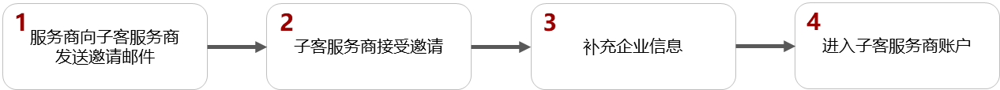
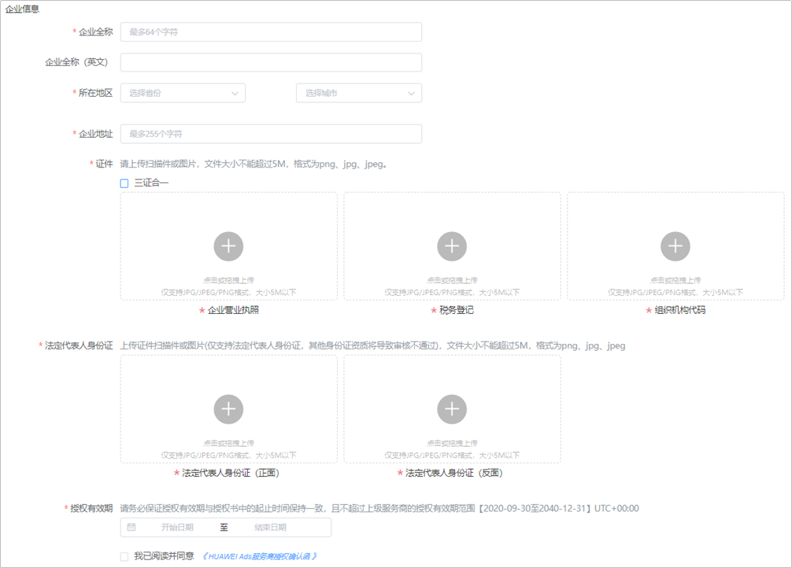
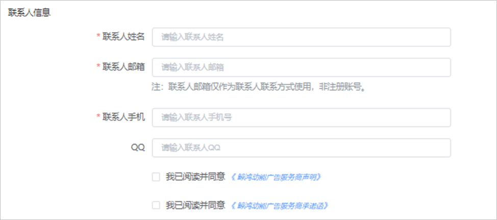
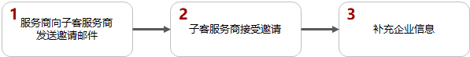
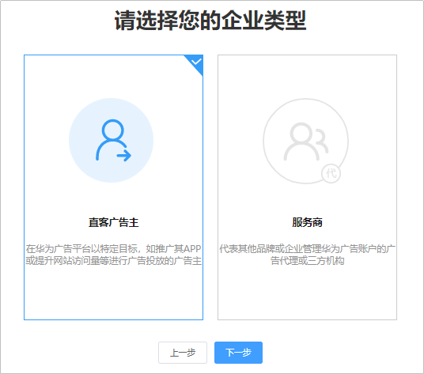
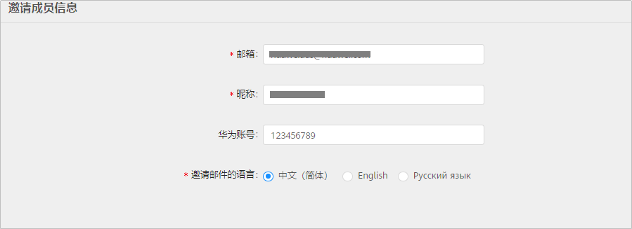
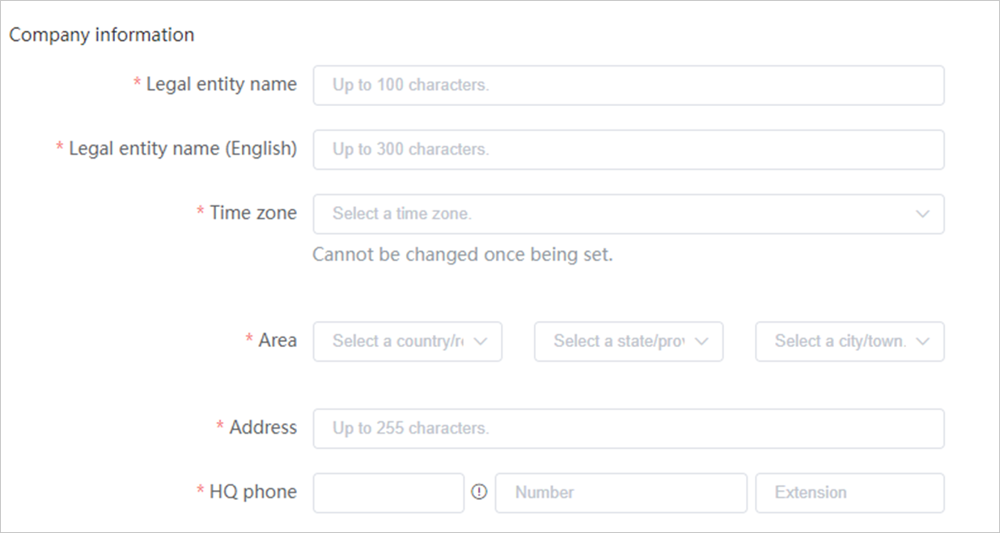
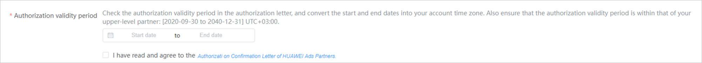
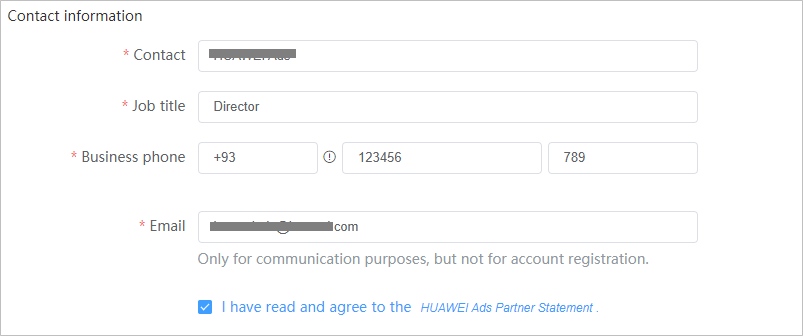
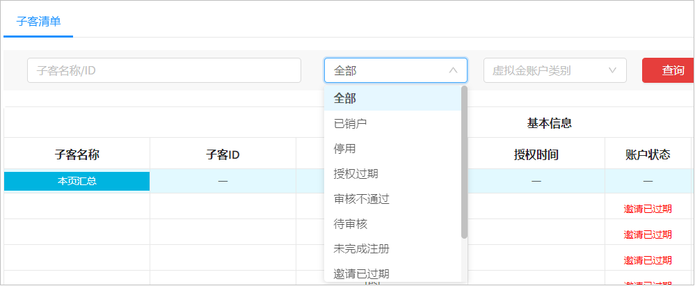

# 子客服务商注册

## 概述

子客服务商不能自己发起注册请求，需要服务商发送注册邀请给子客服务商。子客服务商在接收到邀请邮件时点击邀请中的链接完成注册。

 

如果您的企业注册地为中国大陆地区，且广告投放区域为非中国大陆地区时，需要进行实名认证，实名认证方式分为“<strong>对公银行打款认证</strong>”或“[企业资料人工审核认证](https://developer.huawei.com/consumer/cn/doc/start/mracoei-0000001062678404)”，建议您优先选择“<strong>企业资料人工审核认证</strong>”方式。非中国大陆注册流程请参考[非中国大陆区域子客服务商注册流程](https://developer.huawei.com/consumer/en/doc/distribution/promotion/addlevelpartner-0000001058496239)。

## 企业注册地为中国大陆区域时的子客服务商注册流程

## 企业注册地为中国大陆区域时的子客服务商注册步骤

1. 服务商向子客服务商发送邀请邮件。

   登录服务商账户，点击“”，填写邀请成员信息；发送邀请后，等待子客服务商接收邀请，您同时还可以继续邀请其他子客服务商。

   

   - <strong>邮箱：</strong>此邮箱用于接收子客服务商注册邀请。
   - <strong>昵称：</strong>请填写子客服务商的昵称，建议填写企业名称。
   - <strong>华为账号：</strong>
     - 如果子客服务商没有华为账号，此处不必填，子客服务商可以在接受邀请的时候注册华为账号。
     - 如果子客服务商已有华为账号，请填写被邀请的子客服务商华为账号的手机号（需要带国家码）或邮箱。被邀请的华为账号必须未注册过其它鲸鸿动能广告账户（包括直客、服务商、子客服务商、子客、协作者、团队账号、经理账户），否则可能导致邀请失败。
   - <strong>邀请邮件的语言：</strong>子客服务商接收到邮件的语言。
2. 子客服务商接受邀请。

   点击邀请邮件中的链接，请确认其他华为账号已经退出登录，建议使用Chrome/Firefox浏览器打开，否则可能会导致被邀请失败。

   - <strong>如果服务商在邀请邮件中指定了华为账号：</strong>

     您需要使用指定的华为账号登录并完成鲸鸿动能广告注册。如果注册报错，请确保您的华为账号必须未注册过其他鲸鸿动能广告账户（包括直客、服务商、子客服务商、子客、协作者、团队账号、经理账户），否则会导致注册失败，此时您需要使用新的华为账号完成鲸鸿动能广告注册。
   - <strong>如果服务商在邀请邮件中未指定华为账号：</strong>

     您可以使用手机号或者邮箱进行注册。同时注册的国家/地区需要与您企业注册的国家/地区保持一致，否则会导致子客服务商账户注册失败。
     - 如果您使用手机号/邮箱注册，登录的时候必须使用这个手机号/邮箱登录。
     - 如果您想灵活使用手机号或邮箱登录，需要在[华为账号管理界面](https://id7.cloud.huawei.com/AMW/portal/userCenter/index.html?themeName=red&loginChannel=7000000&countryCode=de&loginUrl=https%253A%252F%252Fid7.cloud.huawei.com%252FCAS%252FcommonLogin.html&reqClientType=7&lang=zh-cn)完成邮箱或手机号关联。

       

       - 请注意以下参数，如果配置不正确<strong>，</strong>否则会导致鲸鸿动能广告账户注册失败。
       - <strong>国家/地区</strong>：请选择“中国“，需要和您企业注册国家/地区保持一致。
       - <strong>出生日期</strong>：需要填写您的出生年月。

     如果您已经有华为账号，希望使用此华为账号注册，点击“<strong>登录</strong>”完成鲸鸿动能广告账户注册。此时您需要注意，您的华为账号必须未注册过其它鲸鸿动能广告账户（包括直客、服务商、子客服务商、子客、协作者、团队账号、经理账户），否则会导致注册失败。

 

若您在鲸鸿动能广告账户注册过程中退出，导致未完成注册流程的，可以在鲸鸿动能广告首页使用该华为账号登录后继续完成注册流程。

3. 填写企业信息。
   - 企业信息：

     

     - <strong>企业全称：</strong>请确保与营业执照上的企业名称保持一致。
     - <strong>企业全称（English）:</strong>请填写您的企业英文名称，若无可不写。
     - <strong>所在地区</strong>：请填写与营业执照一致的省和城市。
     - <strong>企业地址：</strong>详细地址信息请按照您营业执照上的注册地址填写，两者不一致可能导致账户注册失败。
     - <strong>证件：</strong>请上传营业执照的扫描件或者图片，文件大小不能超过5M，格式为png、jpg、jpeg。如果您是三证合一，请勾选，仅补充三证和一的营业执照即可。
     - <strong>法人代表人身份证</strong>：请上传营业执照中法人的身份证正反面，文件大小不能超过5M，格式为png、jpg、jpeg。
     - <strong>授权文件</strong>：您需要下载并填写授权模板，授权模板中，甲方为子客服务商，乙方为服务商，当您的服务商和子客服务商为同一个公司时，授权书甲方、乙方可以一致。

       如果未要求您提供授权文件，此时您需要阅读并勾选[鲸鸿动能广告服务商授权确认函](https://developer.huawei.com/consumer/cn/doc/distribution/promotion/ad-agreements-0000001169499170#ZH-CN_TOPIC_0000001169499170__li435903419247)。
     - <strong>授权有效期</strong>：您可以查看您上级服务商的授权时间，子客服务商授权结束时间应小于服务商授权结束时间。
   - 联系人信息：

     

     - <strong>联系人姓名：</strong>请填写联系人姓名<strong>。</strong>
     - <strong>联系人邮箱：</strong>请填写联系人的邮箱，系统的通知邮件会发送到此邮箱，请确保邮箱可以正常接收邮件。此处的邮箱不作为鲸鸿动能广告账户登录凭证。
     - <strong>联系人手机：</strong>请填写联系人的手机号，系统的通知短信会发送到此电话，请确保号码可以正常接收短信。此处的电话不作为鲸鸿动能广告账户登录凭证。
     - <strong>QQ：</strong>此项为选填，您可以补充QQ号。
     - 勾选我已阅读并同意《[鲸鸿动能广告服务商声明](https://developer.huawei.com/consumer/cn/doc/distribution/promotion/ad-agreements-0000001169499170#ZH-CN_TOPIC_0000001169499170__li157883022414)》。
     - 勾选我已阅读并同意《[鲸鸿动能广告服务商承诺函](https://developer.huawei.com/consumer/cn/doc/distribution/promotion/ad-agreements-0000001169499170#ZH-CN_TOPIC_0000001169499170__li1155411325244)》。

4. 进入子客服务商账户。

## 企业注册地为非中国大陆区域时的子客服务商注册流程

 

- 如果您在注册过程中，遇到白屏/报错情况时，您需要服务商重新邀请并重新注册。如有疑问，可[在线提单](https://developer.huawei.com/consumer/cn/doc/promotion/bpos-contact-0000001379837569#ZH-CN_TOPIC_0000001379837569__p5642mcpsimp)联系我们，此时您需要在工单中提供以下信息：
  - 服务商账户ID或服务商公司名称，请联系您的服务商获取。
  - 服务商邀请时填写邀请信息的截图。
  - 白屏或报错时具体的截图，以及描述清楚出现错误的场景。
  - 提供报错日志：获取方式请参考[获取日志](https://developer.huawei.com/consumer/cn/doc/promotion/bpos-faq-0000001328517634#ZH-CN_TOPIC_0000001328517634__li3228mcpsimp)。

- 如果您在注册子客服务商过程中出现了让您选择“直客”或者“服务商”界面时，代表本次注册流程失败，您需要先[注销](https://developer.huawei.com/consumer/cn/doc/promotion/bpos-faq-0000001328517634#ZH-CN_TOPIC_0000001328517634__li3219mcpsimp)子客服务商的华为账号，然后让您的服务商重新邀请您，并重新进行子客服务商流程注册。

## 企业注册地为非中国大陆区域时的子客服务商注册步骤

1. 服务商向子客服务商发送邀请邮件。

   登录服务商账户，点击“”，填写邀请成员信息；发送邀请后，等待子客服务商接收邀请，您同时还可以继续邀请其他子客服务商。

   

   - <strong>邮箱：</strong>此邮箱用于接收子客服务商注册邀请。
   - <strong>昵称：</strong>请填写子客服务商的昵称，建议填写企业名称。
   - <strong>华为账号：</strong>
     - 如果子客服务商没有华为账号，此处不必填，子客服务商可以在接受邀请的时候注册华为账号。
     - 如果子客服务商已有华为账号，请填写被邀请的子客服务商华为账号的手机号（需要带国家码）或邮箱。被邀请的华为账号必须未注册过其它鲸鸿动能广告账户（包括直客、服务商、子客服务商、子客、协作者、团队账号、经理账户），否则可能导致邀请失败。
   - <strong>邀请邮件的语言：</strong>子客服务商接收到邮件的语言。

2. 子客服务商接受邀请。

   点击邀请邮件中的链接，请确认其他华为账号已经退出登录，建议使用Chrome/Firefox浏览器打开，否则可能会导致被邀请失败。

   - <strong>如果服务商在邀请邮件中指定了华为账号：</strong>

     您需要使用指定的华为账号登录并完成鲸鸿动能广告注册。如果注册报错，请确保您的华为账号必须未注册过其他鲸鸿动能广告账户（包括直客、服务商、子客服务商、子客、协作者、团队账号、经理账户），否则会导致注册失败，此时您需要使用新的华为账号完成鲸鸿动能广告注册。
   - <strong>如果服务商在邀请邮件中未指定华为账号：</strong>
     - 您可以使用手机号或者邮箱进行注册。同时注册的国家/地区需要与您企业注册的国家/地区保持一致，否则会导致子客服务商账户注册失败。
       - 如果您使用手机号/邮箱注册，登录的时候必须使用这个手机号/邮箱登录。
       - 如果您想灵活使用手机号或邮箱登录，需要在[华为账号管理界面](https://id7.cloud.huawei.com/AMW/portal/userCenter/index.html?themeName=red&loginChannel=7000000&countryCode=de&loginUrl=https%253A%252F%252Fid7.cloud.huawei.com%252FCAS%252FcommonLogin.html&reqClientType=7&lang=zh-cn)完成邮箱或手机号关联。

         
     - 如果您已经有华为账号，希望使用此华为账号注册，点击“<strong>登录</strong>”完成鲸鸿动能广告账户注册。此时您需要注意，您的华为账号必须未注册过其它鲸鸿动能广告账户（包括直客、服务商、子客服务商、子客、协作者、团队账号、经理账户），否则会导致注册失败。

 

若您在鲸鸿动能广告账户注册过程中退出，导致未完成注册流程的，可以在鲸鸿动能广告首页使用该华为账号登录后继续完成注册流程。

3. 填写企业信息。
   - <strong>企业信息</strong>

     

     - <strong>企业全称</strong>：请确保与营业执照上的企业名称保持一致。
     - <strong>企业全称（English）</strong>：英文名称会用在给您开具的发票上，请准确填写，确保与营业资质上的英文名称一致，企业名称内不允许包含除26个英文字母、英文标点符号及阿拉伯数字之外的任何字符。
     - <strong>营业执照</strong>：对注册时需要上传营业执照的国家/地区，您需要按照界面提示上传营业执照。
     - <strong>投放时区</strong>：<strong>账户注册后时区不能更改</strong>，请慎重选择。系统会按照您在此处选择的时区进行任务投放时间控制、预算控制、报表统计和展示等。
     - <strong>地区</strong>：国家/地区默认使用您华为账号的注册地，同时需要与您企业营业执照的注册国家/地区一致，另外需要配置省和城市。
     - <strong>地址</strong>：详细地址信息请按照您营业执照上的注册地址填写，两者不一致可能导致账户注册失败。
     - <strong>总部电话</strong>：请填写您的企业电话。
   - <strong>授权信息</strong>：

     

     - <strong>授权文件</strong>：您需要下载并填写授权模板，授权模板中，甲方为子客服务商，乙方为服务商，当您的服务商和子客服务商为同一个公司时，授权书甲方、乙方可以一致。

    

   授权模板中，公章与法人签字可二选一，若两者都不提供则授权无效。

   如果未要求您提供授权文件，此时您需要阅读并勾选[鲸鸿动能广告服务商授权确认函](https://developer.huawei.com/consumer/cn/doc/distribution/promotion/ad-agreements-0000001169499170#ZH-CN_TOPIC_0000001169499170__li191931552172413)。

   - <strong>授权有效期</strong>：您可以查看您上级服务商的授权时间，子客服务商授权结束时间应小于服务商授权结束时间。
   - <strong>联系人信息</strong>：

     

     - <strong>联系人姓名</strong>：请填写联系人姓名<strong>。</strong>
     - <strong>职位</strong>：请填写您的职位信息。
     - <strong>联系人电话</strong>：请填写联系人的手机号，系统的通知短信会发送到此电话，请确保号码可以正常接收短信。此处的电话不作为子客服务商账户登录凭证。
     - <strong>联系人邮箱</strong>：请填写联系人的邮箱，系统的通知邮件会发送到此邮箱，请确保号码可以正常接收邮件。此处的邮箱不作为子客服务商账户登录凭证。
     - 此时您需要阅读并勾选[鲸鸿动能广告服务商声明](https://developer.huawei.com/consumer/cn/doc/distribution/promotion/ad-agreements-0000001169499170#ZH-CN_TOPIC_0000001169499170__li14545411245)，子客服务商注册完成。

## 子客管理

<strong>子客的账户状态</strong>

- <strong>已销户</strong>：指的是子客注销华为账号。
- <strong>停用</strong>：一般由华为进行判定并操作，如果子客账户被停用，请[在线提单](https://developer.huawei.com/consumer/cn/doc/promotion/bpos-contact-0000001379837569#ZH-CN_TOPIC_0000001379837569__p5642mcpsimp)联系我们。
- <strong>授权过期</strong>：指的是子客授权函过期。您可以进行“编辑”、“进入账户”等操作。
  - <strong>编辑</strong>：您可以修改子客的授权时间。
  - <strong>进入账户</strong>：您可以进入子客账户。
- <strong>审核不通过</strong>：指的是子客账户审核不通过、变更审核不通过。
- <strong>待审核</strong>：指的是子客账户审核中、变更审核中。
- <strong>未完成注册</strong>：指的是子客点击邀请链接进行注册但未完成注册流程。此时可以做“移除”操作，点击“<strong>移除</strong>”时，弹出提示框，若点击“<strong>确定</strong>”，成员将从列表删除，同时邀请链接失效。
- <strong>邀请已过期</strong>：指的是失效期为发送邀请后的10天，若子客在链接失效前仍未注册成功，则邀请过期，您可以进行“<strong>移除</strong>”、“<strong>编辑</strong>”和“<strong>重新邀请</strong>”等操作。
  - <strong>移除：</strong>点击“<strong>移除</strong>”时，弹出提示框，若点击“<strong>确定</strong>”，成员将从列表删除，同时邀请链接失效。
  - <strong>编辑：</strong>点击“<strong>编辑</strong>”时，进入“<strong>编辑成员信息</strong>”页面，可修改该成员的“<strong>邮箱</strong>”、“<strong>昵称</strong>”、“<strong>语言</strong>”和“<strong>华为账号</strong>”，不影响编辑前的邀请链接有效期。
  - <strong>重新邀请：</strong>在链接失效之前可以重新邀请，此时之前的邀请链接失效，您也可以在链接失效后重新邀请。
- <strong>邀请中：</strong>邀请发送成功后，在首页的子客服务商清单列表中显示已邀请的子客服务商，授权状态为“邀请中”。
- <strong>生效：</strong>成功邀请的子客状态显示正常。
  - <strong>转账</strong>：您可以对子客进行转账。
  - <strong>编辑</strong>：您可以对子客进行修改。当您编辑子客以下内容时将会重新审核子客账户：

    实名审核：Full name、Full name(English)、DUNS number、Business license number、Business license、Time zone、Area。

    资质审核：Promotional content、Domain names、Authorization certificate、Industry qualification。

    - 子客注册地为中国大陆区域时：

      实名审核：企业全称、所在地区、证件、法定代表人身份证。

      资质审核：推广内容、推广标的、授权证明、所属行业、业务范围、资质证件。
    - 子客注册地为非中国大陆区域时：

      实名审核：Full name、Full name(English)、DUNS number、Business license number、Business license、Time zone、Area。

      资质审核：Promotional content、Domain names、Authorization certificate、Industry qualification。
  - <strong>进入账户</strong>：您可以进入子客账户。
