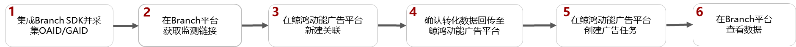

# Branch

## 概述

Branch支持4.4.0以上版本，详情请参考[官网链接](https://help.branch.io/developers-hub/docs/android-basic-integration)。

## 操作流程

## Branch操作步骤

1. 集成Branch SDK并采集OAID/GAID。
   - 集成：详细操作请参照[Branch SDK集成指南](https://help.branch.io/developers-hub/docs/android-basic-integration)。
   - 采集OAID/GAID：三方监测事件必须使用OAID/GAID跟踪归因，请确保您的应用已加入OAID/GAID采集代码，否则可能将无法正确跟踪。
     - 如果您跟踪的应用是华为应用市场的应用，您必须采集OAID。
     - 如果您跟踪的应用是非华为应用市场的应用，GAID会自动采集。
   - 在投放鲸鸿动能广告前，需要在集成branch SDK的过程中需要添加如下依赖和代码：
     - 在项目级build gradle文件里面添加如下依赖：maven \{ url 'https://developer.huawei.com/repo/' \}
     - 在App级build gradle文件里面添加如下依赖：implementation 'com.huawei.hms:ads-identifier:3.4.28.305
     - 在Proguard Settings添加如下代码：

       -keep class com.huawei.hms.ads.\*\* \{ \*; \}

       -keep interface com.huawei.hms.ads.\*\* \{ \*; \}
2. 在Branch平台获取监测链接。

   详情请参考[Branch操作指导](https://alliance-communityfile-drcn.dbankcdn.com/FileServer/getFile/cmtyPub/011/111/111/0000000000011111111.20260513165911.53808223388539488505396774133270:20260531101615:2800:FA548A0676A73D292E7CDD2F69F6A1C5212EADD99CCF1D2F26FA4183AFDF2380.pdf?needInitFileName=true)。
3. 在鲸鸿动能广告平台新建关联。

   需要为您希望跟踪的每一个应用使用指定的监测工具新建资产，详细请参考[新建资产](https://developer.huawei.com/consumer/cn/doc/promotion/tracking-app-overview-0000001209244840#ZH-CN_TOPIC_0000001209244840__li8351194812211)。
4. 确认转化数据回传至鲸鸿动能广告平台。
   - 如果您想要投放非oCPC广告，您可以直接创建广告任务，待鲸鸿动能广告平台收到转化数据后，转化跟踪指标状态为“已启用”。
   - 如果您想要投放oCPC广告，鲸鸿动能广告平台必须先收到转化数据，收到转化数据后，转化跟踪指标状态为“已启用”，此时您才能创建任务，详情可参考[如何让鲸鸿动能广告平台收到转化数据](https://developer.huawei.com/consumer/cn/doc/promotion/tracking-app-overview-0000001209244840#ZH-CN_TOPIC_0000001209244840__table594218593381)。
5. 在鲸鸿动能广告平台创建广告任务。

   您在上传广告创意时，系统将会自动关联到创意中的曝光/点击监测链接（自动关联的链接不要修改，避免影响跟踪数据）。
6. 在Branch平台查看转化数据。
