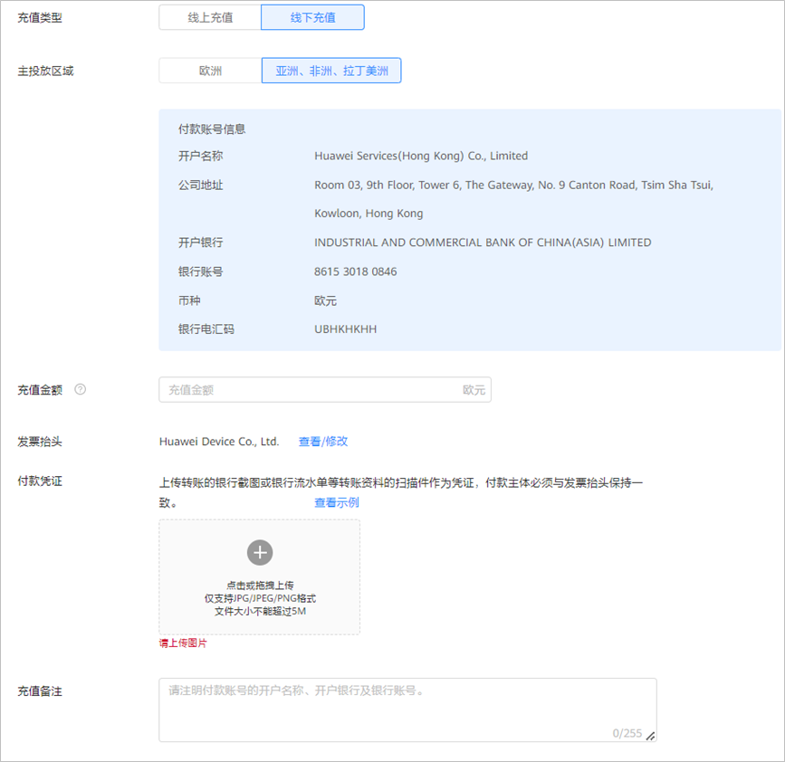
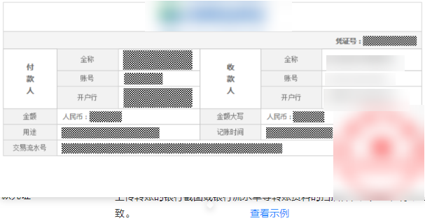

# 线下充值

本章节为直客线下充值，服务商线下充值请参考[服务商充值-线下充值](/docs/monetize/promotion/finance-0000001058604140#h2服务商充值-线下充值)。

## 操作流程

## 操作步骤

1. 银行转账。

   为保障广告计划顺利使用账户余额进行投放，需要先进行账户充值，可以使用银行转账的充值方式，请提前与银行确认转账时效（公对公跨行转账到账时间一般为1-3个工作日）。

    

   - 线下充值不支持个人银行账户充值。
   - 线下充值仅支持企业银行账户充值，且您用来充值的银行账户必须与广告账户主体一致，否则将无法充值到广告账户中。
2. 在鲸鸿动能广告平台提交充值申请。

   单击-&gt;“<strong>充值</strong>”。

   

   充值类型：选择“线下充值”。

   - 主要投放区域：根据您广告主要投放的区域选择阿斯比格或者华为服务（香港）充值。
   - 充值金额：输入“充值金额“。

      

     - 如果您一次性线下充值少于1000美元或1000欧元，银行会收取一定的手续费，手续费的金额需要您与银行确认。实际到款金额与汇款金额不一致。提交充值申请时，需要填写实际到账的金额。
     - 如果您一次性线下充值超过1000美元或1000欧元，华为承担中间行转账手续费。
     - 涉及退款时，华为仅退还实际到账金额，详情可参考[鲸鸿动能广告协议](/docs/monetize/promotion/ad-agreements-0000001169499170#ZH-CN_TOPIC_0000001169499170__li2061184515243)中“预付费”内容。
   - 发票抬头：支持查看/修改。
   - 付款凭证：上传转账的银行截图或银行流水单等转账资料的扫描件作为凭证，付款主体必须与发票抬头保持一致。示例如下：

     
   - 充值备注：必须填写付款主体、开户银行及银行账号、充值用途。
3. 等待审批结果。

   一般情况下，银行转账1-3个工作日可以到账，到账后3个工作日完成充值审批。

   审批结果将通过联系人邮箱/站内信/短信方式通知您。如果审核不通过，请按照被拒原因修改原充值申请，并提交审核。
