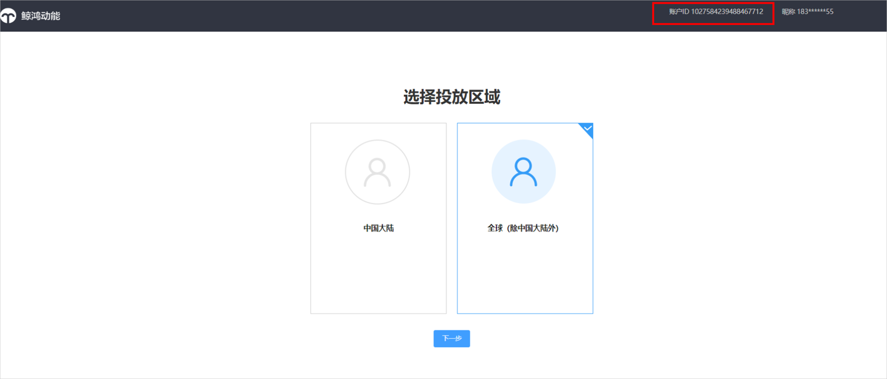
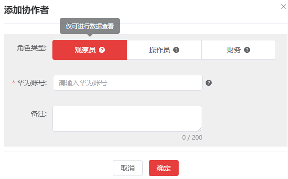
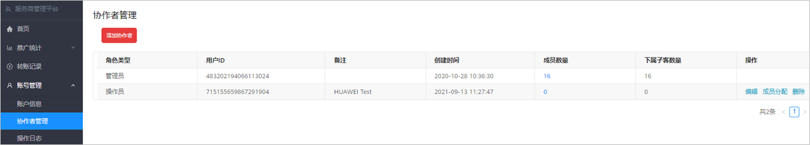

# 协作者管理

## 概述

服务商和子客服务商可以添加多个协作者，协助进行账户管理。

协作者角色分为观察员、操作员、财务，不支持自定义角色，角色权限如下表所示：

| 服务商界面操作权限 | 观察员 | | 操作员 | | 财务 | |
| --- | --- | --- | --- | --- | --- | --- |
| 服务商类别 | 一级 | 二级 | 一级 | 二级 | 一级 | 二级 |
| 首页新增（邀请）按钮 | - | - | √ | √ | - | - |
| 转账 | - | - | - | - | √ | √ |
| 编辑下级账户信息 | - | - | √ | √ | - | - |
| 进入下级账户 | - | - | √ | √ | - | - |
| 查看下级账户列表 | √ | √ | √ | √ | √ | √ |
| 查看二级服务商消耗统计 | √ | - | √ | - | √ | - |
| 查看子客消耗统计 | √ | √ | √ | √ | √ | √ |
| 充值 | - | - | - | - | √ | - |
| 查看充值记录 | √ | - | √ | - | √ | - |
| 查看转账记录 | √ | √ | √ | √ | √ | √ |
| 查看账户信息 | √ | √ | √ | √ | √ | √ |
| 查看操作日志 | - | - | √ | √ | - | - |

- 同一个华为账号只能被一个服务商/子客服务商账户添加为协作者，且只能指定一种角色。
- 服务商/子客服务商的账户持有者为管理员，拥有上表里面的所有权限。
- 服务商/子客服务商账户可添加多个协作者，每个协作者之间数据独立。
- 协作者的华为账号国家/地区必须与服务商/子客服务商的国家/地区保持一致。
- 协作者的华为账号必须未注册过其它鲸鸿动能广告账户（包括直客、服务商、子客服务商、子客、协作者、团队账号、经理账户）。
- 如果服务商/子客服务商在自己的账户中手动删除了协作者，那么协作者的广告账户ID默认被注销，且服务商/子客服务商无法再次添加这个协作者的广告账户ID。如果您想重新添加这个协作者，您可以让协作者使用之前的华为账号（或者使用新的手机号/邮箱重新注册华为账号）再次登录鲸鸿动能广告平台，并提供新的广告账户ID。

  如果协作者主动注销了协作者的华为账号，那么服务商/子客服务商账户中此协作者账户自动被删除，且无法再次添加这个协作者。如果您想重新添加这个协作者，您可以让协作者使用手机号/邮箱重新注册华为账号，登录鲸鸿动能广告平台，并提供新的广告账户ID。

## 添加协作者

1. 获取协作者华为账号的鲸鸿动能广告账户ID：使用未注册过鲸鸿动能广告账户的华为账号登录[鲸鸿动能广告平台](https://ads.huawei.com/usermgtportal/home/index.html#/)，复制右上角的账户ID，无需继续注册。

   
2. 登录[服务商平台](https://id1.cloud.huawei.com/CAS/portal/loginAuth.html)，单击“<strong>账号管理</strong>”-&gt;“<strong>协作者管理</strong>”-&gt;“<strong>添加</strong> <strong>协作者</strong>”。
3. 选择<strong>角色类型</strong>，每次只能添加一种角色，输入华为账号。

   
4. 分配账户，具体请参考[管理协作者](#section15695171611183)。

## 管理协作者

账户持有者可以查看协作者列表，对协作者进行成员分配、查看、编辑、删除等操作。

- <strong>成员分配</strong>：服务商/子客服务商可以将下一级的账户分配给每个角色（观察员、财务、操作员），此时每个角色拥有账户的不同权限，具体请参考[角色权限](#ZH-CN_TOPIC_0000001059241934__table151501831164717)。
- <strong>查看成员数量</strong>：单击每个协作者的成员数量列，您可以看到其管理的账户ID和企业名称。
- <strong>编辑</strong>：单击“<strong>编辑</strong>”时，管理员可以修改该协作者的角色类型，即从当前角色类型修改为其他角色类型。
- <strong>删除</strong>：支持删除协作者，该协作者删除后，不影响其管理的成员。
