# 投放搜索大卡合约任务

## 背景信息

华为应用市场在丰富的榜单类和搜索类资源外，推出了搜索大卡合约的投放资源，通过丰富多样的素材投放吸引用户注意力，显著提升推广转化效果。开发者可上传大卡单图、大卡双图、大卡三图三种样式，实现投放效果脱颖而出。

 

合约竞拍任务状态为竞价中-领先、竞得资源时，不支持取消任务。

搜索大卡合约资源位示例如下图所示：

## 单天合约任务创建操作流程

1. 登录[华为应用市场应用推广平台](https://developer.huawei.com/consumer/cn/service/apcs/app/home.html)，点击左上角“推广”进入推广页面，选择“应用市场应用推广”。

   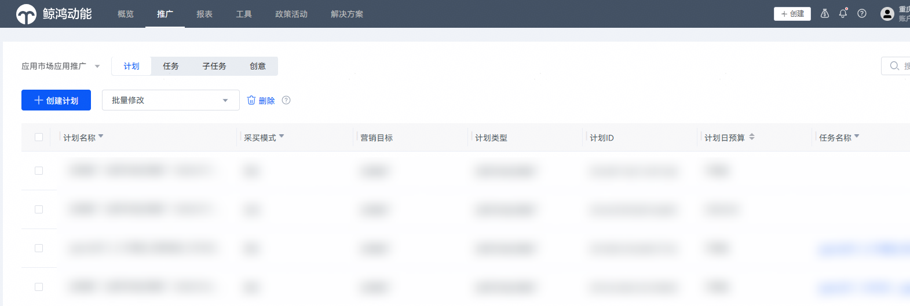
2. 在创建“计划”设置模块，配置相关计划设置项。

   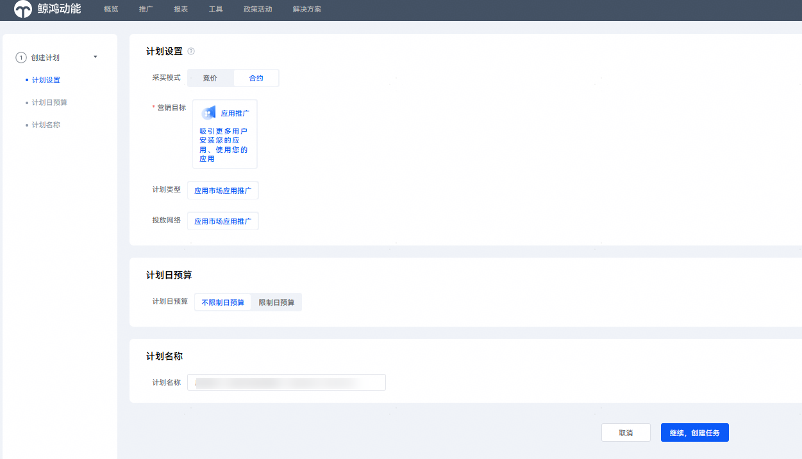

   |  |  |
   | --- | --- |
   | <strong>计划设置项</strong> | <strong>说明</strong> |
   | 采买模式 | 选择“合约”。 |
   | 计划日预算 | 选择“不限制日预算”。 |
   | 计划名称 | 计划名称命名格式建议：应用名称+搜索词+时间。 |
3. 配置完成后，点击“继续，创建任务”。
4. 在“推广内容”模块，配置相关任务设置项。

   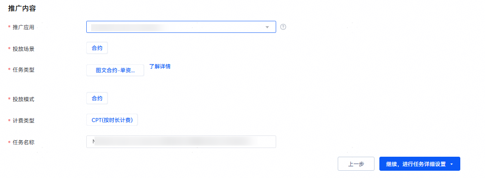

   |  |  |
   | --- | --- |
   | <strong>任务设置项</strong> | <strong>说明</strong> |
   | 推广应用 | 选择您需要推广的应用。 |
   | 投放场景 | 选择“合约”。 |
   | 任务类型 | 选择“图文合约-单资源”。 |
   | 投放模式 | 选择“合约”。 |
   | 计费类型 | 选择“CPT”。 |
   | 任务名称 | 任务名称命名格式建议：应用名称+关键词+时间。 |
5. 配置完成后，点击“继续，进行任务详细设置”。
6. 在“推广范围”设置模块，配置相关任务设置项。

   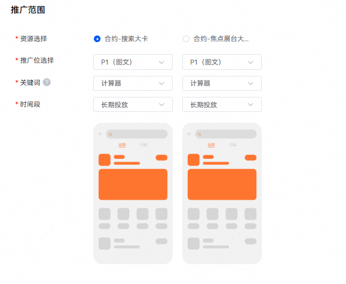

   |  |  |
   | --- | --- |
   | <strong>任务设置项</strong> | <strong>说明</strong> |
   | 资源选择 | 选择要竞拍的资源，如：“合约-搜索大卡”、“合约-焦点展台大卡”。 |
   | 推广位选择 | 选择P1/P2。  1.“合约-搜索大卡”开放推广位为P1、P2。  2.“合约-焦点展台大卡”开放推广位为P1。 |
   | 关键词 | 选择要竞拍的目标资源。 |
   | 时间段 | 时间段为该资源开放时间。  说明：  选择关键词后，若时间段显示“无数据”，说明该关键词未开放排期，不可竞拍。 |
7. 在“投放控制”设置模块，配置相关任务设置项。

   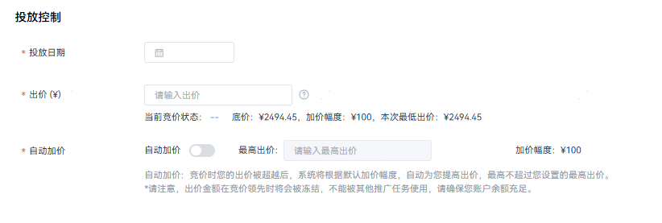

   |  |  |
   | --- | --- |
   | <strong>任务设置项</strong> | <strong>说明</strong> |
   | 投放日期 | 设置任务对应的投放日期X。  1. 投放日期仅可选1天创建竞拍任务；若要连续多天竞拍，可用合约长期竞拍工具创建自动竞拍计划。 2. 任务最早创建时间：X-32天的下午15:00之后，最晚创建时间：X-2天的下午15:00之前。 3. 任务竞价结束时间：X-2天的下午15:00。 例如：投放日期为2月5日，则最早创建时间为1月4日下午15:00过后，最晚创建时间为2月3日下午15:00之前。2月3日的下午15:00过后即可知道是否竞拍成功。 |
   | 出价 | 设置任务起拍价。  当前竞价状态有：竞价中-领先、竞价中-落后、竞得资源、未竞得资源，共4种状态。  如果显示竞价中-落后，可以修改并提高出价。出价时请确保您的账户余额充足。  说明：  出价领先的任务订单，系统会实时锁定您的账户里面的这个出价金额，不能被其他推广任务使用，请确保您账户余额充足。出价被超越后，锁定的金额立即会被释放。 |
   | 自动加价 | 是否开启自动加价功能。竞价时您的出价被超越后，系统将根据默认加价幅度（100元），自动为您提高出价，最高不超过您设置的最高出价。  如果开启，则需要配置“最高出价”设置项。  说明：  最高出价：您接受的最高出价。如有多家客户竞争同一关键词时，可能导致竞拍失败。设置最高出价后，在有竞争的情况下，系统会根据加价幅度（100元）自动为您提高出价，直到竞拍成功，或者出到最高出价仍无竞胜则竞拍失败。 |
8. 在“推广创意”设置模块，配置相关任务设置项。

    

   - 如果图片中使用了肖像，请上传对应的证明资质。
   - 如果有多个材料，请打包上传。
   - 请在“创意展示”任务设置项处点击“创意类型及素材规范说明”查看并严格依照[素材审核规范](#section119481449133811)进行推广素材制作。
   - 若您需修改素材，请在投放日期的12小时之前上传修改后的版本。若未及时修改导致素材审核不通过，合约任务将无法正常上线投放。例如：投放日期为2月5日，素材最晚修改提交时间为2月4日12:00，请您及时修改并上传符合要求的素材。

   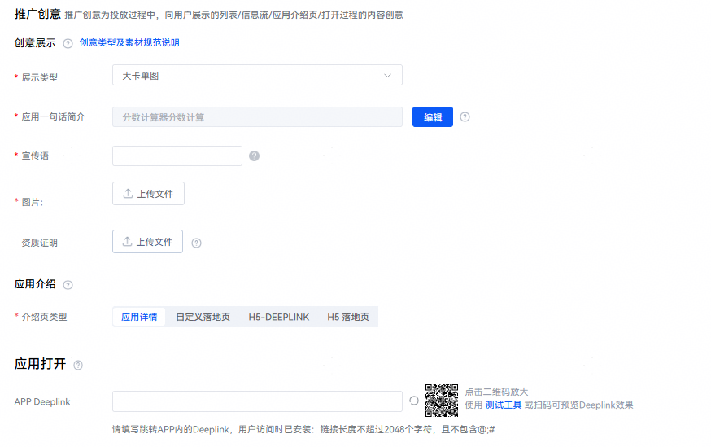
9. 填写完毕后，点击“提交”。

## 多天合约任务创建操作流程

如您需要连续购买多天合约，需按照以上单天合约任务创建步骤，先创建单天合约任务。在单天合约任务竞拍成功且素材审核通过之后，使用“合约长期竞拍工具”创建多天合约任务。

### 具体操作如下：

1. 单天合约任务竞拍成功且素材审核通过后，点击“工具”-“应用市场应用推广”-“合约长期竞拍工具” –“添加”。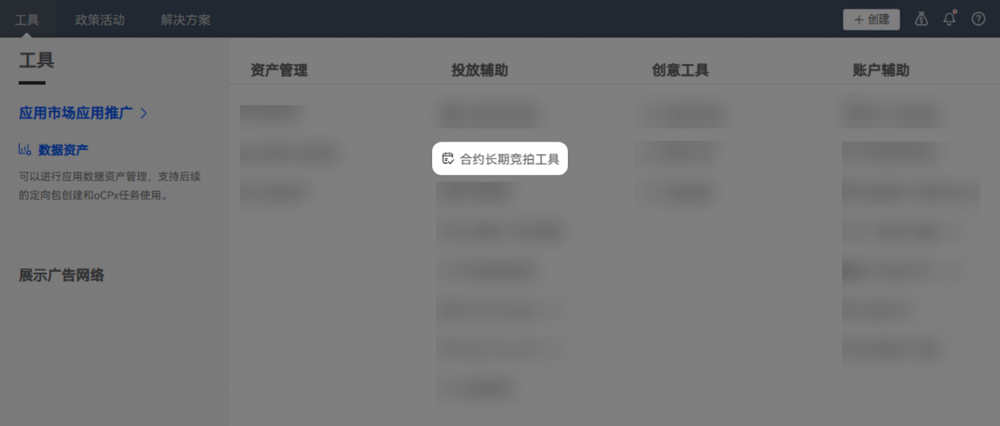

   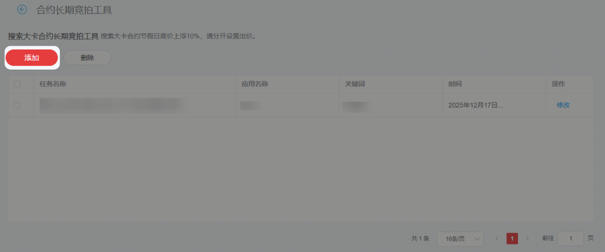
2. 选择对应关键词的单天合约任务，点击“添加”。

   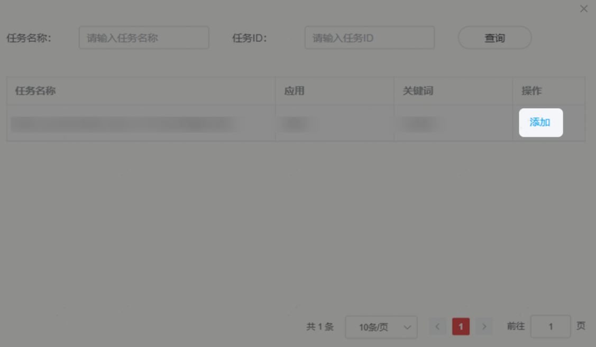
3. 根据广告主购买需求填写时间、出价、最高出价（选填）。

   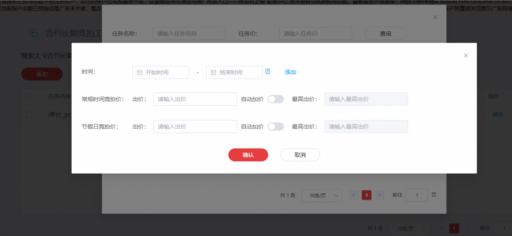

   |  |  |
   | --- | --- |
   | <strong>任务设置项</strong> | <strong>说明</strong> |
   | 时间 | 参与竞拍的时间段，可选择连续日期，也可间隔日期段选择。 |
   | 出价 | 设置该时间段内合约出价，该出价必须大于或等于单天合约任务出价。次日系统会自动创建时间段内的单天合约任务。由于关键词底价会随时间变动，如设置的出价偏低，低于关键词底价时，对应日期的单天合约任务可能无法创建成功，仅在高于底价的日期创建单天合约任务。 |
   | 最高出价 | 该最高出价会覆盖单天合约任务上的最高出价。  如有多家客户竞争同一关键词时，可能导致竞争失败。您可设置最高出价，在有竞争的情况下，系统会根据加价幅度（100元）自动为您提高出价，直到竞拍成功，或者出到最高出价仍无竞胜则竞拍失败。 |

## FAQ

<strong>Q1</strong> <strong>：</strong> <strong>在什么场景下，才会用到合约长期竞拍工具呢？</strong>

A1：在广告主有购买多天合约需求的场景下，可使用合约长期竞拍工具创建自动竞拍计划，实现连续购买多天合约。

如：广告主需连续购买2月1日-2月28日的合约时，可先手动创建一个2月1日的单天合约任务，竞拍成功且素材通过后，即可使用该工具创建2月2日-2月28日的自动竞拍计划，创建成功后，系统会在每日凌晨0点过后自动创建计划上的单天合约任务。

<strong>Q2</strong> <strong>：</strong> <strong>合约长期竞拍工具上的时间有限制么，如果广告主想连续购买3个月的合约，是否支持设置？</strong>

A2： 无时间限制，如果广告主要连续购买3个月的合约，正常填写对应的时间、出价和最高出价即可，系统会在投放日期开放后自动创建对应时间的单天合约任务。

<strong>Q3</strong> <strong>：</strong> <strong>合约长期竞拍工具上不显示底价，如何知道关键词底价？</strong>

A3：建议到任务创建页面获取实时底价；创建计划时输入出价低于底价时，下方会出现“必须大于等于XX（底价），可保留两位小数”提示语。

<strong>Q4</strong> <strong>：</strong> <strong>合约长期竞拍工具计划任务上时间、出价、最高出价修改，修改后是否会影响正在竞拍中的单天合约任务？</strong>

A4：不会影响，合约长期竞拍工具作用仅是基于已完成的单天合约任务创建新任务，已创建成功的合约任务不会受到影响，可正常参与竞拍。

<strong>Q5</strong> <strong>：</strong> <strong>如果长期合约竞拍工具任务出价和最高出价设置完成后，底价变化高于原来设置好的出价，是否还能正常自动创建新的合约任务？</strong>

A5：无法创建，出价必须高于底价才可自动创建任务。若未创建出新的合约任务，建议修改出价大于等于实时底价。实时底价可在任务创建详情内查看。

<strong>Q6</strong> <strong>：</strong> <strong>如果合约长期竞拍工具自动创建出新单天合约任务后，若竞价状态为落后，是否可以修改出价和最高出价？</strong>

A6：可以，可在合约任务详情中进行修改出价和最高出价。

<strong>Q7</strong> <strong>：</strong> <strong>1月1日创建1月1日-2月5日的合约长期竞拍任务，结果仅成功创建1月4日-2月5日每日的单天合约任务，1月1日-1月3日的单天合约任务创建失败，是什么原因？</strong>

A7：因为1月1日-1月3日的竞价结束时间（如：1月3日的竞价结束时间为1月1日下午15:00）已过，所以无法创建对应的单天合约任务。

## 素材审核规范

素材准备与审核规范相关内容如下：

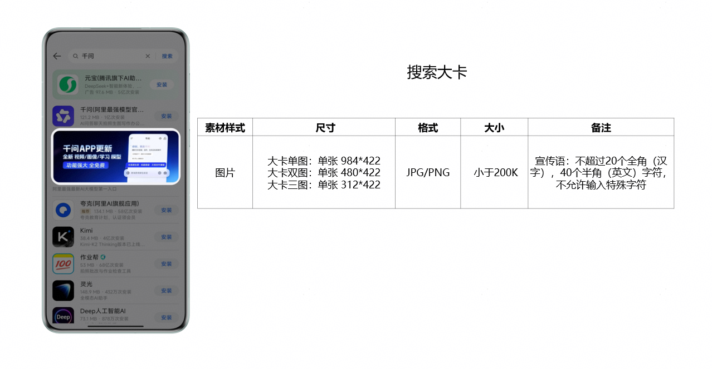

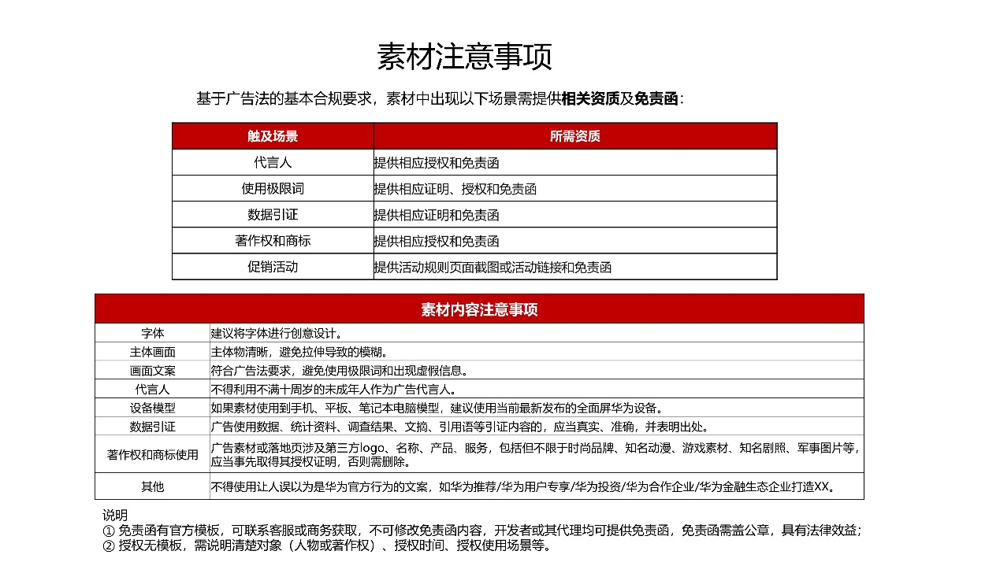
