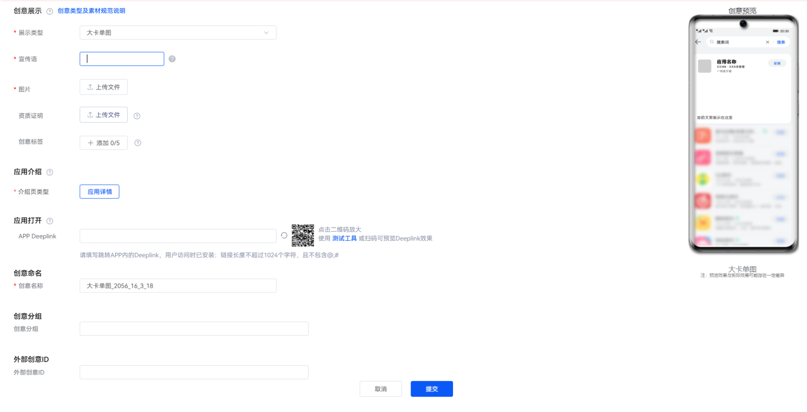
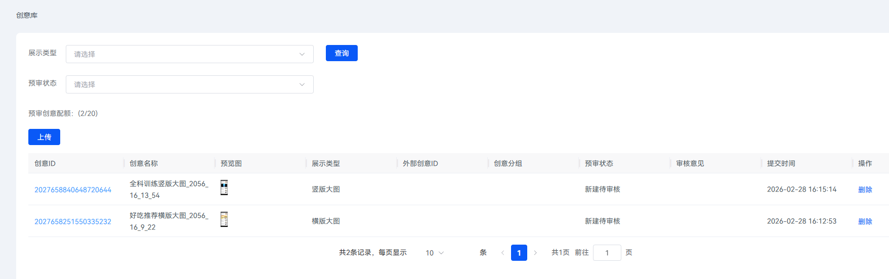
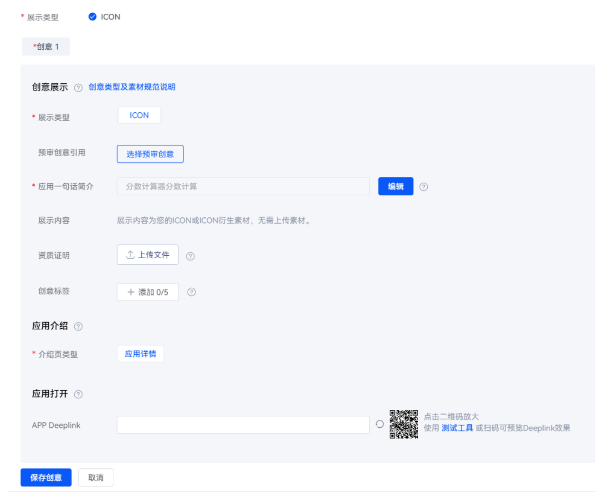

# 使用创意预审库

1. 登录[华为应用市场应用推广平台](https://ads.huawei.com/cn/)。
2. 点击“工具”页签，在“创意工具”中选择“创意预审库”。
3. 点击“上传”进入创意编辑页面，上传并编辑创意素材，然后点击“提交”。提交素材后，素材会自动生成创意ID。

   

   - “创意展示”区域

     |  |  |
     | --- | --- |
     | 任务设置项 | 说明 |
     | 展示类型 | 点击下拉框，根据您的需求选择创意的展示类型，并根据页面提示的规格要求上传图片或视频。  说明：  当您展示类型选择为“横版大图”、“竖版大图”、“横版小图”、“横版小三图”时，您可以直接上传图片，也可以点击“[使用模板制图](/docs/monetize/promotion/bp-functions-draw-tools-introduction-0000001399522565)”快速生成创意素材或“[从素材库选择](/docs/monetize/promotion/bp-functions-material-library-introduction-0000001399645709)”复用之前保存的素材。 |
     | 资质证明 | 若您使用了肖像，请上传证明资质。当前支持格式JPEG/JPG/PNG/BMP/PPTX/DOCX/PDF/MP4/GIF/ZIP，请勿上传不支持的文件格式。大小不超过50M，多材料请打包上传。 |
     | 创意标签 | 您可以选择添加创意标签，更好地提升推广效果。当前最多可添加5个标签。 |
   - “应用介绍”区域

     |  |  |
     | --- | --- |
     | 任务设置项 | 说明 |
     | 介绍页类型 | 选择用户点击展示创意的方式。 |
   - “应用打开”区域

     |  |  |
     | --- | --- |
     | 任务设置项 | 说明 |
     | APP Deeplink | 若用户已安装您的应用，点击”打开”或素材，将会直接访问您配置的Deeplink页面和内容。具体调测方法请参见普通Deeplink调测流程。 |
   - “创意命名”区域

     |  |  |
     | --- | --- |
     | 任务设置项 | 说明 |
     | 创意名称 | 输入展示的创意名称，要求不超过50个字符。 |

      

     创意预审素材最多可以提交20个。
4. 回到“创意预审库”页面，可点击“展示类型”下拉框、“预审状态”下拉框进行筛选，查询创意素材的预审状态。点击素材的创意ID，能够重新进入素材创编页面；在“操作”一栏，可以点击“删除”，删除已提交的创意素材。

   
5. 新建推广任务，在“推广创意”设置模块，“预审创意引用”设置项点击“选择预审创意”，选择审核通过的创意素材。

   

    

   选择预审创意后，如果对创意内容进行修改，则需触发审核流程；如无修改，则无需审核（对于卸载召回任务，选择预审创意后提交，依旧要触发审核流程）。
