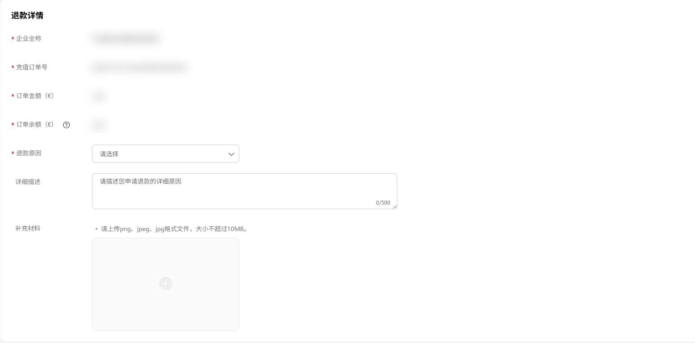
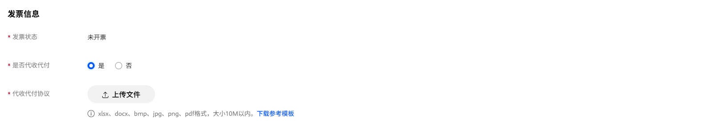

# 2B充值业务线上退款操作流程

线上退款遵循原路退回原则，需保持退款接收账户与打款时的银行账户一致。

目前线上退款仅适用于原路退款，如因原打款银行账号注销、公司注销等特殊情况请发邮件至联盟邮箱&lt;devConnect@huawei.com&gt;咨询线下退款流程。

<strong>可退款前提条件：</strong>

1. 现金充值（注：赠送金及返利金等非现金充值余额不可申请退款）；

2. 充值订单状态：待审核、审核不通过、交易成功、退款失败。

1）如果是通过客户投放伙伴主账户充值的，需要将钱从操作账户及客户投放伙伴子账户转回客户投放伙伴主账户再申请退款操作；

2）退款时余额所在账户需要和充值的账户保持一致（可前往管理中心-我的账户-余额-划转：如充值给应用市场推广基金/通用基金，退款时需要将资金划转到应用市场推广基金/通用基金；如充值给鲸鸿动能广告投放基金/通用基金，退款时需要将资金划转到鲸鸿动能广告投放基金/通用基金）;

3）退款前推广任务全部暂停。

退款入口：“[开发者联盟后台](https://developer.huawei.com/consumer/cn/console#/serviceCards/AppService)”-&gt; “我的账户” -&gt; “余额”-&gt; “充值记录”找到对应需要退款的订单编号单击“退款”。

撤销退款：若您计划有变需要中止退款或误提交，请在退款详情页进行撤销。已经开始审核（退款订单状态为“审核中”）的退款订单无法自行撤销，请谨慎操作。

## 1. 常见退款场景及操作流程

## 1.1 线上退款-充值不成功退款

 

1. 收款方银行账号需与原充值的汇款银行账号一致，账号之间<strong>数字请勿留空</strong>；

2. <strong>开户行及支行信息必须填写完整，不可简写</strong>，否则会导致打款失败，严重影响退款时长。

适用于使用个人账户进行充值、打款账户主体错误等导致订单状态为充值不成功的情形。订单状态一般为：审核不通过。发票状态为：未开票。

操作流程：单击“退款”按钮-&gt;填写汇款方名称、收款方银行账户等信息，（标有红色星号（\*）的项目是必填项）-&gt;提交。

## 1.2 线上退款-充值成功退款（已开票&未开票&已退票）

适用于充值成功，但因业务调整，产品下架等原因需要暂停推广申请将余额退回的情形。订单状态一般为：交易成功。发票状态为：已开票&未开票&已退票。

操作步骤：单击“退款”按钮-&gt;选择“是否代收代付”-&gt;填写汇款方名称、申请退款金额及收款银行账户等信息（标有红色星号（\*）的项目是必填项）-&gt;提交（注：此处需填写申请退款金额不能大于订单金额和账户可用余额）。

涉及代收代付情形填写指引

（1）不属于代收代付情形。请在“是否代收代付”选项中选“否”，单击下一步，填写完必填选项后提交。

（2）属于代收代付情形。请在“是否代收代付”选项中选“是”，并上传代收代付协议（模板可自行下载），上传完成后单击下一步，填写完必填项后提交。

## 2.查看退款进度

查看订单的退款进度，可通过“[开发者联盟后台](https://developer.huawei.com/consumer/cn/console#/serviceCards/AppService)”-&gt; “我的账户” -&gt; “余额”-&gt; “充值记录”的状态列查看订单状态。

订单退款进度详情可单击操作列的“退款详情”进行了解。

退款订单状态一般为：

（1）驳回。请查看驳回建议尽快修改退款信息后重提；

（2）已退款。退款已完成，请自行查看收款银行账号到款情况；

（3）退款审核中。当前退款审核中，请耐心等待；

（4）申请中。已提交申请，审核人员还未开始审核，可自行操作撤销退款；

（5）已撤销。已撤销退款申请，退款订单暂停审核，如需继续退款请检查退款信息后重提。

## 3. 退款周期

线上退款周期预计1个月左右，请您耐心等待。

## 4. 团队账号

支持团队账号操作退款和查看退款详情。
