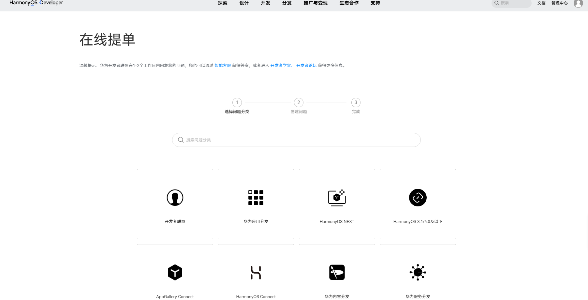
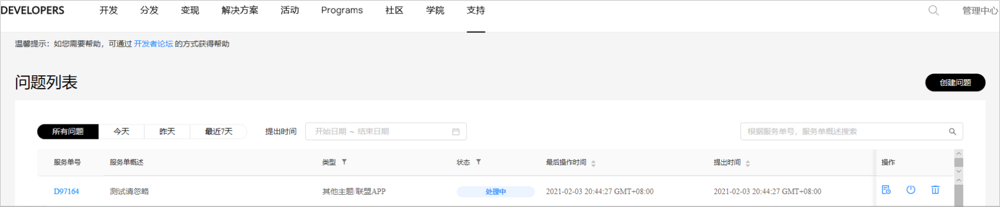
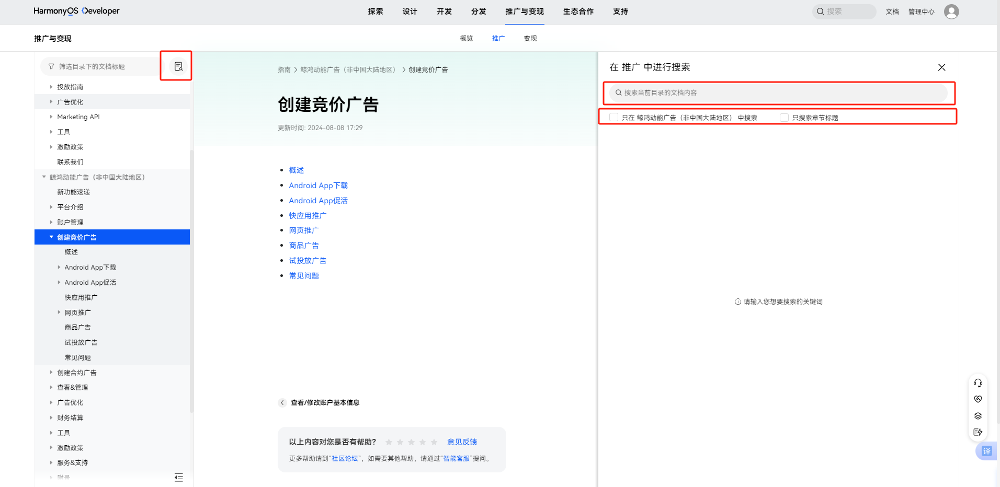

# 客服支持

若文档内容未解决您的问题，您可以通过下述方式反馈问题给我们的客服团队。

## 智能客服

智能客服为您提供7\*24小时在线咨询服务，无论是广告投放前还是广告投放后，遇到任何问题均可联系[智能客服](https://smartrobot-drcn.platform.dbankcloud.cn/?appId=31001)，我们会即刻响应为您解答处理。

## 在线提单

1. 在线提单。

   在“[在线提单](https://developer.huawei.com/consumer/cn/support/feedback/#/)”页面，依次输入服务类型,问题类型<strong>，</strong>概述和问题描述，并提交。

   
2. 查看结果。

   问题提交后，您可以在此页面上单击进入“进入问题列表”查看问题的状态及反馈结果。

   

   同时系统也会给您的[联系人邮箱](https://developer.huawei.com/consumer/cn/doc/promotion/register-0000001052264353#ZH-CN_TOPIC_0000001052264353__li4641112612506)发送邮件通知，您可以打开邮件中的链接查看问题的状态及反馈结果。

## 文档搜索

如何在文档中搜索到自己想要的内容？请按照下述步骤操作。

1. 在浏览器中打开任意一个鲸鸿动能广告文档。
2. 单击左上角搜索框后弹出搜索专栏，在搜索框中输入要查找的内容，支持模糊搜索。
   - 搜索框展示后，默认展示您所在的文档的所有相关内容，同时您也可以选择只在本手册中搜索内容或只搜索章节标题。
   - 若您不小心关闭搜索框，再次点开搜索框，系统会保留您上次的搜索记录。

## 文档内容在线反馈

如果您对文档内容有一些优化建议，您可以选中文字后单击“”，通过意见反馈提交给我们，我们收到您的优化建议后会尽快修改，提升您的文档使用感受。
