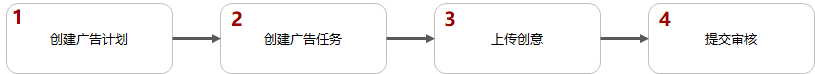
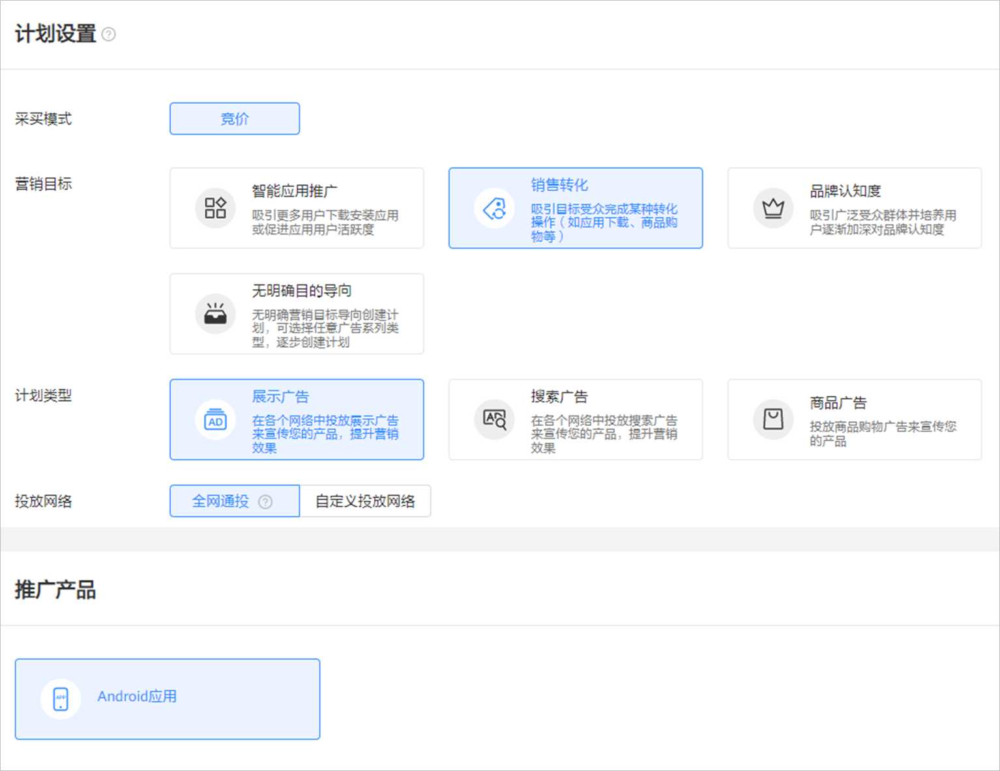
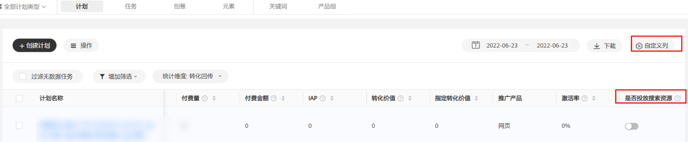
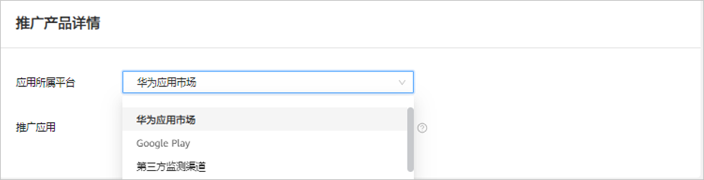
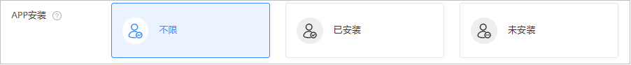
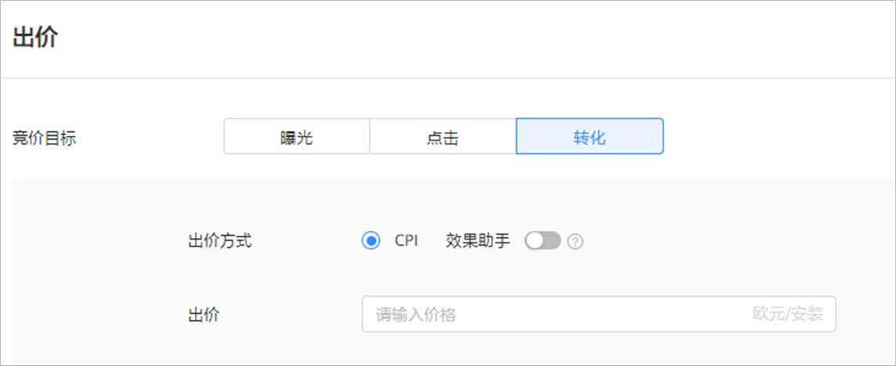
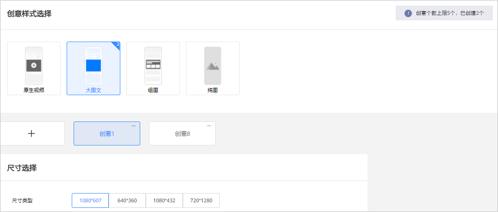
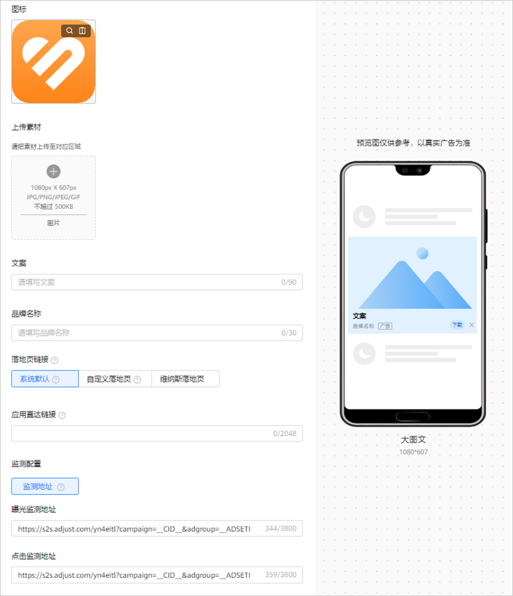
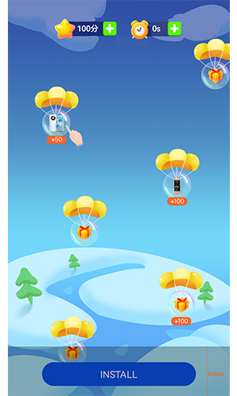
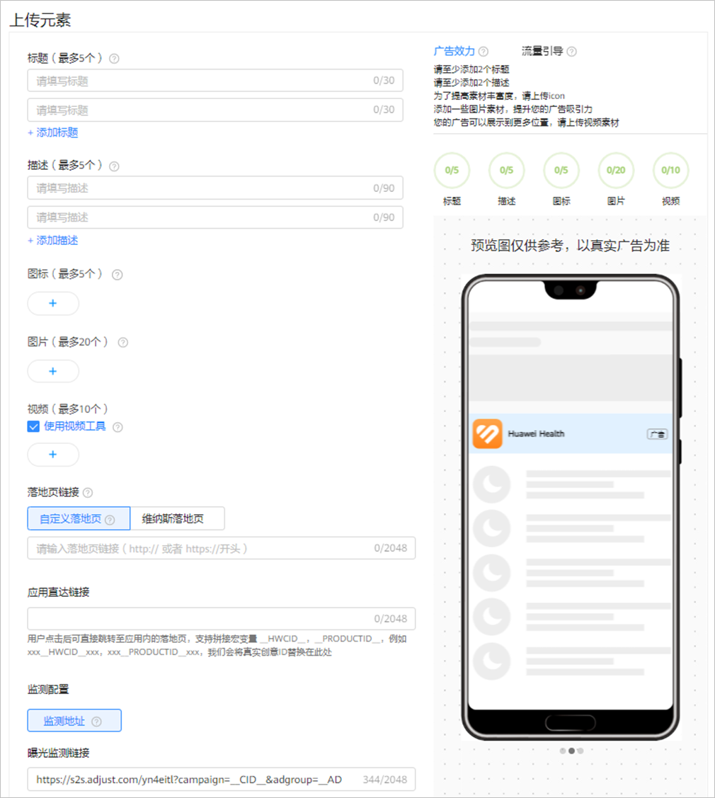

# 创建展示应用广告

## 概述

展示应用广告是指在[展示广告网络的资源上](/docs/monetize/promotion/display-0000001057113500)对您的应用进行推广，您可以自由选择在哪些展示广告网络版位上推广您的应用，您可以控制各个广告素材的组合方式和定向条件等。您也可以选择自动版位，您只需要添加元素，系统会根据您提供的图片、视频等素材，为您自动生成多个版位的创意，系统自动为您选择效果较佳的位置进行展示广告。

 

- 如果您想推广非华为应用市场的应用，需要申请[业务通行名单](/docs/monetize/promotion/addtongxing-0000001128278195#ZH-CN_TOPIC_0000001128278195__li58021033171912)。
- 如果您想使用自动版位，需要申请[特性通行名单](/docs/monetize/promotion/addtongxing-0000001128278195#ZH-CN_TOPIC_0000001128278195__li18901039122518)。

## 操作流程



## 操作步骤

1. 创建广告计划。

   单击，选择“创建计划”。

   

   - <strong>营销目标：</strong>选择“销售转化”或者“无明确目的导向”，详情参考[营销目标](/docs/monetize/promotion/overview-cjjjgg-0000001182873508#ZH-CN_TOPIC_0000001182873508__zh-cn_topic_0000001205953939_zh-cn_topic_0000001105216776_li07111843183611)。
   - <strong>计划类型：</strong>选择“展示广告”，详情参考[计划类型](/docs/monetize/promotion/overview-cjjjgg-0000001182873508#ZH-CN_TOPIC_0000001182873508__zh-cn_topic_0000001205953939_zh-cn_topic_0000001105216776_li234211653411)。
   - <strong>投放网络：</strong>选择<strong>“</strong>全网通投”或者“自定义投放网络-展示广告网络”，详情参考[投放网络](/docs/monetize/promotion/overview-cjjjgg-0000001182873508#ZH-CN_TOPIC_0000001182873508__zh-cn_topic_0000001205953939_zh-cn_topic_0000001105216776_li93421166342)<strong>。</strong>
     - 当您选择“全网通投”时，如果您想将广告同时投放在应用市场，此时您需要选择出价为CPI，且创意必须包含160\*160尺寸的创意。如果您选择其他出价模式，则广告只会同时投放在展示广告网络资源。

      

     如果您不想将广告同时投放到应用市场，您可以在创建完广告后，单击“推广”-&gt;”计划”，在右上角的自定义列中，勾选“是否投放应用市场”，进行关闭操作。

     
   - <strong>推广产品：</strong>选择<strong>“</strong>Android应用<strong>”</strong>，详情参考[推广产品](/docs/monetize/promotion/overview-cjjjgg-0000001182873508#ZH-CN_TOPIC_0000001182873508__zh-cn_topic_0000001205953939_zh-cn_topic_0000001105216776_li8342416193416)<strong>。</strong>
   - <strong>计划日预算：</strong>详情参考[计划日预算](/docs/monetize/promotion/overview-cjjjgg-0000001182873508#ZH-CN_TOPIC_0000001182873508__zh-cn_topic_0000001205953939_zh-cn_topic_0000001105216776_li14342141615342)。
   - <strong>推广计划名称：</strong>详情参考[推广计划名称](/docs/monetize/promotion/overview-cjjjgg-0000001182873508#ZH-CN_TOPIC_0000001182873508__zh-cn_topic_0000001205953939_zh-cn_topic_0000001105216776_li1434211615342)。
2. 创建广告任务。

   如果您希望在已有的计划下增加新的任务，请参考[已有计划下创建任务](/docs/monetize/promotion/overview-cjjjgg-0000001182873508#ZH-CN_TOPIC_0000001182873508__zh-cn_topic_0000001205953939_li5851143183912)。
   - <strong>广告投放类型</strong>：选择“正式投放”。如果您希望在正式投放之前对投放进行测试，您们可以创建[试投放](/docs/monetize/promotion/ads-adtest-0000001190031279)任务。
   - <strong>应用所属平台：</strong>如果您的应用在多个应用市场上架，推荐您使用“多平台智能推广<strong>”。</strong>用户下载方式请参考[应用管理](/docs/monetize/promotion/appmanagement-0000001182393586#ZH-CN_TOPIC_0000001182393586__table69041722122016)。

     

     - <strong>华为应用市场：</strong>从下拉列表中选择您想要推广的应用，或者手动输入应用ID/包名，应用ID可在华为应用市场应用详情页网页链接尾部获取，例：``https://appgallery.huawei.com/#/app/Cxxxxxxxxx``，请前往[华为应用市场](https://appgallery.huawei.com/#/Featured)查看。
     - <strong>GooglePlay：</strong>当您的应用仅在Google Play上架时，其任务计费方式不支持选择CPI。
       - 应用包名：输入推广应用包名，例如：com.huawei.appmarket，请确保应用包名与GooglePlay中包名一致，否则广告将无法正确投放。
       - 应用链接：系统根据您输入的应用包名自动生成推广应用链接。通过推广应用链接，用户看到您的广告后，可以点击跳转到GooglePlay上的应用详情页面。
       - 应用名称：输入推广应用名称，请确认该名称与在GooglePlay上架时所使用的名称一致，否则广告将无法正确投放。
       - 应用图标：上传您的应用图标。
     - <strong>多平台智能推广</strong>：从下拉列表中选择您想要推广的应用，如果您的应用不在下拉列表中，请到[应用管理](/docs/monetize/promotion/appmanagement-0000001182393586#展示广告网络-应用管理操作步骤)进行添加。

        

       如果您想推广多平台智能推广，需要申请[业务通行名单](/docs/monetize/promotion/addtongxing-0000001128278195#ZH-CN_TOPIC_0000001128278195__li14715365208)。

       当您的应用仅在Google Play上架时，创建和编辑多平台智能推广任务时，其任务计费方式不支持选择CPI。
     - <strong>其他安卓应用商店</strong>：输入应用包名，即可搜索应用。例如：com.huawei.appmarket，请确保应用包名与其他安卓应用商店中包名一致，否则广告将无法正确投放。
     - <strong>第三方监测渠道：</strong>
       - 应用包名：输入推广应用包名，例如：com.huawei.appmarket。请确认输入的应用包名与应用链接，均属于相关应用市场里的同一个应用。
       - 应用链接：输入来自第三方监测渠道AppsFlyer的可到达相关应用市场上的应用详情页面链接，例如：来自三方监测平台AppsFlyer创建的OneLink。
       - 应用名称：输入推广应用名称，请确认该名称与在相关应用市场上架时所使用的名称一致。
       - 应用图标：上传您的应用图标。
       - 定向应用市场：将用户定向到相关的应用市场上，因此选择应用市场之前，请确认该应用市场里有这个推广应用。
   - <strong>定向</strong>：详情参考[定向设置](/docs/monetize/promotion/targeting-0000001180547094)。此时您的应用安装需要选择“未安装”。

     当您的应用所属平台选择的是“多平台智能推广”时，您可以选择“不限”、“已安装”、“未安装”。

     

     - 不限：指的是您的广告可以投放给未安装您应用的用户和已安装您应用的用户。
     - 未安装：指的是您的广告想投放给未安装您应用的用户，提升下载，您可以在报表中的“下载”指标中查看数据。
     - 已安装：指的是您的广告想投放给已安装您应用的用户，进行应用促活，您需要对您想要跟踪的数据进行[转化跟踪](/docs/monetize/promotion/tracking-gaishu-0000001139892539)，例如：激活、付费等。您可以在报表中的“激活”或者“付费”等指标中查看数据。
   - <strong>版位</strong>：支持选择通用版位或自动版位。

     
     - 通用版位：您可以自由选择在哪些展示广告网络版位上推广您的应用，您可以控制各个广告素材的组合方式和定向条件等，详情参考[版位](/docs/monetize/promotion/overview-cjjjgg-0000001182873508#ZH-CN_TOPIC_0000001182873508__zh-cn_topic_0000001205953939_zh-cn_topic_0000001105216776_li1776203594114)。
     - 自动版位：自动版位表示系统自动为您选择效果较佳的位置进行展示广告，您只需要添加元素，系统会根据您提供的图片、视频等素材，为您自动生成多个版位的创意。

        

       自动版位不支持使用已有定向包功能。
   - <strong>投放日期：</strong>详情参考[投放日期](/docs/monetize/promotion/overview-cjjjgg-0000001182873508#ZH-CN_TOPIC_0000001182873508__zh-cn_topic_0000001205953939_li73789433254)。
   - <strong>投放时间：</strong>详情参考[投放时间](/docs/monetize/promotion/overview-cjjjgg-0000001182873508#ZH-CN_TOPIC_0000001182873508__zh-cn_topic_0000001205953939_li1237874310252)。
   - <strong>投放频次设置：</strong>您可以设置广告任务对用户的展示次数。例如：时长设置5，展示频次设置为10，则在5天的周期内此任务向一个用户展示不超过10次。

   
   - <strong>出价：</strong>版位不同，计费方式可能不同。

     CPI任务效果助手：为了提升CPI任务的用户激活率，出价方式为CPI时，您可以打开“效果助手”，可以提升CPI任务的整体效果，此时您CPI的实际扣费单价可能会高于您的CPI出价，但是不会超出预算。如果您需要使用此功能，您需要申请[特性通行名单](/docs/monetize/promotion/addtongxing-0000001128278195#ZH-CN_TOPIC_0000001128278195__li3661543162014)。
   - <strong>任务名称</strong>：详情参考[任务名称](/docs/monetize/promotion/overview-cjjjgg-0000001182873508#ZH-CN_TOPIC_0000001182873508__zh-cn_topic_0000001205953939_li237864312259)。
3. <strong>添加广告创意。</strong>
   - 当您版位选择通用版位时，根据您需要版位的不同，您需要先选择创意样式及尺寸，并添加对应的创意图片或视频、设置品牌名称和描述信息等，详情参见[素材指导](/docs/monetize/promotion/overview_ggsczd-0000001182713584)。

     
     - 同一任务下只能选一种创意样式，一种创意样式可以添加5条创意，每条创意支持独立的素材，且每条创意尺寸类型只能选一个，如果您想要添加所有的尺寸类型，那您需要为每个尺寸类型添加创意。

       例如：您创意样式选择了纯图，纯图包含了以下尺寸类型：1080\*607、640\*360、1080\*432、720\*1280，您在创意1中选择了1080\*432，那么您在创意2中可以选择1080\*607，创意3中选择640\*360。

       

       | 应用所属平台 | 落地页链接 | 应用直达链接 |
       | --- | --- | --- |
       | 华为应用市场 | 选填 | 必填 |
       | GooglePlay | 无需填写 | 无需填写 |
       | 多平台智能下载 | 选填 | 选填（当您的应用安装为不限时，此处为必填） |
       | 其他安卓应用商店 | 选填 | 必填 |
       | 第三方监测渠道 | 无需填写 | 无需填写 |
     - <strong>落地页链接</strong>：

       如果用户查看您广告并点击了下载时，当用户无法打开应用市场时，根据版位的不同，系统将自动跳转系统为您生成的落地页中或者跳转到您设置的落地页链接上。

       如果您的版位选择的是“自有媒体资源”、“三方媒体资源”时，系统将优先跳转到您设置的落地页链接上，如果您没有填写落地页，系统将自动跳转系统为您生成的落地页。

       如果您的版位选择的是“其他首选资源”中的SSP版位时，系统将自动跳转系统为您生成的落地页。

       - <strong>系统默认</strong>：如果您没有自己的落地页，系统可以为您自动生成落地页，您在投放前可以通过试投放来测试您的广告是否展示正常。
       - <strong>自定义落地页：</strong>填写自定义的HTTPS访问地址。例如：``https://ads.huawei.com/usermgtportal/home/index.html#/``。您可以在自定义落地页中添加宏参数，用来监测广告流量信息，区分用户来自哪个广告计划任务等，详情请参考[鲸鸿动能支持的宏参数](/docs/monetize/promotion/overview-cjjjgg-0000001182873508#ZH-CN_TOPIC_0000001182873508__li1775211574612)。
       - <strong>维纳斯落地页：</strong>您也可以选择维纳斯落地页，用户点击您的广告后，进入您在维纳斯创建的落地页，具体请查看[落地页工具](/docs/monetize/promotion/venus-0000001063299665)。
       - <strong>试玩落地页：</strong>

          

         如果您想投放试玩落地页，需要申请[业务通行名单](/docs/monetize/promotion/addtongxing-0000001128278195#ZH-CN_TOPIC_0000001128278195__li1683725811205)。

         您需要填写应用的试玩链接（ ```http://或者https://开`头`）`，用户点击您的广告后，可以优先试玩您的应用，试玩结束后，用户可以单击”下载“，下载您的应用。试玩落地页案例展示如下：

         

         试玩落地页制作要求：
         1. 试玩落地页不应使用mraid.js格式。
         2. 试玩落地页只能使用一个下载按钮，默认由系统自动提供下载按钮，如果您不想用系统提供的下载按钮，您可以自行在试玩落地页中添加下载按钮，请通过[在线提单](https://developer.huawei.com/consumer/cn/support/feedback/#/)联系鲸鸿动能广告平台为您开通此功能。
         3. 试玩落地页中除下载按钮外，其他部分不得放置其他URL， 例如：用户随意点击页面就跳转到应用市场详情页的onelink URL。
         4. 试玩落地的关闭按钮由鲸鸿动能广告平台自动添加，您无法自己添加关闭按钮。
         5. 您需自主添加加载条，若不加，当用户网络有问题时，试玩落地页会出现白屏现象。
         6. 您提供的试玩落地页应适配不同型号的手机。
         7. 试玩落地页应为纵向模式。
         8. 试玩落地页素材制作安全区如图所示：

            
     - <strong>应用直达链接</strong> <strong>：</strong>
       - 普通应用直达链接：用户点击广告后，打开即到达指定页面，如果您想获取应用首页，获取方式请参考<strong>[应用直达链接获取工具](/docs/monetize/promotion/overview-cjjjgg-0000001182873508#应用直达链接获取工具)；</strong>如果您想获取应用直达链接的指定页面，请联系您的研发同事获取。您可以在Deeplink链接中添加宏参数，用来监测广告流量信息，区分用户来自哪个广告计划任务等，详情请参考[鲸鸿动能广告支持的宏参数](/docs/monetize/promotion/overview-cjjjgg-0000001182873508#ZH-CN_TOPIC_0000001182873508__li1775211574612)。
       - 延迟深度链接：用户点击广告后，若用户没有下载应用则拉起应用市场下载，下载激活后，用户打开即到达指定页面，如果用户下载完应用后，当时没有立即打开应用，那么当他下一次第一次打开应用时则打开您上一次推广的应用直达链接页面。如果您想使用延迟深度链接功能，您需要完成以下步骤：
         1. 链接生成：您需要将自己生成的应用直达链接填入创意中。
         2. 延迟深度链接：需要集成com.huawei.hms:ads-installreferrer: 3.4.56.300，详情可参考[DeeplinkClient](https://developer.huawei.com/consumer/cn/doc/development/HMSCore-References/deeplinkclient-0000001361239353)。
         3. 开发：
            - 如果您使用华为分析进行转化跟踪，您需要将华为分析SDK版本升级到6.8.0以上（包含6.8.0）。
            - 如果您未使用华为分析进行转化跟踪，您需要按照此文档[广告服务API](/docs/monetize/promotion/attachments-0000001532611905#ZH-CN_TOPIC_0000001532611905__li19257226201617)操作。
     - <strong>监测地址（选填）</strong>：如果您使用三方监测进行转化跟踪，请先完成[三方监测](/docs/monetize/promotion/tracking-overview-0000001170938773)的对应操作，完成后在您创建任务的时候，系统将会自动关联监测地址（关联出来的链接建议不要修改，避免影响跟踪数据）。如果您修改了关联分析工具中的监测链接，系统将会自动同步到任务，任务中无需修改。
       - 自定义参数：创建oCPC广告创意时，您可以在监测地址后面添加自定义参数，应用于监测不同渠道转化等功能。使用前您必须保证增加了自定义参数的监测地址可以正常访问。单击“+”可添加1-10个自定义参数。

          

         每个监测地址必须包含以下5个参数，且自定义参数不允许修改这5个参数：\_\_OAID1\_\_、\_\_CALLBACK\_URL\_\_、\_\_CID\_\_、\_\_CALLBACK\_\_、\_\_AAID1\_\_。

         - 举例：自定义参数为：source=hw，监测地址链接为：``https://www.huawei.com``，添加后的监测地址为：``https://www.huawei.com&source=hw``。
         - 自定义参数包含以下功能：
           - <strong>宏替换：</strong>替换曝光/点击监测链接的宏参数，详情可参考[鲸鸿动能广告支持的宏参数](/docs/monetize/promotion/overview-cjjjgg-0000001182873508#ZH-CN_TOPIC_0000001182873508__li1775211574612)。
           - <strong>覆盖：</strong>如果原来监测链接中已有参数，您自己添加了相同的自定义参数，系统会将原来参数的值覆盖为新的参数值。例如：原来监测链接为``https://www.huawei.com?utm\_source=huawei``，您配置了自定义参数utm\_source=efg。新下发的监测链接应当为``https://www.huawei.com?utm\_source=efg``。
   - 当您版位选择自动版位时，您需要设置<strong>标题和描述等</strong>，系统会根据您提供的图片、视频等素材，为您自动生成合适的创意。

     

     - <strong>标题</strong>：可以设置2-5条，标题可以提升您的广告的吸引力，请确保您的标题能够独立成文，可与任何其他素材资源搭配使用。
     - <strong>描述：</strong>可以设置2-5条，描述可以增加用户与您的广告的互动，请确保您的描述能够独立成文，可与任何其他素材资源搭配使用。
     - <strong>图标：</strong>如果您想要增加应用图标的丰富度，您可以在此处添加与您应用相关的图标，系统将会在此处添加的图标与您在应用市场的图标中选择优质的进行展示，可以上传5个。

        

       应用图标不得上传您在应用市场上架的应用图标。
     - <strong>图片</strong>：为了保证效果，图片素材建议不要加文字，同时为了广告能够获取更多展示机会，建议您上传尽可能多的尺寸图片，可以添加20张：

       图片类型：JPG, PNG, JPEG。

       图片文件大小：500 KB以内。

       图片尺寸：为了保证您的广告覆盖率以及广告美观度，建议您上传的图片素材包含如下尺寸：160\*160、225\*150（单图）、225\*150（多图）、320\*50、728\*90、720\*1280、1080\*1620、1080\*1920、1920\*1080。

        

       225 \* 150（多图）需要同时添加 3 张 225 \* 150 图片。
     - <strong>视频：</strong>为了保证您的广告覆盖率以及广告美观度，建议您上传的视频素材包含下表尺寸，可以添加10个。

       视频类型：MP4

       视频文件大小：30MB以内

       视频尺寸（对应时长）：

       | <strong>广告样式</strong> | 视频尺寸 | 视频对应时长s（自己制作的视频） |
       | --- | --- | --- |
       | 开屏 | 1280\*720 | 3-5s |
       | 720\*1280 | 5s |
       | 激励视频 | 720\*1280 | 15-30s |
       | 640\*360 | 15-30s |
       | 插屏 | 720\*1080 | 15s |
       | 640\*360 | 15s |
       | 1280\*720 | 15-60s |
       | 720\*1280 | 15s |
       | 原生 | 640\*360 | 6-60s |
       | 1280\*720 | 5-60s |
       | 视频贴片 | 640\*360 | 30s |
     - <strong>落地页链接</strong>：落地页是您想要推广内容的信息承载页面，用户点击广告创意时，会优先打开落地页，再进行下载安装。您可以选择自定义落地页或者选择维纳斯落地页。如果您不填写落地页链接，平台会智能帮您生成一个落地页。
       - <strong>自定义落地页：</strong>填写自定义的HTTPS访问地址。例如：``https://ads.huawei.com/usermgtportal/home/index.html#/``。
       - <strong>维纳斯落地页：</strong>您也可以选择维纳斯落地页，用户点击您的广告后，进入您在维纳斯创建的落地页，具体请查看[落地页工具](/docs/monetize/promotion/venus-0000001063299665#概述)。
     - <strong>应用直达链接</strong> <strong>（选填）</strong>：
       - 普通应用直达链接：用户点击后可直接跳转至应用内的详情页。如果您想获取应用首页，获取方式请参考<strong>[应用直达链接获取工具](/docs/monetize/promotion/overview-cjjjgg-0000001182873508#应用直达链接获取工具)；</strong>如果您想获取应用直达链接的指定页面，请联系您的研发同事获取。
       - 延迟深度链接：用户点击广告后，若用户没有下载应用则拉起应用市场下载，下载激活后，用户打开即到达指定页面，如果用户下载完应用后，当时没有立即打开应用，那么当他下一次第一次打开应用时则打开您上一次推广的应用直达链接页面。如果您想使用延迟深度链接功能，您需要完成以下步骤：
         1. 链接生成：您需要将自己生成的应用直达链接填入创意中。
         2. 延迟深度链接：需要集成com.huawei.hms:ads-installreferrer: 3.4.56.300，详情可参考[DeeplinkClient](https://developer.huawei.com/consumer/cn/doc/development/HMSCore-References/deeplinkclient-0000001361239353)。
         3. 开发：
            - 如果您使用华为分析进行转化跟踪，您需要将华为分析SDK版本升级到6.8.0以上（包含6.8.0）。
            - 如果您未使用华为分析进行转化跟踪，您需要按照此文档[广告服务API](/docs/monetize/promotion/attachments-0000001532611905#ZH-CN_TOPIC_0000001532611905__li19257226201617)操作。
     - <strong>监测地址（选填）：</strong>如果您使用三方监测进行后期转化数据的跟踪，请先完成[三方监测](/docs/monetize/promotion/tracking-overview-0000001170938773)的对应操作，完成后系统自动关联监测地址到任务（关联出来的链接不要修改，避免影响数据跟踪）。如果您修改了关联分析工具中的监测链接，系统将会自动同步到任务，任务中无需修改。
       - 自定义参数：创建oCPC广告创意时，您可以在监测地址后面添加自定义参数，应用于监测不同渠道转化等功能。使用前您必须保证增加了自定义参数的监测地址可以正常访问。单击“+”可添加1-10个自定义参数。

          

         每个监测地址必须包含以下5个参数，且自定义参数不允许修改这5个参数：\_\_OAID1\_\_、\_\_CALLBACK\_URL\_\_、\_\_CID\_\_、\_\_CALLBACK\_\_、\_\_AAID1\_\_。

         - 举例：自定义参数为：source=hw，监测地址链接为：``https://www.huawei.com``，添加后的监测地址为：``https://www.huawei.com&source=hw``。
         - 自定义参数包含以下功能：
           - <strong>宏替换：</strong>替换曝光/点击监测链接的宏参数，详情可参考[鲸鸿动能广告支持的宏参数](/docs/monetize/promotion/overview-cjjjgg-0000001182873508#ZH-CN_TOPIC_0000001182873508__li1775211574612)。
           - <strong>覆盖：</strong>如果原来监测链接中已有参数，您自己添加了相同的自定义参数，系统会将原来参数的值覆盖为新的参数值。例如：原来监测链接为``https://www.huawei.com?utm\_source=huawei``，您配置了自定义参数utm\_source=efg。新下发的监测链接应当为``https://www.huawei.com?utm\_source=efg``。
     - <strong>广告效力</strong>：广告效力用来衡量您的广告的多样性。在添加素材资源时，您可以参考广告效力，丰富广告样式及相关性，提高您的转化效果。
     - <strong>流量引导：</strong>您可以重点添加/优化如下尺寸素材，系统会为您带来更好的投放效果：

       图片：1080\*607、1080\*170、1080×1620、1920×1080、1080\*1920。

       视频：640\*360、720\*1280、720×1080。
     - <strong>预览：</strong>创意支持实时预览，此处显示的预览效果仅为示例，并不包含所有可能展示的广告样式。请确保您提供的元素资源无论单独使用，还是组合使用均不违反[审核要求](/docs/monetize/promotion/review-0000001052064324)。
   - <strong>创意名称：</strong>详情参考[创意名称](/docs/monetize/promotion/overview-cjjjgg-0000001182873508#ZH-CN_TOPIC_0000001182873508__zh-cn_topic_0000001205953939_zh-cn_topic_0000001105216776_li1471941495513)。
4. 提交审核。

   单击“提交”，审核通过后即可推广，审核时间、审核结果通知、审核结果查看请参考[广告审核](/docs/monetize/promotion/review-0000001052064324)。
