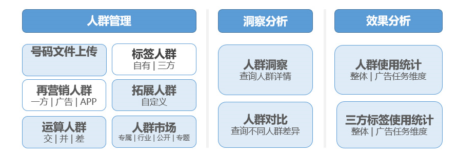

# 简介

## 功能简介

DMP(Data Management Platform)即数据管理平台，可以对多方数据进行整合归纳，精准描绘出人群画像，帮助广告主实现精准营销。

按照数据归属，可将用户数据分为如下三类（数据均需在满足国家法律法规及监管政策、确保信息安全及用户隐私的前提下采集）：

- 第一方数据：需求方即广告主自有用户数据，包括网站/App监测数据、 CRM数据、电商交易数据等。
- 第二方数据：需求方服务提供者/平台采集的相关数据，包括在广告投放过程中积累的浏览、点击等业务相关数据。
- 第三方数据：三方合作平台拥有的数据，如运营商数据等。

DMP平台当前支持的能力有：

<strong>人群管理：</strong>海量、精细标签和丰富的再营销人群，支持人群拓展、组合运算等，全方位保障精准触达用户。

<strong>洞察分析：</strong>提供丰富的画像维度，精准洞悉人群、辅助定向选择，不同人群包之间可对比分析，通过分析用户行为，定位精准人群，提高广告转化率,支持基于TGI洞察结果创建标签人群。

 

TGI指数= [目标群体中具有某一特征的群体所占比例/总体中具有相同特征的群体所占比例]\*标准数100。

<strong>效果分析：</strong>数据可细化至广告任务维度，通过数据分析持续优化广告任务，人群包、三方标签数据独立展现，反推优质标签拓展使用，提高定向精准度。选择统计时间跨度和人群包后，可查看以下四种维度的统计数据。

- 人群使用统计：统计使用了该人群包的投放的总曝光、总点击、平均点击率、平均转化率等各项转化数据和转化成本。
- 三方细分受众人群使用统计：统计该人群包所使用的三方标签的所属平台、花费，以及收益投放的总曝光、总点击、总下载、总激活、平均点击率、平均转化率等各项转化数据。
- 广告明细：统计使用了该人群包的各个广告任务的投放状态、花费、曝光、点击、下载、激活等各项转化数据以及转化成本。
- 广告中的三方细分受众人群明细：统计该人群包所使用的三方标签，在各个收益投放任务中的花费、曝光、点击、下载、激活、点击率、转化率等各项转化数据。

