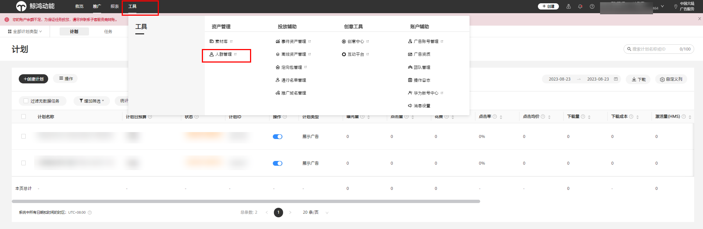
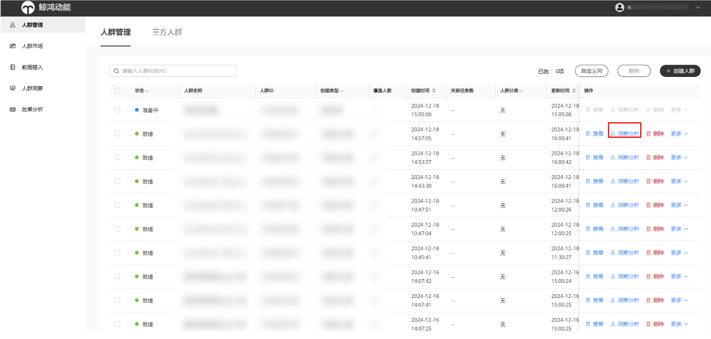
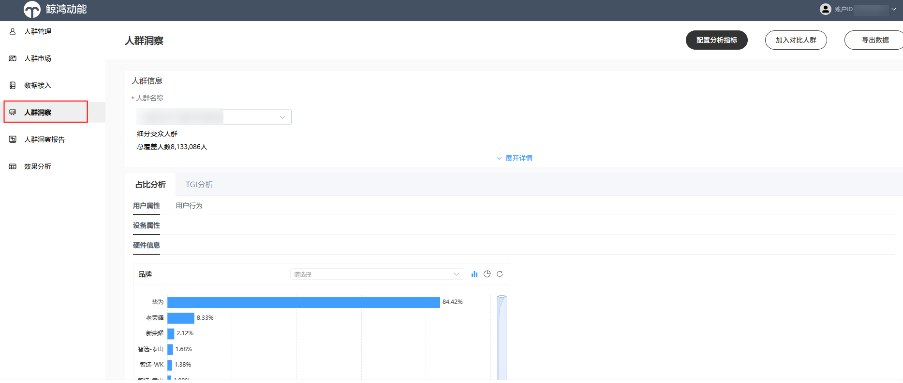
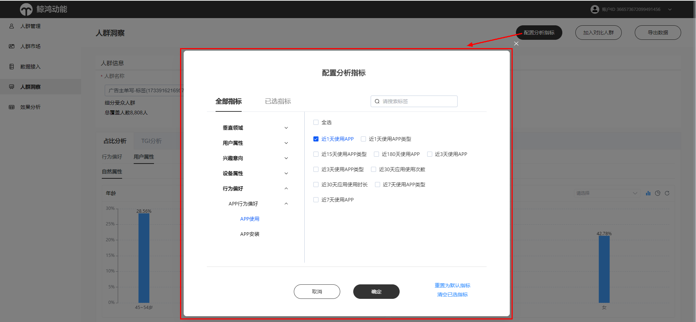
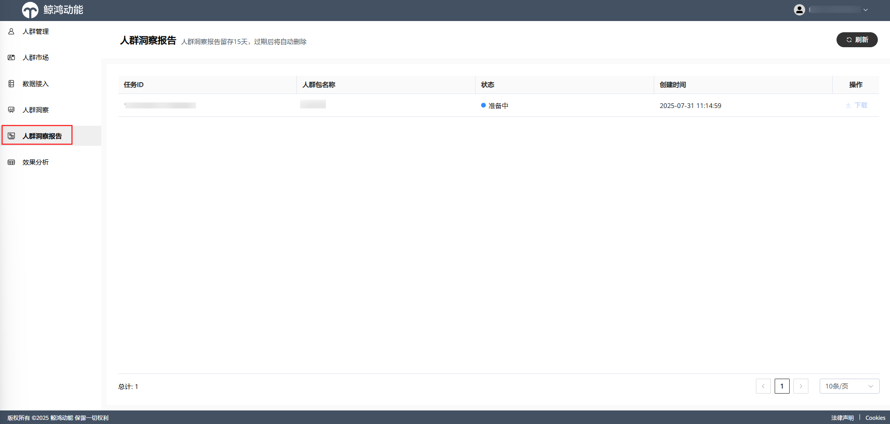
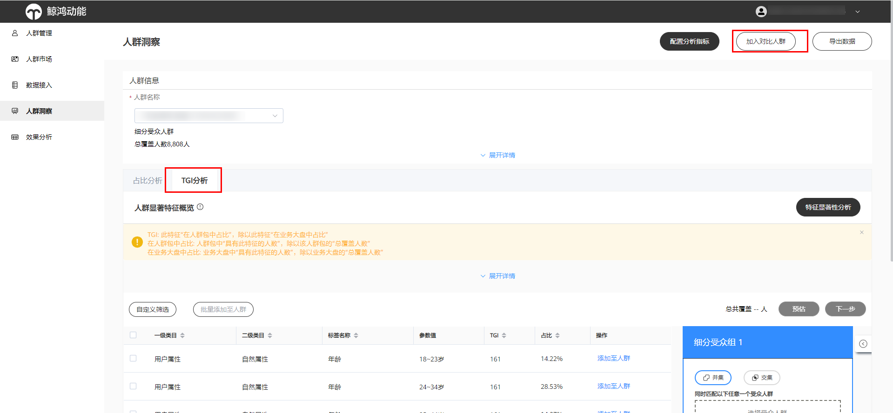
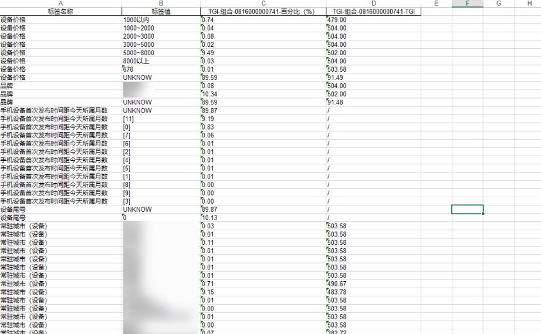
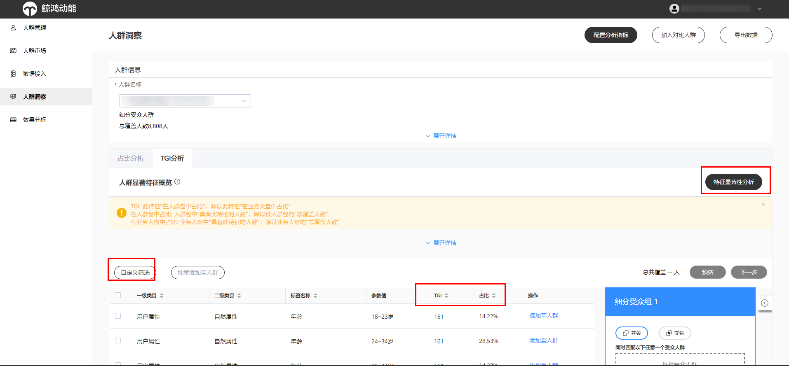

# 人群自动化洞察

## 功能简介

洞察分析可以帮助客户更加全面地了解人群的属性、兴趣分类、关注点及地域特点等的特征分布情况，通过这些特征可以用来优化广告创意，指导营销策略，为进一步投放提供参考依据。客户对人群的洞察越清晰，越能准确地传达推广信息，提升投放效果。

- 支持在线实时洞察分析。
- 支持基于TGI洞察结果创建标签人群。
- 支持导出数据、配置分析指标、加入对比人群。
- 支持TGI特征显著性分析，度量当前人群和大盘全量人群在不同属性上的差异大小，精准识别人群的显著特征。
- 可最多支持两个人群对比。

## 操作步骤

<strong>功能入口：</strong>通过“工具”，单击进入“人群管理”操作界面。

### 查看画像

1. <strong>查看画像的两种方式</strong>

    

   人群包状态为“就绪”时，才可查看洞察离线任务。

   - 第一种：人群列表-&gt;选择对应的人群包-&gt;洞察分析。

   

   - 第二种：人群洞察-&gt;选择对应的人群包。

   
2. <strong>配置洞察维度：</strong>广告主可以根据需求添加各种分析指标维度。

   

    

   1. 系统默认展示固定的20+维度，用户可自定义展示维度，添加/减少任意维度。
   2. 部分维度的画像需实时生成，等待时间较长。
   3. 人群对比：TGI只展示主人群的结果。
3. <strong>查看结果</strong> <strong>/导出结果：</strong>群画像生成后，可以查看和导出结果，导出结果可在人群洞察报告页面查看，洞察结果保留15天。

   

   

   

    

   1. 人群画像结果有两个分析维度：
      - 占比分析：按标签维度查看人群包画像分布
      - TGI分析：按标签维度查看人群包显著特征
   2. 画像分析结果可以导出Excel，如上图：

      主要字段为：标签-标签参数值-占比值-TGI值
   3. TGI分析：部分参数值的TGI值需要在特征显著性分析中配置后实时计算生成，需等待时间较长。
   4. TGI表格支持按TGI值/占比值过滤和排序。
4. <strong>生成人群</strong>：支持基于TGI洞察结果生成人群包。

   可以选择目标标签值添加至人群，在右方编辑人群规则，并生成人群包。

   
