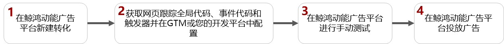
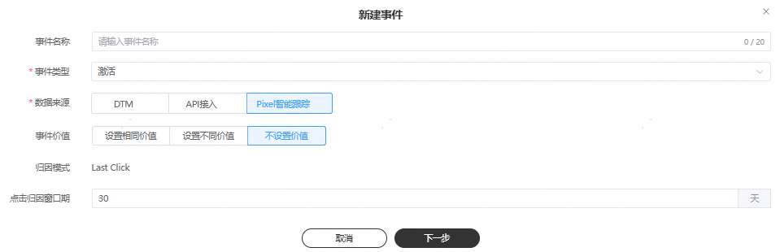
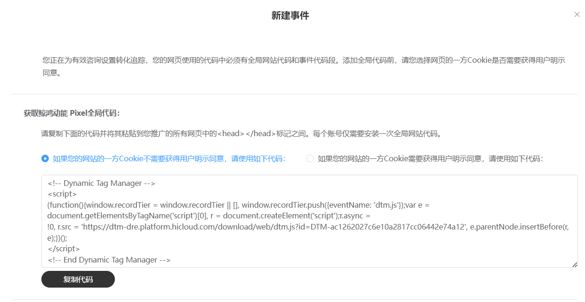
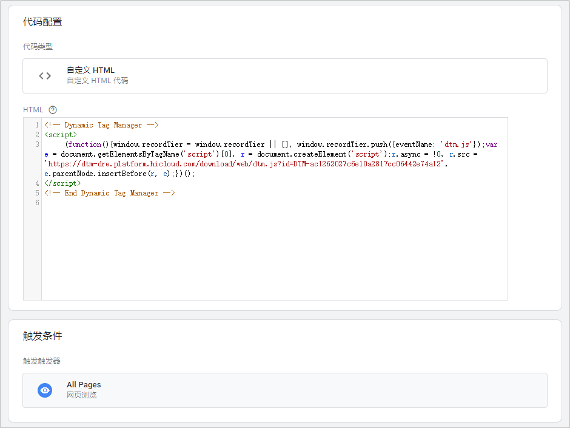
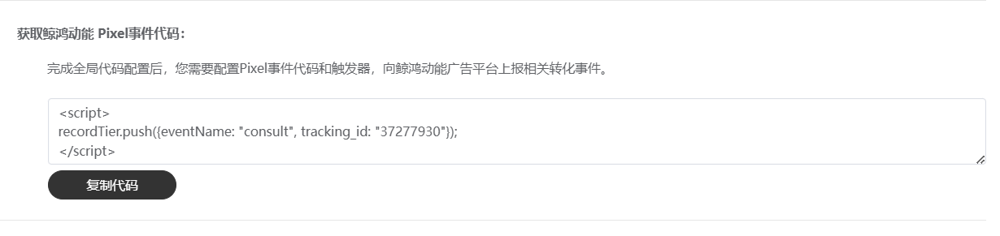
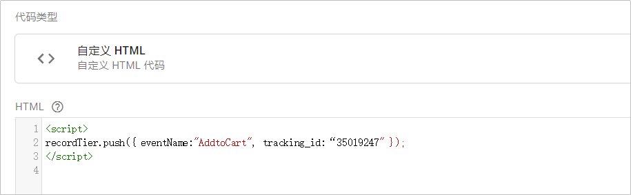
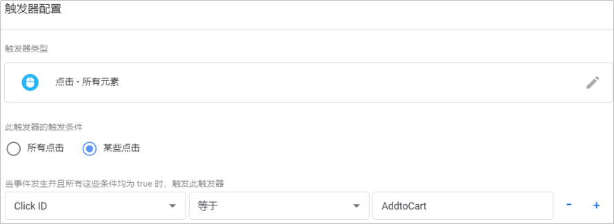

# Pixel智能跟踪

## 概述

Pixel智能跟踪是一段 JavaScript 代码，可让您在自己的网页上追踪访客活动。它的工作原理是加载一个小型函数库，能让您在网页访客执行操作（即事件）时使用该库进行追踪（即转化），您可以使用 Google 跟踪代码管理器(Google Tag Manager，以下简称GTM)或者您自己的开发平台来管理Pixel。所追踪到的转化数据会显示在 鲸鸿动能广告平台数据报表中，您可用这些转化来衡量广告效果。

## 操作流程

## 操作步骤

1. 在鲸鸿动能广告平台新建转化。

   对每一个您希望回传和统计的转化指标，需要都在此创建跟踪，只有成功添加的转化，鲸鸿动能广告平台在收到转化数据后才会统计到报表里。
   1. 单击“工具”-&gt;“事件资产管理”-&gt;“新建网页资产”-&gt;“新建事件”，选择“Pixel智能跟踪”。
   2. 设置事件信息。

      
      - <strong>事件类别：</strong>指的是您可以跟踪的转化动作，仅支持单选。如果您要添加多个转化动作，您可以创建多个线索跟踪进行跟踪，详情可参考[转化数据](/docs/monetize/promotion/tracking-shu-0000001139892541#ZH-CN_TOPIC_0000001139892541__table10838115914391)。
      - <strong>事件名称：</strong>设置一个清晰易懂的计划名称，转化名称仅用于转化列表管理且唯一，例如：线索+转化类别，设置完成后转化名称可编辑修改。
      - <strong>点击归因时间范围：</strong>点击归因时间7-30天（默认30天），指的是广告点击发生后，最长可以在多长时间内统计转化次数。初始归因时间为默认值，归因时间支持编辑，提交后不可修改。
      - <strong>转化价值：</strong>为转化指定价值可以衡量广告的影响力，币种随您广告账户的币种而定，此功能需要申请[通行名单](/docs/monetize/promotion/addtongxing-0000001128278195)。
        - 为每次转化使用相同的价值：如果您要跟踪潜在客户，建议输入每个潜在客户带来的平均价值。例如，如果您仅销售一种价格为 20 元的产品，请将价值指定为 20 元。这样，对于每笔销售，鲸鸿动能广告就会统计 20 元的价值。
        - 为每次转化使用不同的价值：您可以为某一种转化的不同产品指定不同价值。当您使用API回传时，转化事件将会回传不同的转化价值。如果您没有回传不同的转化价值，您可以输入默认价值，系统将以默认价值进行回传。
        - 不为此转化操作指定价值：对于大部分转化，不建议采用此选项，因为指定价值有助于您衡量广告的影响力，如果选择此选项，转化价值始终为0。

      <strong>归因模式：</strong>部分转化跟踪工具支持使用归因模式，例如Kochava、Airbridge等。在完成转化跟踪的过程中，用户可能会与您的多个广告进行互动。通过指定归因模式，您可以选择为每次广告互动分配多少转化功劳。

      <strong>首次点击：</strong>将转化功劳全部归于客户首次点击的那个广告。

      <strong>最终点击：</strong>将转化功劳全部归于客户最后点击的那个广告。
2. 获取网页跟踪全局代码、事件代码和触发器并在[GTM](https://tagmanager.google.com/)或您的开发平台中配置。

   完成创建转化后并单击”下一步”，您需要在GTM或您的开发平台中为待跟踪的网页添加网页跟踪全局代码、事件代码和触发器，向鲸鸿动能广告上报相关转化事件。

   1. 网页跟踪全局代码：

      

      每个账号仅需安装一次网页跟踪全局网站代码，添加网页跟踪全局代码前，您需要选择网页的一方Cookie是否需要获得用户明示同意，并单击”复制代码”，将复制的代码粘贴到您网站中每个网页的<head></head>标记之间。

      - 如果您选择了需要获得用户明示同意，Pixel默认不上报转化，您必须请按照如下操作，才会开始上传转化数据。
        - 用户同意cookie consent，需要在GTM或您的开发平台中调用如下接口开始采集数据：

          recordTier.push(\\{eventName: 'OnConsentChanged', report\_enable: true\\});
        - 用户拒绝cookie consent，需要在GTM或您的开发平台中调用如下接口，数据将无法上报：

          recordTier.push(\\{eventName: 'OnConsentChanged', report\_enable: false\\});
      - 如果您选择了不需要获得用户明示同意或者您已经在GTM中满足了关于Cookie明示同意的要求，则无需单独调用接口。

      获取到网页跟踪全局代码后，您需要在GTM或您的开发平台中填入网页跟踪全局代码：

      以GTM为例：选择“代码”-&gt;“新建”-&gt;“代码配置”-&gt;“自定义HTML”，填入全局代码，设置触发器为网页浏览。例如：

      
   2. 事件代码：

      

      添加完网页跟踪全局代码后，您需要将下面的代码粘贴到您想要推广的每个网页的<head></head>标记之间，事件代码自动填入eventName、tracking\_id。
      - eventName：与步骤一填写的[转化类别](#ZH-CN_TOPIC_0000001175770900__zh-cn_topic_0000001140151431_li15312205818216)一致。
      - tracking\_id：与创建完转化后获取到的转化ID一致。

      获取到事件代码后，您需要在GTM或您的开发平台中填入事件代码：

      以GTM为例：选择“代码”-&gt;“新建”-&gt;“代码配置”-&gt;“自定义HTML”。例如：

      
   3. 触发器：

      事件代码添加完成后，您需要根据您的网页配置情况设定触发器。

      以GTM为例：选择“代码”-&gt;“新建”-&gt;“代码配置”-&gt;“触发器”。例如：

      
3. 在鲸鸿动能广告平台进行[手动测试](/docs/monetize/promotion/manual-conversion-testing-0000001221434335#section476518108286)。
4. 在鲸鸿动能广告平台投放广告。

## 个性化功能

我们会为已集成Pixel的网站自动积累再营销名单，再营销可以帮助吸引之前访问过您网站的用户。对于不想看到个性化的用户，您可以选择禁止收集与他们有关的再营销数据。为此您可以使用‘allow\_personalized\_ad’参数。

此参数默认值为true，如果传入的参数值为false，那就会停止将该数据用于个性化广告。

 

如果您已经植入Pixel代码，您只需要按照以下示例修改现有代码即可。

此参数值不会停止转化跟踪。

<strong>注意：</strong>您在使用这段代码时建议使用动态值填充占位符（true/false），以下示例代码含义为所有转化数据默认不可用于个性化。

全局代码示例：

\

如果您需要在其他时机更改个性化配置，您可以使用如下接口：

- 当用户同意个性化广告调用：

window.recordTier.push('allow\_personalized\_ad', true)

- 当用户拒绝个性化广告调用：

window.recordTier.push('allow\_personalized\_ad', false)

## IAB TCF v2.0用户同意信息传递

Petal Ads已支持IAB TCF 2.0。Pixel转化跟踪代码支持获取标准的TC字符串，并且我们的广告产品能够解读字符串的内容然后调整自身行为。

如果要让Pixel代码读取TC字符串，您需要执行以下步骤来启用功能：

1. 您使用的是[TCF2.0CMP](https://iabeurope.eu/cmp-list/)
2. 确保您的网站使用的是Pixel代码
3. 在您的Pixel代码上添加TCF代码段

 

您需要在已植入Pixel代码的所有网页中添加下方这行代码段，以启用TCF2.0支持：

window.recordTier.push('enable\_tcf\_support', true);

代码示例：

\

Petal Ads 会根据如下方式处理从Pixel代码获取到的包含TC字符串的数据：

|  |  |  |  |
| --- | --- | --- | --- |
| <strong>目的</strong> | <strong>说明</strong> | 法律基础 | 未同意时的影响 |
| 1 | 在设备上存储和/或访问信息 | 用户同意 | Petal Ads将不会创建Cookie,也不会从广告主网站上获取任何数据。 |
| 3和4 | 创建和使用用于投放个性化广告的个人资料 | 用户同意 | 数据将不会用于个性化及再营销 |
| 7 | 衡量广告效果 | 用户同意 | Petal Ads将不会记录转化 |
| 9 | 开展市场调研以进行受众群体分析 | 用户同意 | Petal Ads将不会记录转化 |
| 10 | 开发和改进产品 | 用户同意 | Petal Ads将不会记录转化 |
