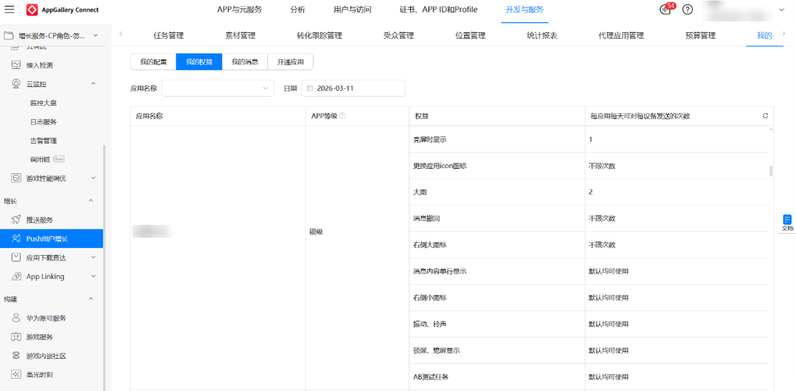

# 合作伙伴分级权益规则

<strong>该规则自发布之日起生效。</strong>

华为Push用户增长服务为合作伙伴提供各类基于推送服务的增值权益，助力合作伙伴应用用户增长。合作伙伴可以在投放平台查看账户内应用的分级权益。

查看方式：投放平台-我的-我的权益，查看应用等级与权益。

详细权益情况如下：

| 权益类型 | 权益内容 | 黑金级 | 钻石级 | 铂金级 | 金级 | 银级 | 说明 |
| --- | --- | --- | --- | --- | --- | --- | --- |
| 资源权益类 | 更换推送背景 | <strong>√</strong> | - | - | - | - | 黑金级客户每天可对每设备发送1条更换推送背景的通知。 |
| 更换标题颜色 | <strong>√</strong> | <strong>√</strong> | - | - | - | 钻石级及以上客户每天可对每设备发送1条更换标题颜色的通知。 |
| 消息不折叠 | <strong>√</strong> | <strong>√</strong> | <strong>√</strong> | <strong>√</strong> | <strong>√</strong> | 银级及以上客户每天可对每设备发送2条消息不折叠的通知，钻石级客户可发送4条，黑金级客户可发送5条。 |
| 下拉通知栏显示 | <strong>√</strong> | <strong>√</strong> | <strong>√</strong> | - | - | 银级及以上客户每天可对每设备发送2条下拉通知栏显示的通知，黑金级客户可发送3条。 |
| 更换应用icon图标 | <strong>√</strong> | <strong>√</strong> | <strong>√</strong> | <strong>√</strong> | <strong>√</strong> | 默认Push用户增长客户均可使用此权益。 |
| 消息内容单行显示 | <strong>√</strong> | <strong>√</strong> | <strong>√</strong> | <strong>√</strong> | <strong>√</strong> | 默认Push用户增长客户均可使用此权益。 |
| 右侧小图 | <strong>√</strong> | <strong>√</strong> | <strong>√</strong> | <strong>√</strong> | <strong>√</strong> | 默认Push用户增长客户均可使用此权益。 |
| 震动、铃声 | <strong>√</strong> | <strong>√</strong> | <strong>√</strong> | <strong>√</strong> | <strong>√</strong> | 默认Push用户增长客户均可使用此权益。 |
| 亮屏显示 | <strong>√</strong> | <strong>√</strong> | <strong>√</strong> | <strong>√</strong> | <strong>√</strong> | 银级及以上客户每天可对每设备发送1条亮屏展示的通知。 |
| 锁屏、息屏显示 | <strong>√</strong> | <strong>√</strong> | <strong>√</strong> | <strong>√</strong> | <strong>√</strong> | 默认Push用户增长客户均可使用此权益。 |
| AB测试 | <strong>√</strong> | <strong>√</strong> | <strong>√</strong> | <strong>√</strong> | <strong>√</strong> | 默认Push用户增长客户均可使用此权益。 |
| 新功能优先试用 | <strong>√</strong> | <strong>√</strong> | <strong>√</strong> | - | - | 铂金级及以上客户有机会参与产品新功能上线的测试邀请。 |
| 服务支撑类 | 专属客户代表 | <strong>√</strong> | - | - | - | - | 指定专属客户代表，负责商务工作对接；若连续2个月消耗没有达到黑金级标准，则取消专属客户代表服务。 |
| 投放分析报告 | <strong>√</strong> | <strong>√</strong> | - | - | - | 包括投放点击率情况分析、投放内容分析、投放策略优化等。 |
| 专属技术代表 | <strong>√</strong> | <strong>√</strong> | <strong>√</strong> | - | - | 指定专属技术代表，负责技术工作对接。 |
| 专属商业化运营代表 | <strong>√</strong> | <strong>√</strong> | <strong>√</strong> | <strong>√</strong> | - | 指定专属商业化运营代表，负责投放运营工作对接。 |
| 线上和线下交流会优先邀请 | <strong>√</strong> | <strong>√</strong> | <strong>√</strong> | <strong>√</strong> | - | 包含HDD、HDC、HMS Sparkle和HMS Core Discovery等活动主题分享。 |
| 企业参观交流活动优先邀请 | <strong>√</strong> | <strong>√</strong> | <strong>√</strong> | <strong>√</strong> | - | 包括且不限于华为总部参观交流活动。 |

如您想进一步了解以上权益或成为华为Push用户增长服务客户，请联系[pushservices@huawei.com](mailto:pushservices@huawei.com)。

 

- 每月15日前将根据应用上月消耗的流水配置相应等级权益，权益自配置上线之日起30天内有效；为满足应用对高级权益的测试使用场景，在有效期内，应用可以在对应等级权益上，申请更高一级别的权益体验试用2天，需至少提前5个工作日申请。
- 以上增值权益只针对单款应用进行匹配，同一账户下的多款应用的增值权益不能共享。（即当同一账户中有多款应用时，单款应用当月须满足相应等级条件才能享受对应的分级权益。）
