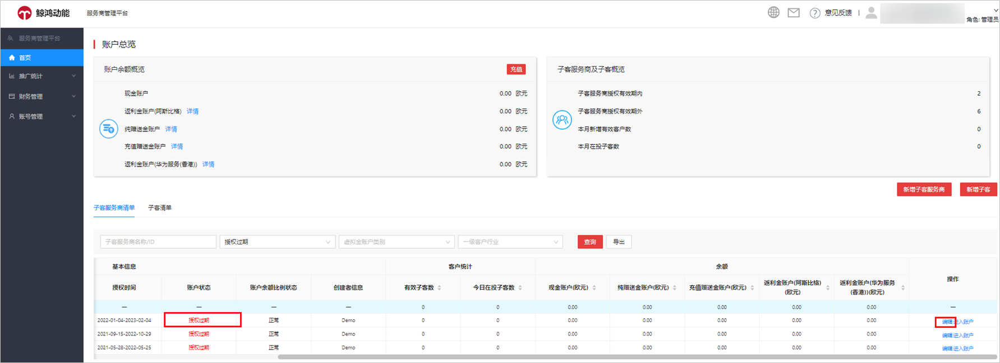
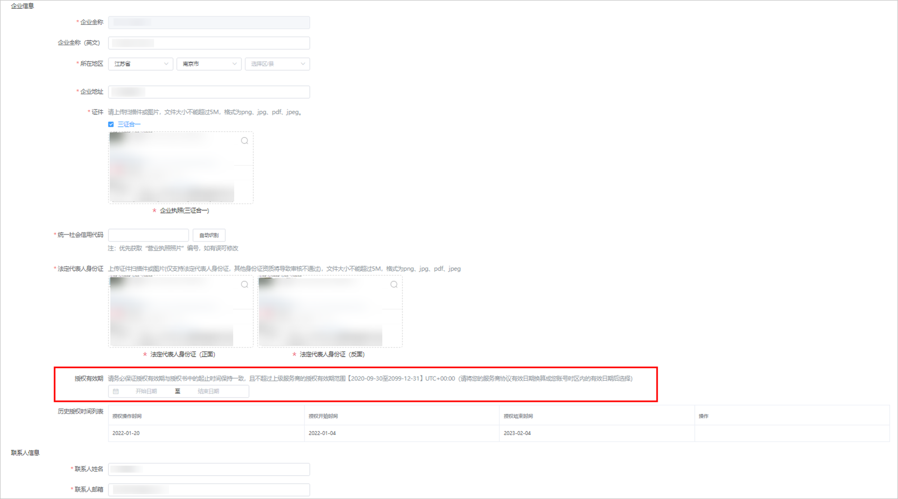
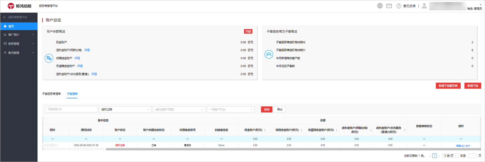
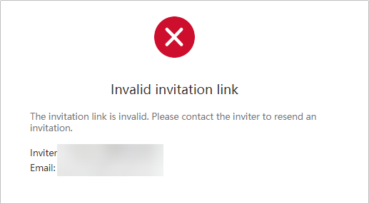

# 常见问题

1. <strong>服务商、子客服务商为什么不可以创建任务？</strong>

   服务商、子客服务商只有账户管理的权限，广告投放需要注册子客账户，子客可直接创建任务进行广告投放。
2. <strong>同一个企业可以同时注册服务商、子客服务商、子客吗？</strong>

   可以。但是需要注意，同一个邓白氏码不能用作多个账户的企业验证信息。如果在注册服务商账户的时候使用邓白氏码作为企业验证信息，在注册子客服务商和子客账户时需要使用营业执照作为企业验证信息。
3. <strong>使用同一个企业信息注册服务商和子客服务商，子客服务商签署授权书时Party A（甲方）Party B（乙方）分别对应什么？</strong>

   您好，Party A （甲方）为子客服务商，Party B（乙方）为服务商，当服务商和子客服务商为同一个企业时，授权书中的Party A（甲方）和Party B （乙方）可以一样。
4. <strong>服务商账户授权过期，该如何处理？</strong>

   如果服务商账户授权过期，请联系您的商务经理协助处理。若依旧无法解决，请通过[在线提单](https://developer.huawei.com/consumer/cn/support/feedback/#/)处理。
5. <strong>服务商页面中部分子客服务商账户显示授权过期</strong>，<strong>该如何处理？</strong>
   - 登录服务商账户，从服务商账户的子客服务商列表里面选择对应的子客服务商账户，单击“编辑”。

   

   - 进行资质信息补充或者重新设置授权期限后再单击“提交”。如果对应子客服务商账户的操作栏没有“编辑”，那么您需要登录子客服务商账户去完成注册。

   
6. <strong>子客服务商页面中部分子客账户显示授权过期，</strong> <strong>该如何处理？</strong>
   - 登录子客服务商账户，从子客服务商账户的子客列表里面选择对应的子客账户，单击“编辑”。

   

   - 进行资质信息补充修改或者重新设置授权期限后再单击“提交”。如果对应子客账户的操作栏没有“编辑”，那么您需要登录子客账户去完成注册。

   
7. <strong>子客服务商/子客收到链接之后单击链接时报错显示“邀请链接无效”，该如何处理？</strong>

   单击页面右上方下拉菜单的“<strong>退出</strong>”，退出当前的华为账号。使用谷歌或火狐浏览器重新打开邀请链接。

   
8. <strong>子客账户支持转移吗？</strong>

   子客服务商下的子客账户不支持转移。您需要使用未使用过的华为账号通过营业执照或邓白氏码在其他子客服务商下重新注册（因为邓白氏号码或营业执照只能使用一次），其中鲸鸿动能广告平台的投放历史数据仍然在原账户中。
9. <strong>子客服务商/子客授权过期后，是否支持更换上一级服务商？</strong>

   不支持。
10. <strong>如何申请开具形式发票？</strong>

    如果您尚未充值，需要在充值前申请开具发票支撑充值转账，您可以申请形式发票，形式发票不可替代正式发票，详情请参考[形式发票申请](/docs/monetize/promotion/invoice-0000001051704326#section14192310104117)。

     

    目前形式发票只支持注册地为非中国大陆区域的广告账户申请。
11. <strong>以前注册子客服务商/子客账户时，授权函是线下签署的，现在改成线上签署之后，要怎么签呢？</strong>

    使用注册子客服务商/子客账户的华为账号登录服务商管理平台/投放端后，按照提示签署授权函。

     

    如果子客账户使用了团队账户的功能，您可以授权给管理员签署协议，详情请参考[团队管理](/docs/monetize/promotion/addtuandui-0000001079312694#ZH-CN_TOPIC_0000001079312694__li16934182711012)。此点适用于问题11、13。
12. <strong>在注册子客服务商/子客账户时，授权函是在线上签署的，现在授权函到期了，如何进行延期呢？</strong>
    - 子客服务商：
      - 登录子客服务商账户，单击“账号管理”-&gt;“账户信息”，将授权时间延期并单击“提交”，无需重新审核。
      - 您需要联系服务商，让服务商登录服务商账户，从服务商账户的子客服务商列表里面选择对应的子客服务商账户，单击“编辑”，将授权时间延期并单击“提交”，无需重新审核。
    - 子客：
      - 登录子客账户，单击“工具”-&gt;“广告账号管理”，将授权时间延期并单击“提交”，无需重新审核。
      - 您需要联系服务商/子客服务商，让服务商/子客服务商登录他们账户，选择对应的子客账户，单击“编辑”，将授权时间延期并单击“提交”，无需重新审核。
13. <strong>在注册子客服务商/子客账户时，授权函是在线上签署的，现在授权函更新后，提示重签，如何签署呢？</strong>

    使用注册子客服务商/子客账户的华为账号登录服务商管理平台/投放端后，按照提示签署授权函。
14. <strong>服务商账户注册时，账户币种怎么选？</strong>

    您好，注册时选择的账户币种将用来您账户的充值币种及出价计费币种。鲸鸿动能广告平台目前支持的币种为：人民币、欧元、美元、日元和英镑。如果您充值币种和账户的币种不一致，可能会产生换汇费用。<strong>账户币种一经选择后无法更改</strong>。

    若您是注册地在德国、英国、爱尔兰、以色列、法国、意大利、西班牙、波兰、罗马尼亚、捷克、芬兰、土耳其、乌克兰，新加坡、马来西亚、泰国、印度尼西亚、中国香港、菲律宾、沙特阿拉伯、埃及、南非、墨西哥、智利、秘鲁和哥伦比亚的客户，币种的选择会影响您是否能使用线上充值功能。详情请参考：[服务商财务管理](/docs/monetize/promotion/finance-0000001058604140)。
15. <strong>鲸鸿动能广告有认证的服务商吗?</strong>

    如果您想查看非中国大陆地区业务已认证的服务商信息，点击[此链接页面](/docs/monetize/promotion/partnerinformation-0000001058393913)，语言选择英文或者俄文，选择“Partners”&gt;“Find a partner”进行查看。
16. <strong>子客账户账户间可不可以互相转账？</strong>

    不可以，子客账户只能由服务商为其充值。
17. <strong>服务商账户下可以增加多少个子客账户？</strong>

    服务商账户可添加子客账户的数量没有上限，具体详情请参考：[子客账户注册](/docs/monetize/promotion/addadvertiser-0000001059081952)
