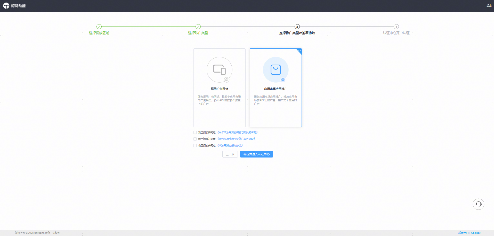
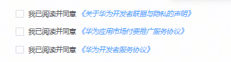
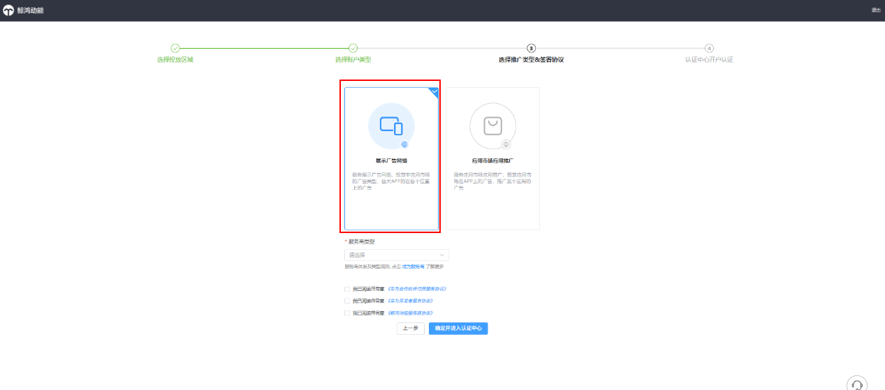

# 选择推广类型&签署协议

开通应用市场应用推广和鲸鸿动能广告的一级服务商所需要签署协议不同。

一个开发者账号，您只可以选择开通“应用市场应用推广”、“鲸鸿动能广告” 其中一个推广范围的一级服务商账户。

如您需分别开通鲸鸿动能广告和应用市场应用推广的一级服务商账号，需要分别注册开通。

## 开通应用市场应用推广一级服务商（客户投放伙伴主账户）

需要签署以下协议：

## 开通鲸鸿动能广告一级服务商

