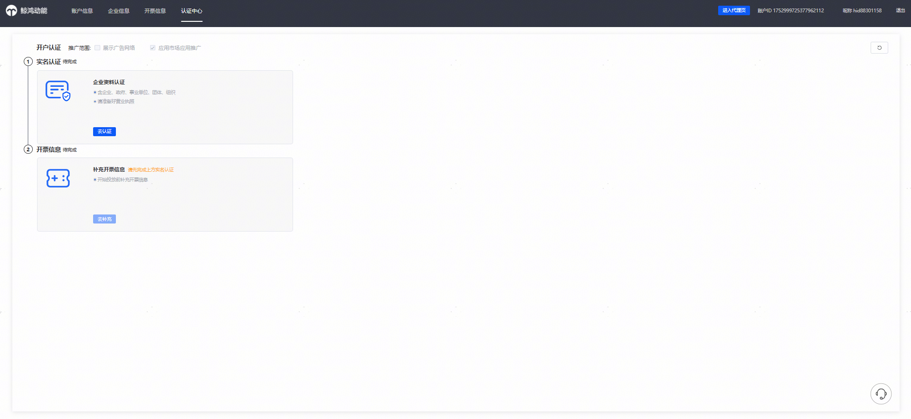
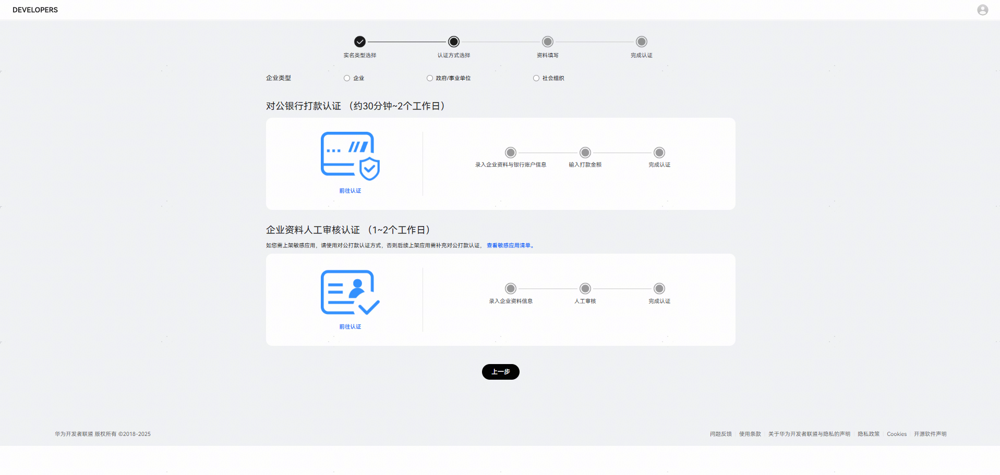
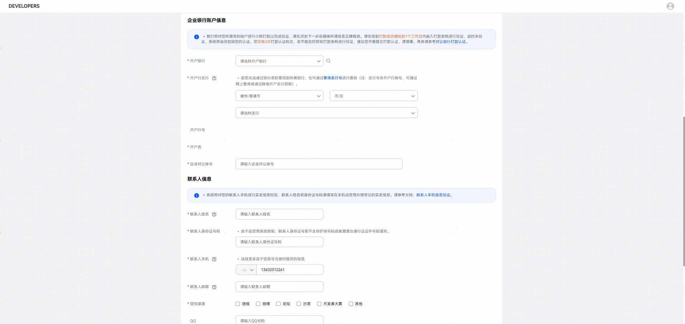
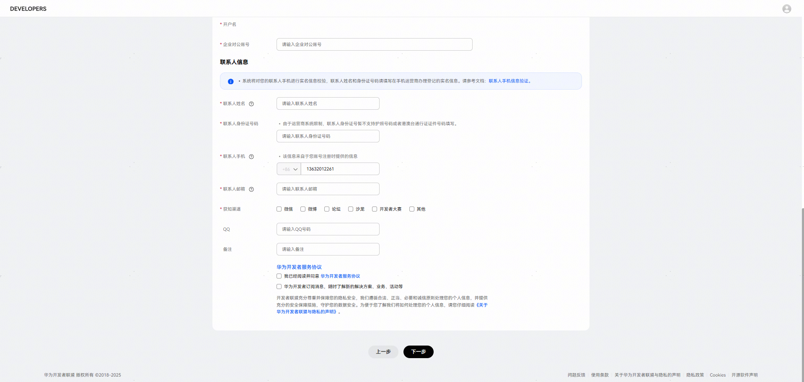
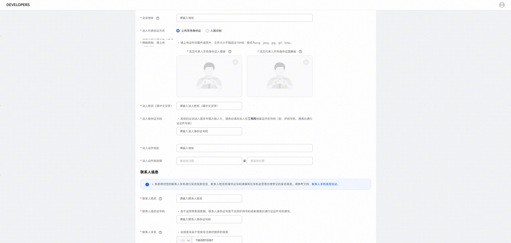
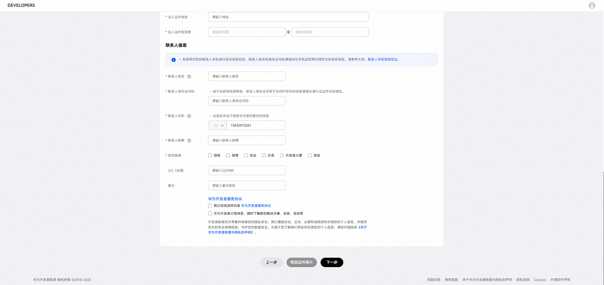
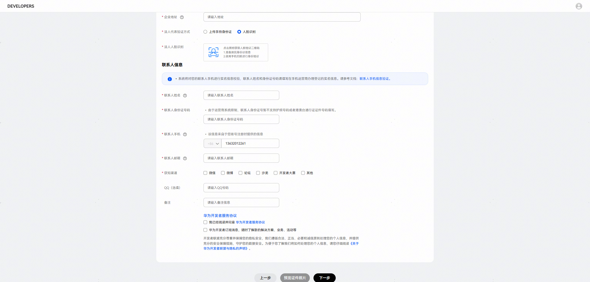
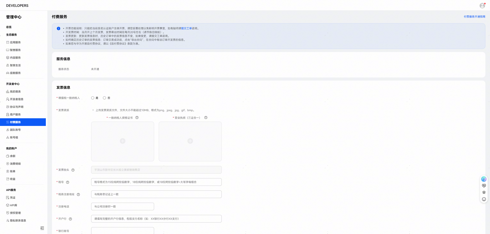

# 进入认证中心完成开户

以选择开通应用市场应用推广一级服务商为例，勾选完推广类型、签署协议后，您只需要在认证中心完成实名认证，并补充开票信息即可。

## 实名认证

点击【去认证】跳转华为开发者联盟进行实名认证。

1. 选择企业类型后，可通过对公银行打款认证或者企业资料人工审核认证完成实名认证。

   
2. 对公银行打款认证，操作步骤参考文档：[对公银行打款认证](https://developer.huawei.com/consumer/cn/doc/start/atpopb-0000001062836624)。

   

   

   
3. 企业资料人工审核认证，操作步骤参考文档：[企业资料人工审核认证](https://developer.huawei.com/consumer/cn/doc/start/mracoei-0000001062678404)。
   1. 上传手持身份证

      

      

      
   2. 人脸识别

      

      

## 开票处理

点击【去补充】，跳转开发者联盟开通付费服务，并补充发票信息。官网指导文档：[付费服务](https://developer.huawei.com/consumer/cn/doc/start/payment-service-0000001052865979)。

