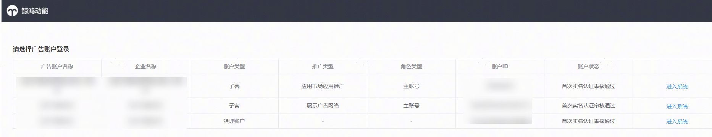
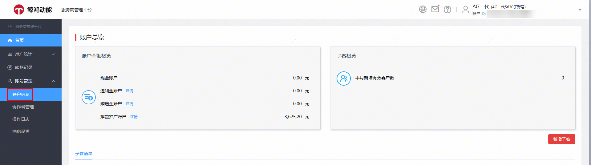
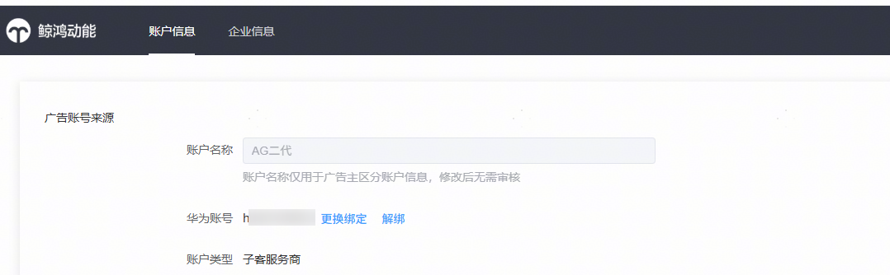
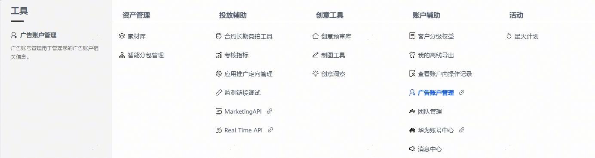
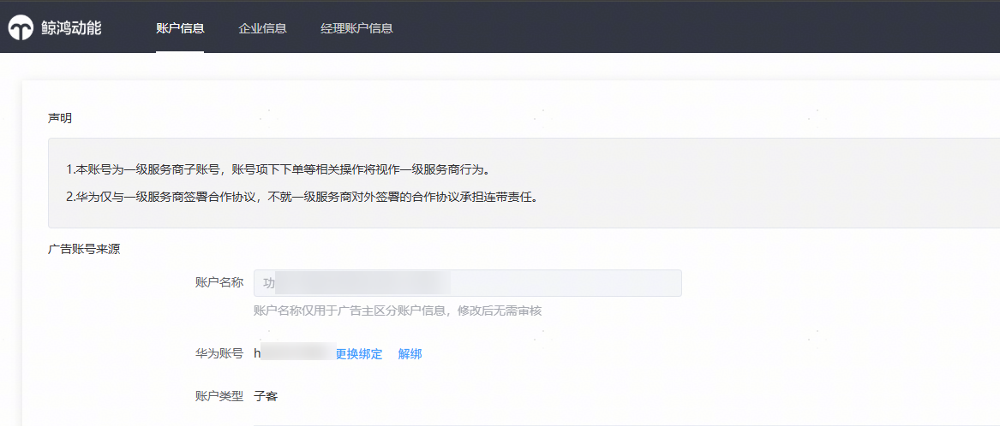

# 平台整合升级高频FAQ

## 登录推广账户的华为账号不变

账户整合升级到鲸鸿动能广告平台后，您可以直接使用原有应用市场的应用推广账号和密码登录鲸鸿动能平台，无需重新注册。如您的账户已迁移成功，通过原应用市场应用推广入口登录时，系统将自动跳转至鲸鸿动能广告平台，无需重复输入登录信息。点击【登录】即可。

## 服务商整合升级处理

服务商平台处理账号迁移，按照整个代理体系进行迁移。即：客户投放伙伴主账户（一级服务商）+客户投放伙伴子账户（子客服务商）+投放操作账户（子客）整个体系打包迁移。比如您的客户投放伙伴主账户下管理20个客户投放伙伴子账户和30个投放操作账户，以上51个代理账户会统一在同一批次进行账户迁移处理。

对于服务商体系，原应用市场应用推广和鲸鸿动能广告的投放账户不会整合为一个投放账户。如您同一个华为账号目前同时已有应用市场应用推广和鲸鸿动能广告的服务商账户，您在登录页需选择登录操作账户，登录界面见下图。

## 指定账户持有人规则

账户迁移后，鲸鸿动能广告服务商的人员管理由账户持有人负责。在进行账户迁移前，需要指定客户投放伙伴子账户和投放操作账户的持有人华为账号，账户持有人的华为账号支持更换。

### 授权规则：

- 账户已授权管理员：默认将应用市场应用推广中最早被授权为"管理员"角色的华为账号设置为账户持有人。
- 对于未授权管理员但已授权浏览员的账户：系统将自动迁移存量广告账户，不会指定账户持有人，您可以在后续自行授权账户持有人。原来客户投放子伙伴账户的浏览员，整合升级后角色为观察员；原投放操作账户的浏览员，整合升级后角色为数据分析师。
- 对于未授权管理员和浏览员的账户：若客户投放子伙伴账户或投放操作账户在迁移前未授权华为账号，系统将自动迁移存量广告账户，不会授权账户持有人，您可以在后续自行授权账户持有人。

### 账户持有人绑定、换绑流程

- 客户投放伙伴子账户

使用子账户账号登录至服务商管理平台，进入【账户管理】——【账号信息】，可进行账户持有人账号的绑定或更换绑定操作。

- 投放操作账户

  使用投放操作账户登录投放端，进入【工具】——【广告账户管理】，可进行账号持有人的绑定或更换绑定操作。

## API调用

账户整合升级后，您在应用市场应用推广的API权限不变、API接口可调用范围不变。后续应用市场应用推广和鲸鸿动能广告的API接口仍维护两套接口。

如您想调用账户内应用市场应用推广的投放数据、投放任务等信息，请参考应用市场应用推广的API接口文档。客户投放主账户的客户ID，对应您整合升级后账户信息的UPID。

## 开票处理

账户投放后的开票处理仍在[华为开发者联盟平台](https://developer.huawei.com/consumer/cn/console/overview)开具，发票开具流程不变。
