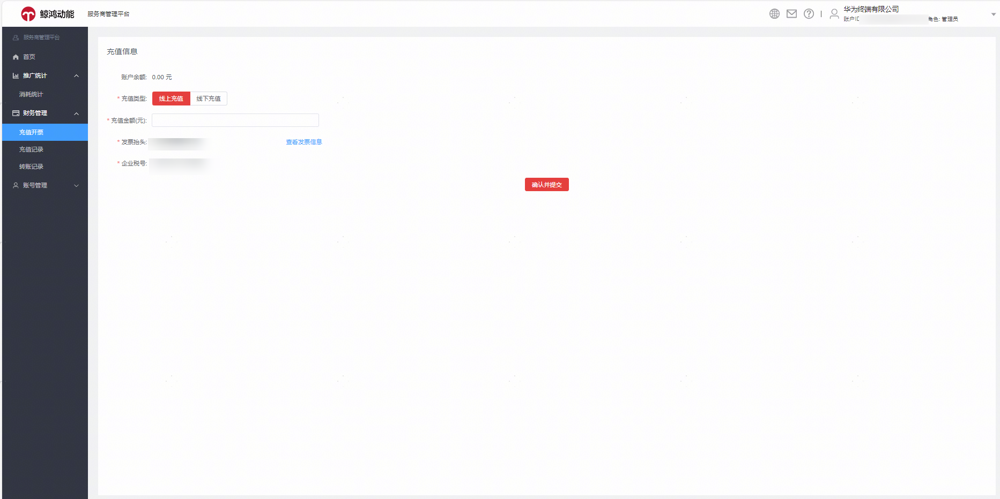
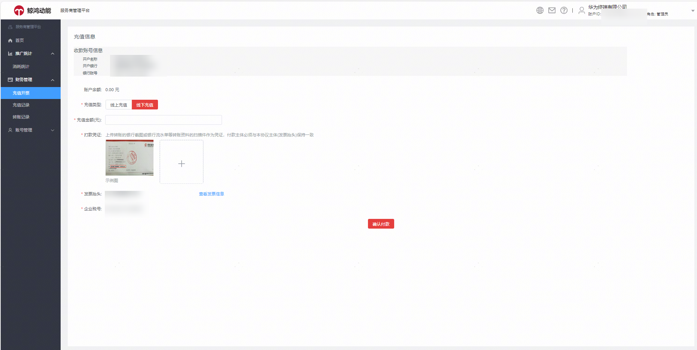
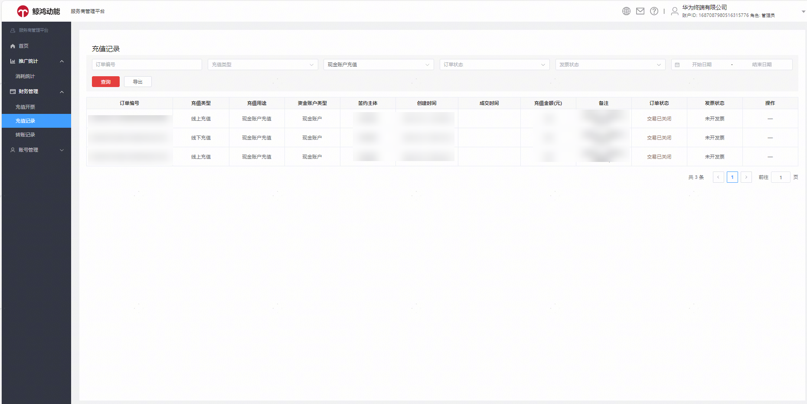

# 财务管理

服务商平台财务管理包含：充值开票、充值记录、转账记录。

## 充值开票

原应用市场应用推广首页点击“充值和发票”后 ，跳转联盟充值。投放端整合升级后，您可在服务商管理平台——财务管理——充值开票进行充值，支持线上充值和线下充值。

## 充值记录

您可以通过服务商管理平台——财务管理——充值记录，查询主账户历史充值记录。

## 转账记录

原主账户转账记录&gt;&gt;&gt;服务商管理平台——财务管理——转账记录，您可以查询主账户和子账户的资金互转明细。

| Before | After |
| --- | --- |
|  |  |
