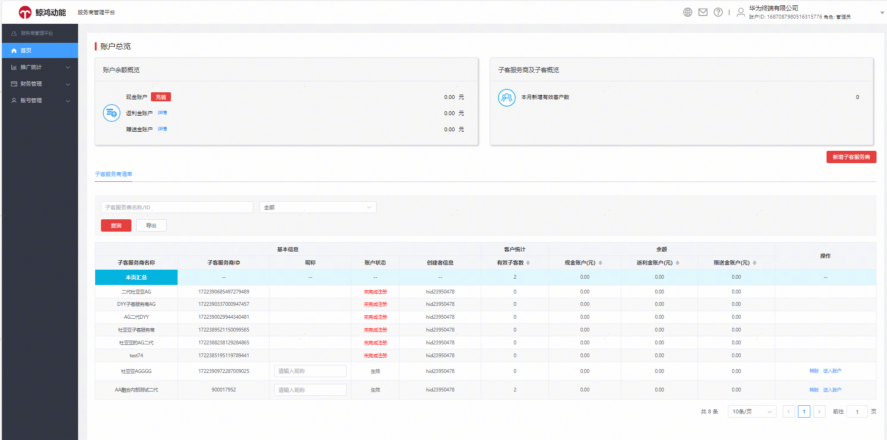
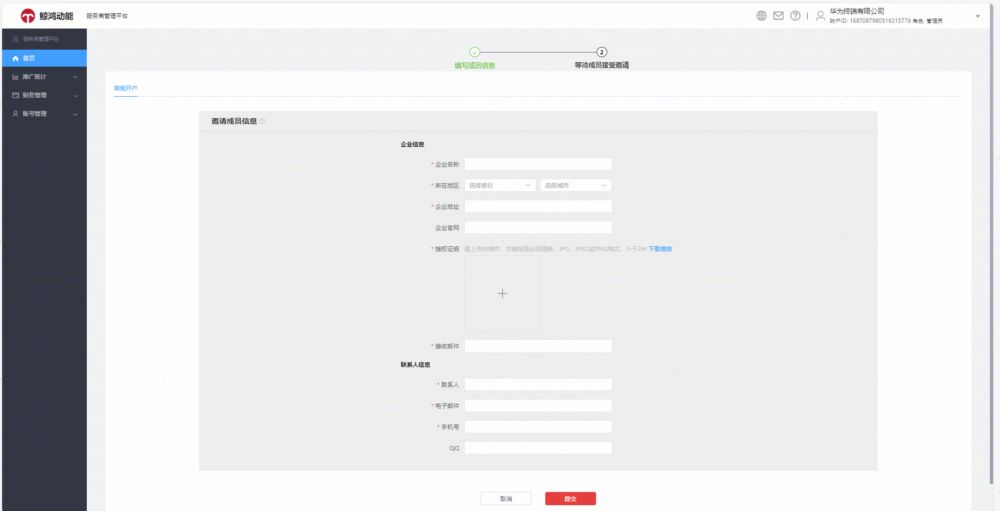
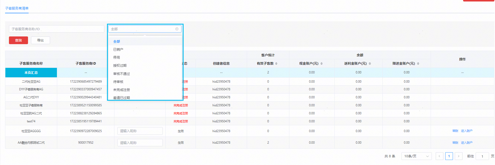
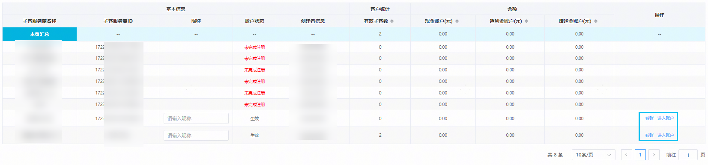

# 首页

支持查看账户资金概览（现金、虚拟金、赠送金、耀星券等）、本月新增有效客户数（仅展示子账户的本月新增账户数）、管理名下已创建的客户投放伙伴子账户，可查看子账户余额、子账户管理的有效投放操作账户数、新建客户投放伙伴子账户。

## 1.新建客户投放伙伴子账户（子客服务商）

您可以点击首页——新增子客服务商，填写企业相关信息，提交后等待审核。

新建客户投放伙伴子账户所需材料和审核流程不变。

## 2.您可以通过查询客户投放伙伴子账户ID/名称，或者账户状态下拉框筛选符合条件的账户。

## 3.您可以给名下管理的客户投放伙伴子账户转账，或跳转进入伙伴子账户。整合升级后，由每个子账户自行管理本账户的授权账号，原客户投放伙伴主账户授权管理子账户授权华为账号能力从界面下线。

