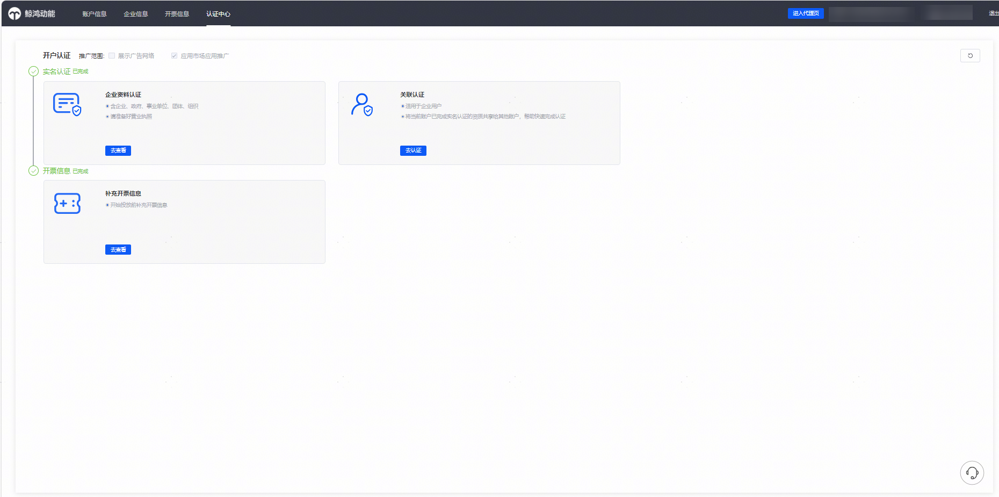
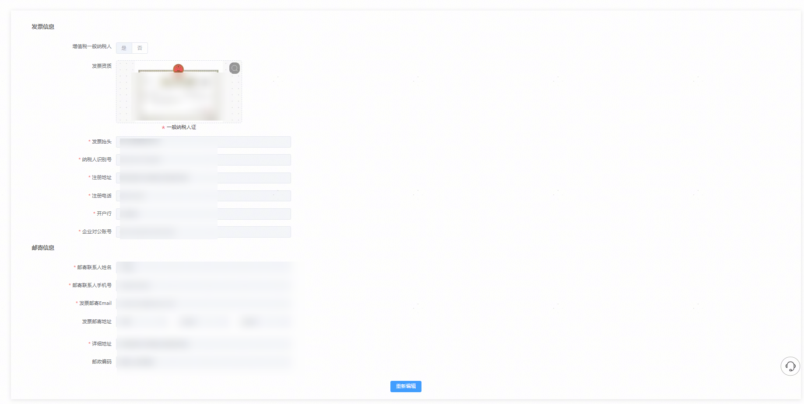
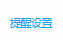
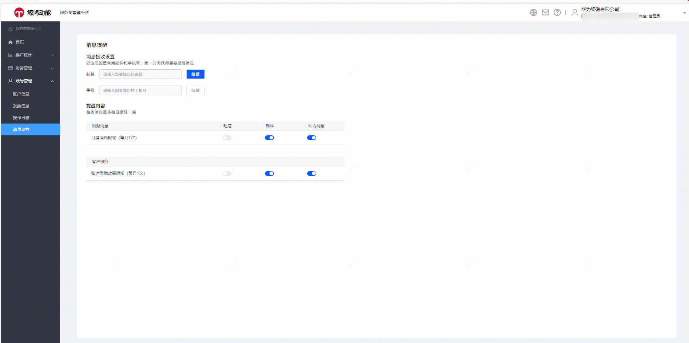

# 账号管理

账号管理包含账户信息、发票信息、操作日志、消息设置等入口。

## 账户信息

点击账号管理——账户信息，跳转认证中心。您可以看到账户开户提交的企业认证资料和开户信息、发票信息等。

## 发票信息

账号管理——发票信息，点击后跳转，您可查看编辑开户提供的发票信息。

## 操作日志

操作日志只记录您客户投放主账户的协议签署记录，与鲸鸿动能平台现有功能保持一致。

## 消息设置

您可以在账号管理——消息设置入口，设置月度消耗和激励政策提醒。对齐原主账户首页提醒设置入口，您也可以在页面右上角的入口进入消息提醒设置。

