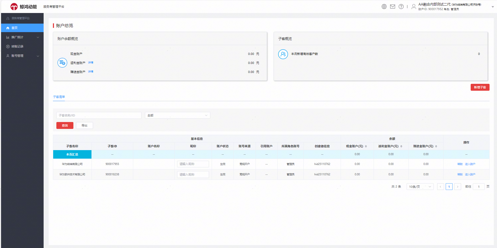
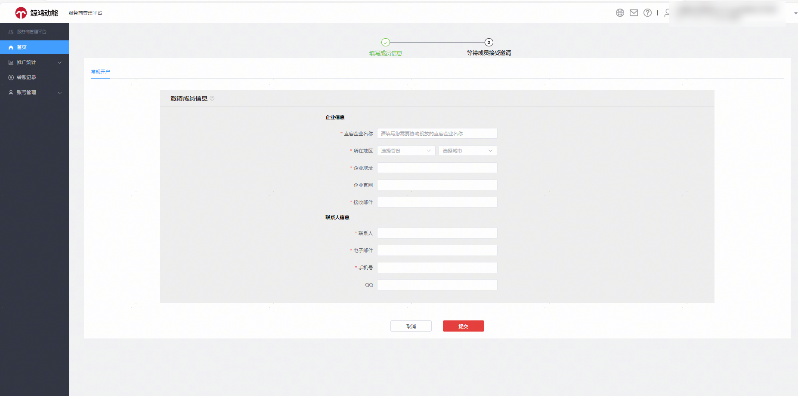
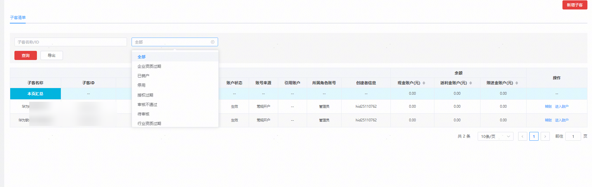
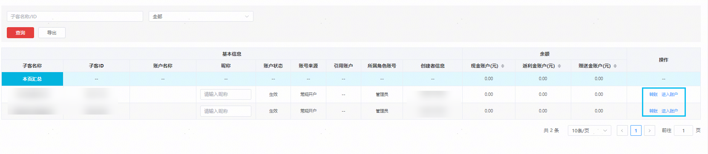
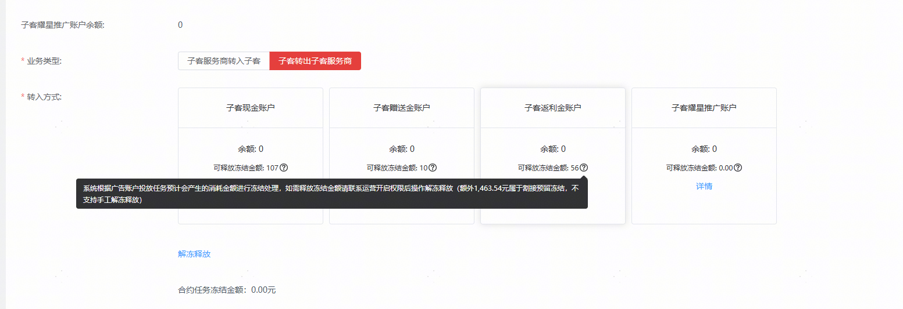

# 首页

您可以查看子账户的账户余额（现金、虚拟金、赠送金、耀星券等）、本月新增的投放操作账户数、名下管理的投放操作账户的余额数据、新建投放操作账户（新建子客）等。

1. 新建投放操作账户（子客）

您可以点击首页——新增子客，填写相关企业信息。提交创建投放操作账户后，投放应用由直客账户授权应用给子客。

2. 您可以通过查询投放操作账户ID/名称，或者账户状态下拉框筛选符合条件的账户。

3. 您可以给名下管理的投放操作账户转账，或跳转进入投放操作账户。原客户投放伙伴子账户给投放操作账户授权华为账号能力，从客户投放伙伴子账户界面下线，由投放操作账户自行管理。

点击"转账"后，页面支持查看子客服务商和子客的可用余额，支持按照资金类型转账。

- “余额”表示当前账户的可用余额(不包含竞价任务和CPT任务冻结的部分)；
- “可释放冻结金额”为竞价过程中系统自动冻结的一部分资金，如需释放金额请点击下方“解冻释放”进行释放。

因整合升级系统自动预留的7天预留金在子客服务商转账系统里不支持释放，如需释放7天预留金请联系应用市场应用推广运营释放。

在子客服务商转账的小问号里，会提示对应子客的7天预留金的剩余金额。

