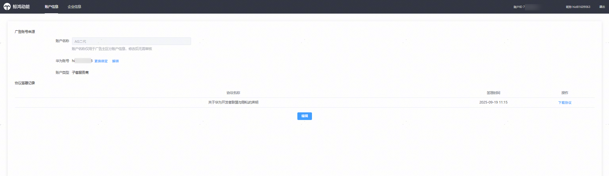
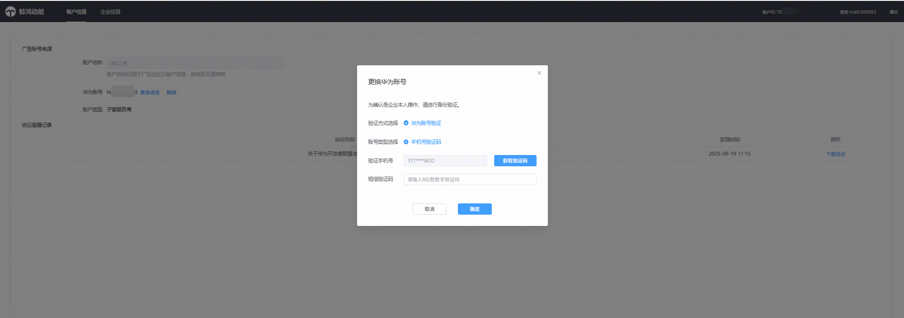
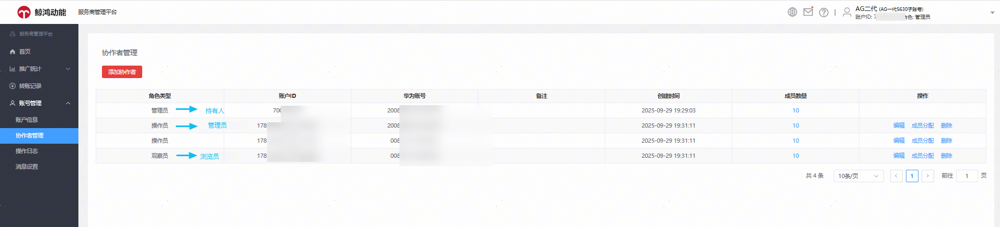
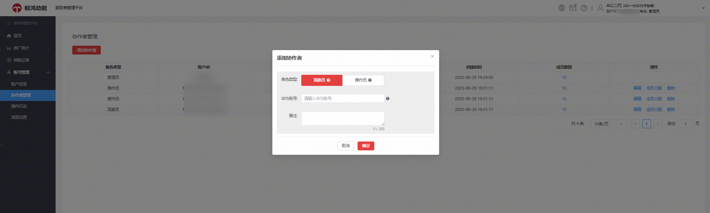
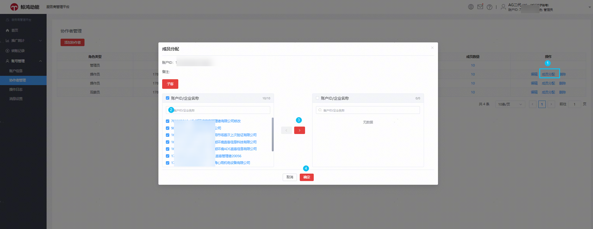
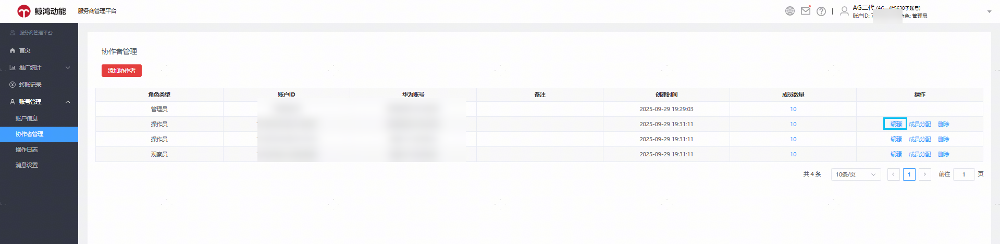

# 账号管理

账号管理包含账户信息、发票信息、操作日志、消息设置等入口。

## 账户信息

点击后查看客户投放伙伴子账户的名称、客户投放账户持有人华为账号信息（持有人账号支持换绑），以及历史账户协议签署记录。

## 协作者管理

协作者管理页面可以查看本账户的人员授权详情，人员授权原由客户投放伙伴主账户处理，投放端整合升级后，客户投放子账户可独立管理本账户的人员权限。

### 支持授权的角色

操作员（原管理员角色）、观察员（原浏览员角色）

### 授权步骤

- 账号授权华为账号要求没有绑定其他投放账户，建议您提前注册一个新的华为账号，注册流程参考：[华为账号注册认证流程](https://developer.huawei.com/consumer/cn/doc/start/registration-and-verification-0000001053628148)。
- 点击添加协作者——选择角色类型——输入授权华为账号ID即可。

### 分配可操作/查看的子客账户

添加完协作者账号后，您需要给这个账号分配可操作/查看的子客账户。

- 点击成员分配——单选/全选客户投放伙伴子账户名下所有账户，分配给对应华为账号管理投放。

- 已授权角色为操作员/观察员的华为账号，可通过编辑来修改角色类型，比如：操作员——观察员的角色互换。

