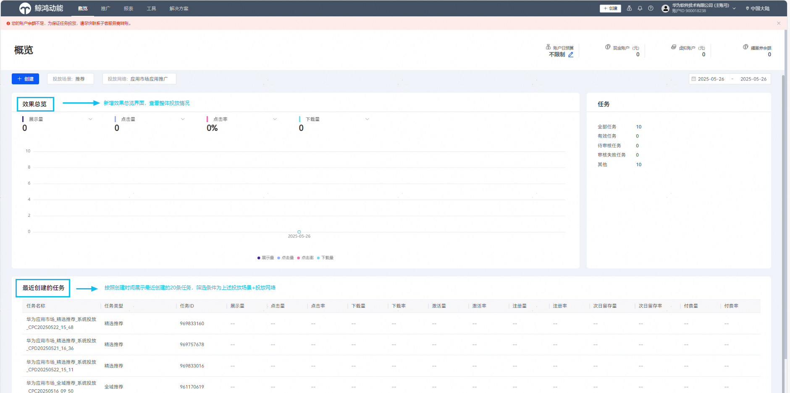
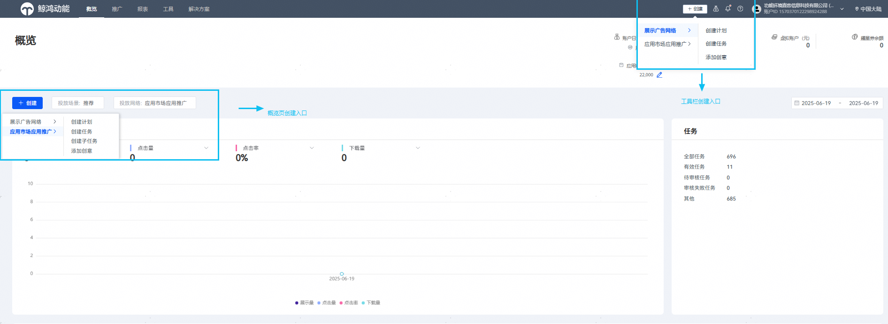
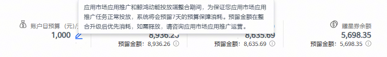

# 投放端——概览

平台整合升级后账户登录首页为“概览页”，支持设置账户预算、查询账户余额，并新增账户投放效果总览数据、最近创建的任务（最新创建的20条任务）、以及账户内创建任务总数、有效任务数、待审核任务、审核失败任务等。

## 数据查看

### 应用市场应用推广和鲸鸿动能广告“双权限客户”

您可通过概览页——“投放网络”，分别查看应用市场应用推广和展示广告网络的投放数据。

### 应用市场应用推广“单权限客户”

投放网络仅展示应用市场应用推广的相关数据。

## 任务创建

概览页的“创建”入口，或投放端上方工具栏的“创建”入口，均可创建投放任务。对于双权限客户，先选择要创建应用市场应用推广/展示广告网络的广告，再进行任务创建，详见下图。

## 7天预留金

投放端整合升级后投放入口统一，您只能通过[鲸鸿动能广告平台](https://ads.huawei.com/usermgtportal/home/index.html#/)操作应用市场应用推广的任务投放。应用市场应用推广和鲸鸿动能投放端整合期间，为保证您应用市场应用推广任务正常投放，系统将会基于切换当天前一周的账户消耗，预留7天的预算保障消耗。

预留金额在整合升级后优先消耗，如需释放，请咨询应用市场应用推广运营。如您的应用推广账户余额为零，则不展示此“预留金额”字段。

