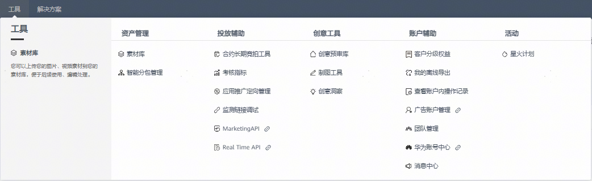
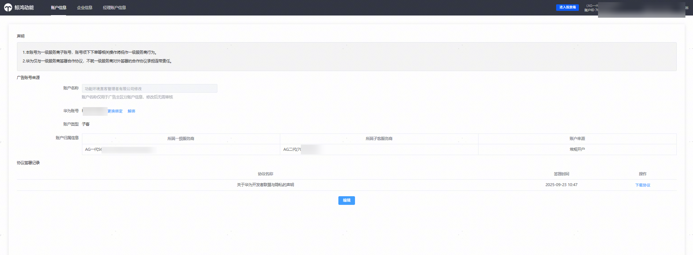
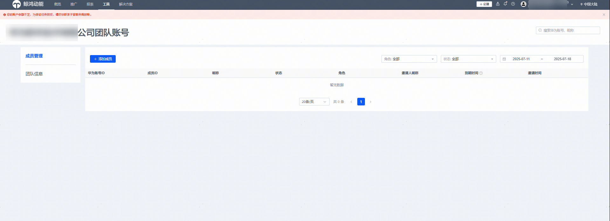
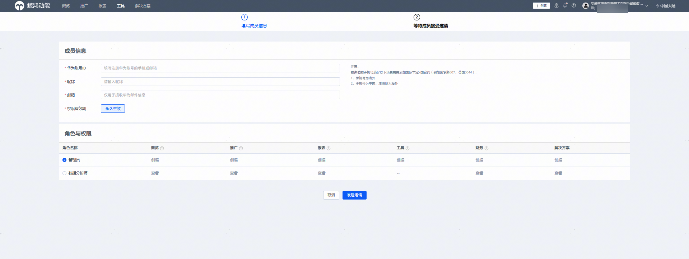
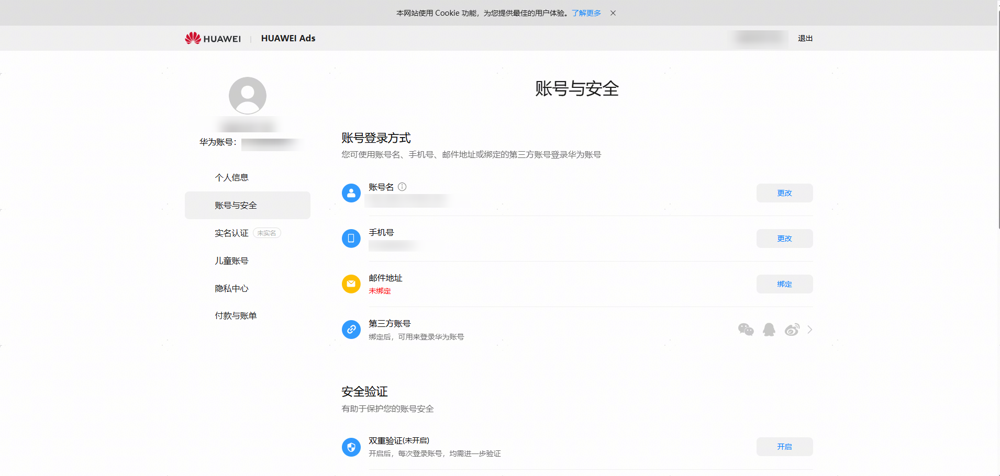
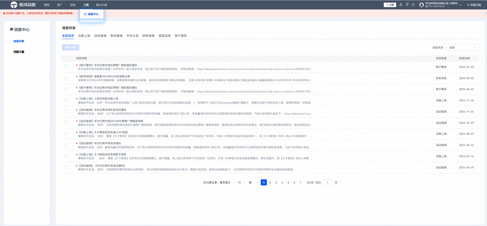

# 投放端——工具

原应用市场应用推广支持的相关投放能力，在投放端升级后均支持。对于需开通白名单的投放工具，请您参照应用市场应用推广帮助文档中的申请流程，提交所需信息以完成开通。

- 工具变化点1：原我的应用等级——查看权益&gt;&gt;&gt;工具——账户辅助——客户分级权益；

  | Before | After |
  | --- | --- |
  |  |  |
- 工具变化点2：原财务管理&gt;&gt;&gt;小钱包ICON——点击查看财务信息——消耗记录

  | Before | After |
  | --- | --- |
  |  |  |

- 工具变化点3：原转账记录&gt;&gt;&gt;小钱包ICON——点击查看财务信息——转账记录

  | Before | After |
  | --- | --- |
  |  |  |
- 工具变化点4：工具——账户辅助入口，适配新增“广告账户管理”，“团队管理”，“华为账号中心”,“消息中心”
  - 工具——账户辅助——广告账户管理：点击后可以查看账户持有人账号信息、协议签署记录、账户开户填写的企业信息和联系人信息等。
  - 投放操作账户的持有人更换：工具——账户辅助——广告账户管理——账户信息，支持账户持有人华为账号换绑和解绑。

- 工具——账户辅助——团队管理：邀请团队其他成员共同管理投放操作账户，可以授权对应华为账号为管理员（原管理员）、数据分析师（原浏览员）等，可操作权限范围参考授权界面。

- 工具——账户辅助——华为账号中心：点击跳转华为账号中心，管理本次登录推广账户的华为账号，可在华为账号中心修改绑定的手机号/邮箱。

- 工具——账户辅助——消息中心：您可以对查看账户的消息列表、设置消息提醒，对应原提醒设置入口。

