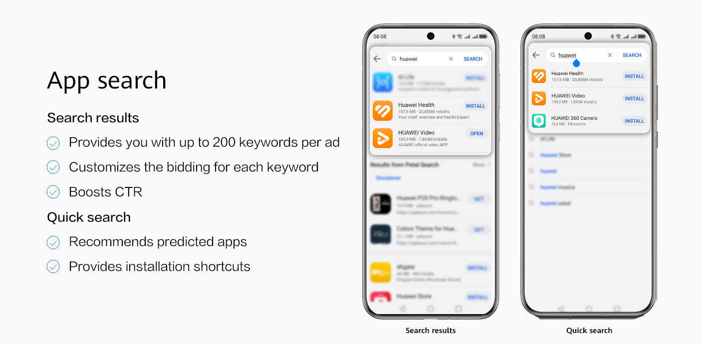
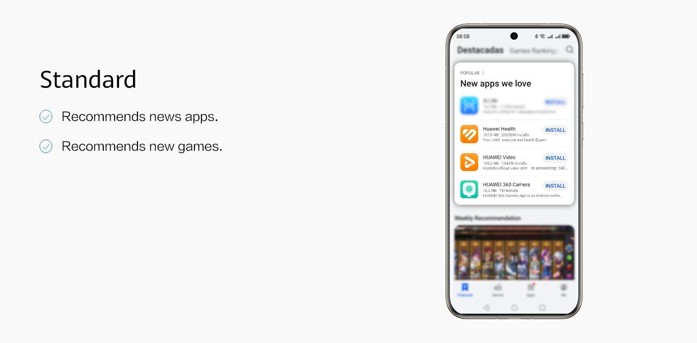
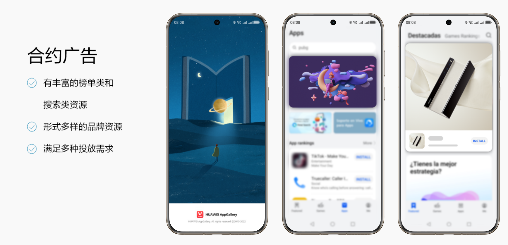

# 应用市场

应用市场是指在应用市场搜索和展示广告位宣传您的应用，在创建应用市场广告计划时，“投放网络”选择”应用市场”。

| <strong>广告样式</strong> | <strong>创意类型</strong> | <strong>规格</strong> | <strong>华为媒体版位</strong> |
| --- | --- | --- | --- |
| [Search](#section830795264818) | 图片  （JPG, JPEG, or PNG） | 216\*216 | App search |
| [APP Icon](#section1317391611510) | 图片  （JPG, JPEG, or PNG） | 216\*216 | Standard |

## 应用市场搜索广告

- <strong>媒体位置：</strong>应用市场
- <strong>采买模式：</strong>竞价
- <strong>版位：</strong>App search
- <strong>支持推广能力：</strong>应用下载
- <strong>广告样式：</strong>图片
- <strong>广告尺寸：</strong>216x216
- <strong>广告展示设备</strong>：手机

  

## 应用市场展示广告

- <strong>媒体位置</strong>：应用市场
- <strong>采买模式</strong>：竞价
- <strong>版位</strong>：Standard
- <strong>支持推广能力：</strong>应用下载
- <strong>广告样式</strong>：应用图标（App Icon）
- <strong>广告尺寸</strong>：216x216
- <strong>广告展示设备</strong>：手机

  

## 应用市场合约广告

应用市场的一种合约广告形式，在开屏、banner等广告形式中固定投放广告，无需竞价即可展示，计费方式为CPD、CPT，具体创建流程请参考[创建应用市场合约广告](https://developer.huawei.com/consumer/cn/doc/promotion/contract-ad-shown-on-ag-0000001294223968)。

- <strong>媒体位置：</strong> 应用市场
- <strong>采买模式</strong>：合约
- <strong>广告展示设备</strong>：手机
- <strong>广告样式：</strong>开屏、banner、story card

  
