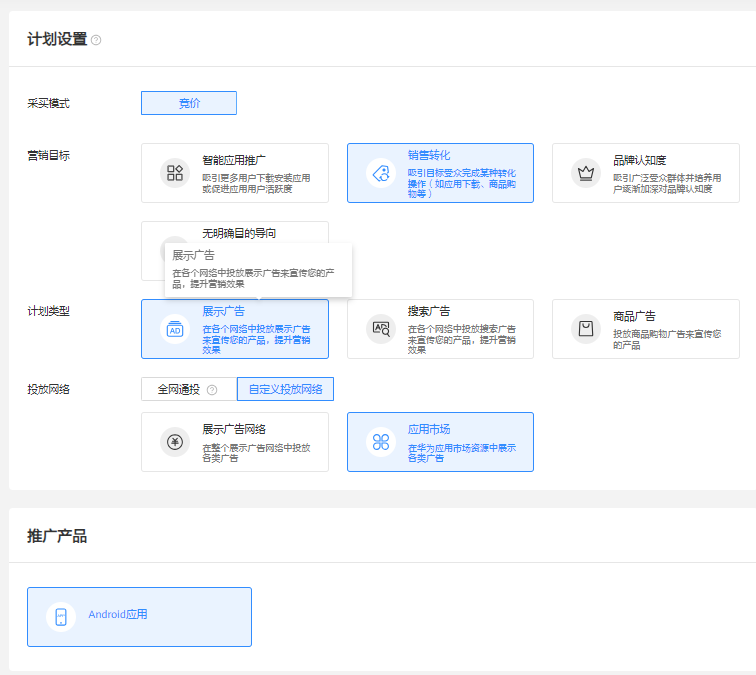
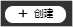
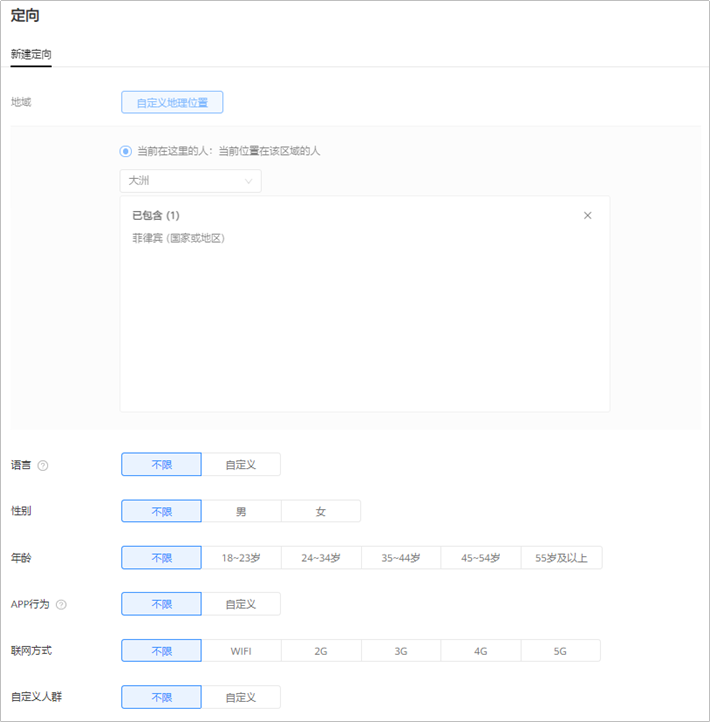
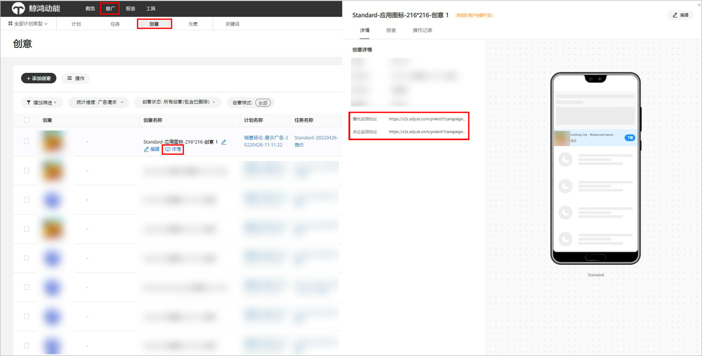

# 创建应用市场展示广告

## 概述

应用市场展示广告是在[华为应用市场的展示位](/docs/monetize/promotion/gallery-0000001057273476#section1317391611510)上将您的应用展示推荐给用户，提升您App的下载率。

## 操作流程

## 操作步骤

1. 在[应用管理](/docs/monetize/promotion/appmanagement-0000001182393586)中添加应用并申请推广国家。
2. 创建广告计划。

   单击“创建”，选择“创建计划”。

   

   - <strong>营销目标：</strong>选择“销售转化”或者“无明确目的导向”，详情参考[营销目标](/docs/monetize/promotion/overview-cjjjgg-0000001182873508#ZH-CN_TOPIC_0000001182873508__zh-cn_topic_0000001205953939_zh-cn_topic_0000001105216776_li07111843183611)。
   - <strong>计划类型：</strong>选择“展示广告”，详情参考[计划类型](/docs/monetize/promotion/overview-cjjjgg-0000001182873508#ZH-CN_TOPIC_0000001182873508__zh-cn_topic_0000001205953939_zh-cn_topic_0000001105216776_li234211653411)。
   - <strong>投放网络：</strong>选择“自定义投放网络-应用市场”，详情参考[投放网络](/docs/monetize/promotion/overview-cjjjgg-0000001182873508#ZH-CN_TOPIC_0000001182873508__zh-cn_topic_0000001205953939_zh-cn_topic_0000001105216776_li93421166342)<strong>。</strong>
   - <strong>推广产品：</strong>选择“Android应用”，详情参考[推广产品](/docs/monetize/promotion/overview-cjjjgg-0000001182873508#ZH-CN_TOPIC_0000001182873508__zh-cn_topic_0000001205953939_zh-cn_topic_0000001105216776_li8342416193416)<strong>。</strong>
   - <strong>计划日预算：</strong>详情参考[计划日预算](/docs/monetize/promotion/overview-cjjjgg-0000001182873508#ZH-CN_TOPIC_0000001182873508__zh-cn_topic_0000001205953939_zh-cn_topic_0000001105216776_li14342141615342)。
   - <strong>推广计划名称：</strong>详情参考[推广计划名称](/docs/monetize/promotion/overview-cjjjgg-0000001182873508#ZH-CN_TOPIC_0000001182873508__zh-cn_topic_0000001205953939_zh-cn_topic_0000001105216776_li1434211615342)。
3. 创建广告任务（简称“基础任务”）。
   - <strong>推广应用：</strong>从下拉列表中选择要推广的应用。列表中仅展示已经成功添加到“应用管理”并通过推广审核的应用。如果需要推广的应用不在下拉列表中，您需要先添加应用，详情请参考[应用管理](/docs/monetize/promotion/appmanagement-0000001182393586)。
   - <strong>定向：</strong>设置您希望推广的国家/地区，只支持从此应用已经[审核通过](/docs/monetize/promotion/review-0000001052064324)的国家中进行选择，同一任务中可以选择多个国家/地区进行投放。如果您想使用更多的定向功能，请参考[应用市场展示广告支持更多定向功能](#section1621823495)。
   - <strong>版位：</strong>参见[应用市场展示广告版位](/docs/monetize/promotion/gallery-0000001057273476#section1317391611510)。推荐您同时在所有版位进行推广，提升应用转化率。由于每个任务只能选择一个版位，需要您为应用市场的每个版位创建任务。
   - <strong>投放日期：</strong>详情参考[投放日期](/docs/monetize/promotion/overview-cjjjgg-0000001182873508#ZH-CN_TOPIC_0000001182873508__zh-cn_topic_0000001205953939_li73789433254)。
   - <strong>出价：</strong>只支持按照CPD模式进行竞价，在用户下载应用后按照您的出价进行计费。
   - <strong>任务名称</strong>：详情参考[任务名称](/docs/monetize/promotion/overview-cjjjgg-0000001182873508#ZH-CN_TOPIC_0000001182873508__zh-cn_topic_0000001205953939_li237864312259)。
4. 添加广告创意。

   在应用市场广告下，系统默认使用您在应用市场上传的应用图标，您无需上传其他图片且不支持修改。

   

   <strong>监测地址（选填）</strong>：如果您使用三方监测进行转化跟踪，请先完成[三方监测](/docs/monetize/promotion/tracking-overview-0000001170938773)的对应操作，完成后在您创建任务的时候，系统将会自动关联监测地址（关联出来的链接建议不要修改，避免影响跟踪数据）。如果您修改了关联分析工具中的监测链接，系统将会自动同步到任务，任务中无需修改。
5. 提交投放。

   单击“提交”，应用市场广告不需要审核，提交后直接进入投放状态。

## 应用市场展示广告支持更多定向功能

如果您想使用更多的定向功能，例如：语言、性别、年龄等，您需要在已有的计划下增加新的任务（简称“普通任务”），在新增的任务中选择定向。

 

目前[部分国家地区](/docs/monetize/promotion/attachments-0000001532611905#ZH-CN_TOPIC_0000001532611905__li1468715372164)不支持使用此功能。

1. 在已有计划下创建普通任务。

   单击，选择“创建任务”。选择后，计划设置默认与所选计划一致，不可修改。

   
2. 设置任务信息。
   - <strong>推广产品详情：</strong>默认与基础任务选择的应用一致，不可修改。
   - <strong>定向</strong>：

     

     <strong>不限：</strong>对所有的定向，默认选择不限，此时您的广告将会投放给所有用户。您可以根据以下定向来设置您广告的投放人群：

     - <strong>地域：</strong>默认与基础任务地域一致，不可修改。
     - <strong>语言</strong>：通过语言定向，您可以选择希望覆盖使用哪种语言的用户，您的广告将会展示给手机上设置这些语言的用户。如果您未选择语言，您的广告创意语言应该与投放地域主流语言一致。
     - <strong>性别</strong>：指定只投放给某个性别的用户。
     - <strong>年龄</strong>：您可以覆盖那些可能在年龄段上符合您特定要求的潜在客户。
     - <strong>App行为：</strong>根据用户对某类App的使用行为进行定向，支持三个定向条件：
       - 一个月内活跃：当前设备上安装有此类应用，且在过去一个月内至少使用过一次。
       - 已安装：当前设备上安装有此类应用。
       - 未安装：当前设备上未安装此类应用。
     - <strong>联网方式：</strong>您可以根据用户设备的联网方式进行定向，可以投放给wifi、2G、3G、4G、5G的用户。
     - <strong>自定义人群</strong>：您可以指定投放给某个人群，也可以指定不向某个人群投放。

       如果您选择了其他定向条件，此时“自定义人群”与其它定向条件同时生效（取并集）。

       如果您没有选择其他定向条件（默认为“不限”），此时您只投放给自定义人群包的人群。
       - <strong>类别</strong>：指的是人群包的类别，分为公共人群包、专属人群包、私有人群包。更多请参考[人群包](/docs/monetize/promotion/overview-renqunbao-0000001228033193)。
       - <strong>区域</strong>：指当前人群包所在的区域，分为中国、俄罗斯、欧盟(GDPR)、亚非拉、全球等，每个区域只保存本区域内用户数据，投放时只能选择投放目标区域内的人群包。
       - <strong>覆盖量</strong>：指的是人群包中包含的人群总数。人群包定向和其它定向条件会同时生效，如果人群包包含的用户太少会导致任务覆盖较少。
   - <strong>版位：</strong>默认与基础任务版位一致，不可修改。
   - <strong>投放时间：</strong>默认与基础任务投放时间一致，不可修改。
   - <strong>出价：</strong>只支持按照CPD进行竞价，在用户下载应用后按照您的出价进行计费。
   - <strong>任务名称</strong>：详情参考[任务名称](/docs/monetize/promotion/overview-cjjjgg-0000001182873508#ZH-CN_TOPIC_0000001182873508__zh-cn_topic_0000001205953939_li237864312259)。
3. 添加广告创意。

   默认与基础任务创意一致，不可修改。
4. 提交投放。

   单击“提交”，应用市场广告不需要审核，提交后直接进入投放状态。

## 管理基础任务/普通任务

- 暂停/删除：
  - 基础任务不支持暂停/删除，您需要通过暂停/删除应用广告推广计划，此时基础任务才会停止投放。
  - 普通任务支持暂停，您可以选择您想要暂停的普通任务，单击操作的“”。
  - 普通任务支持删除，您可以勾选您想要删除的普通任务，单击“删除”。
- 修改：

  基础任务/普通任务支持修改定向、投放时间、出价。

## 常见问题

1. <strong>普通任务的价格如何设置？</strong>

   建议普通任务的出价高于基础任务，人群定向是选取您需要的更精确的人群，针对您更想要的人群顾客，建议您出更高的价格去争取这类客户的曝光和下载。
2. <strong>展示广告网络和应用市场展示广告中，看到的“自定义人群”</strong> <strong>有什么差别？</strong>

   “自定义人群”都是在[人群管理](/docs/monetize/promotion/overview-renqunbao-0000001228033193)中创建的人群，在应用市场展示广告中也可以使用自定义人群进行定向，但是因为两者的广告展示位置以及广告流量均不相同，您可以制定不同的人群包进行投放。
3. <strong>如果投放的应用在[转移](https://developer.huawei.com/consumer/cn/doc/distribution/app/agc-help-transferapp-0000001099998802#section113481811165218)中，相关应用的广告投放任务会受到影响吗？</strong>

   只有应用市场展示广告的任务会受影响，您必须暂停相关应用的应用市场广告任务。
4. <strong>为什么不能监测到广告数据？</strong>

   如果您正在新建计划任务，请按照[操作步骤](#section112009241114)操作。

   如果您已经创建任务并且任务在投放中，您需要编辑任务，进入到创意，重新单击“提交”，此时监测链接生效。
5. <strong>如何检查我的监测地址是生效状态？</strong>

   单击“推广”-&gt;"创意"-&gt;“详情”，查看监测地址是否添加链接。若您的这个位置中未显示链接，请参考问题4进行修改。

   
