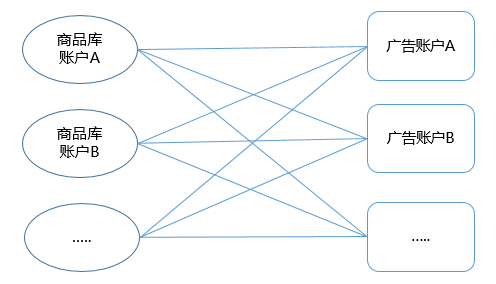
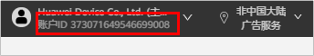
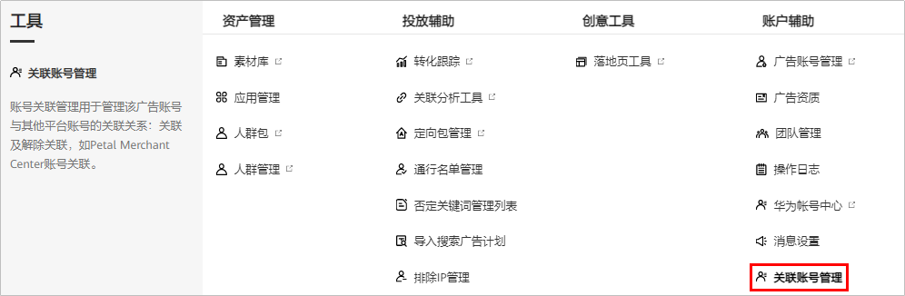
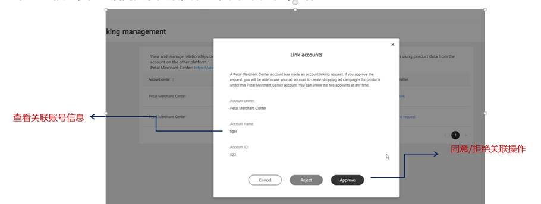
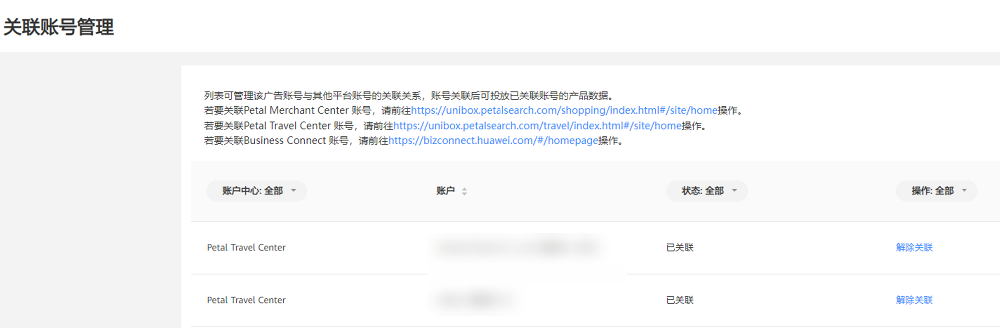
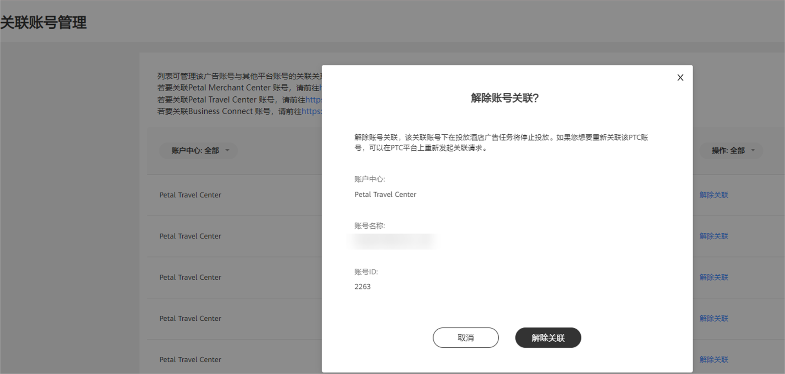

# 关联账号管理

## 概述

广告主可以在PMC、PTC、BC中分别管理待推广的商品。通过将搜索库（包括PMC、PTC、BC）账号与广告账号进行关联，可以授权广告账号选择搜索库中的对应产品进行推广。

搜索库账号与鲸鸿动能广告账号支持多对多关联：一个鲸鸿动能广告账号可关联多个搜索库账号，创建计划时选择对应的搜索库账号；一个搜索库账号可被多个鲸鸿动能广告账号进行投放。

以搜索商品库（PMC）为例：

## 操作流程

## 操作步骤

1. 在搜索库账号中添加鲸鸿动能广告账户。

   登录相应的搜索库，添加华为账号或者鲸鸿动能广告账户ID进行关联。

   - 华为账号：指的是您注册鲸鸿动能广告账户的邮箱或者手机号。
   - 鲸鸿动能广告账户ID：登录[鲸鸿动能广告平台](https://ads.huawei.com/usermgtportal/home/index.html#/help)，选择右上角的“<strong>账户ID</strong>”。

   

   | 搜索广告类型 | 搜索库类型 | 搜索库链接 | 参考文档 |
   | --- | --- | --- | --- |
   | 搜索商品广告 | 搜索商品库PMC | [登录链接](https://unibox.petalsearch.com/shopping/index.html#/site/home) | [商品库文档](https://developer.huawei.com/consumer/cn/doc/20220802?version=V1) |
2. 在鲸鸿动能广告账号中接受邀请。

   添加成功后登录鲸鸿动能广告平台，单击“<strong>工具</strong>”-&gt;“<strong>关联账号管理</strong>”。

   

   系统将会同步您在搜索库平台申请的关联操作，您需要在鲸鸿动能广告平台选择“<strong>同意</strong>”或者“<strong>拒绝</strong>”。

   - 若同意关联，则单击“<strong>同意</strong>”，同意后账号关联成功，创建搜索广告计划时，可选择该账号搜索库进行投放。
   - 若拒绝关联，则单击“<strong>拒绝</strong>”，拒绝后账号关联失败，账号申请在该列表中删除。

     

      

     - 如果您开通了鲸鸿动能广告的团队账号功能，您需要使用鲸鸿动能广告的主账号接受关联，团队账号不支持接受关联。
     - 如果您是服务商，您需要使用子客的账号进行关联。
3. 在鲸鸿动能广告平台中创建广告。
4. 完成搜索库广告投放。

## 关联管理

- <strong>查看关联账号：</strong>支持查看所有已关联/待关联的账号；列表支持所属账号中心、账号、状态排序；未关联的账号支持选择“<strong>同意</strong>”或者“<strong>拒绝</strong>”，若选择“<strong>拒绝</strong>”，申请账号将不再出现在列表中。

  
- <strong>解除关联：</strong>若您的广告投放账号与搜索库账号需要解除绑定，可从搜索库平台操作解除绑定或者在广告投放账号中解除绑定；解除绑定后，该广告账号创建搜索库广告计划将无法选择该搜索库的账号，已创建的广告计划均停止投放；解除关联的账号将不再出现在列表中。

  
