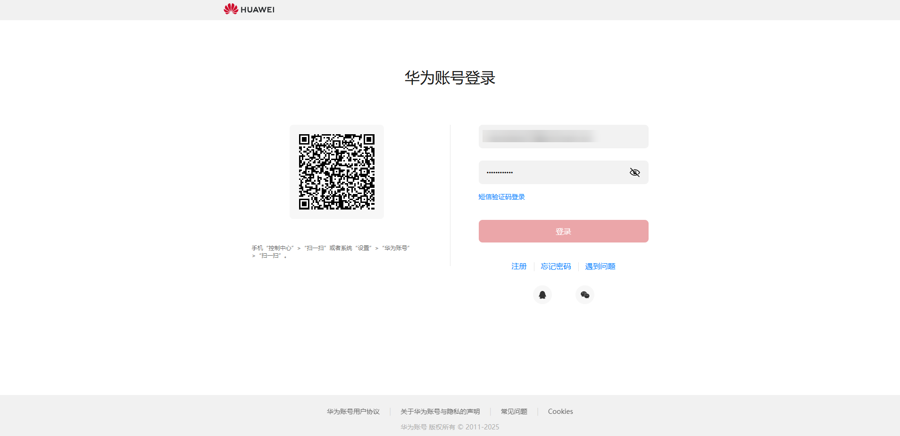
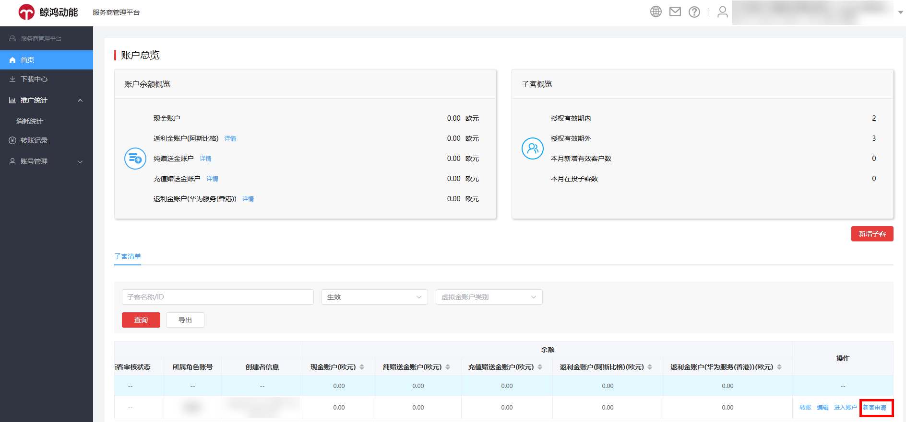
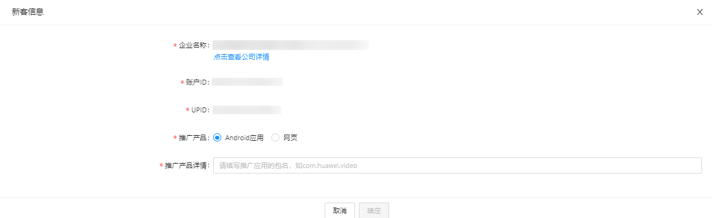

# 新客申请流程

## 新客申请流程

1. 使用广告主上级代理（一级服务商或子客服务商）的华为账号登录[服务商管理平台](https://id1.cloud.huawei.com/CAS/portal/loginAuth.html)。

   
2. 在首页子客清单列表中选择需要申请加入新客的广告主，单击“新客申请”。

   
3. 按系统提示，填写准备申请加入新客的推广产品，Android应用或网页。如您选择Android应用，请填写推广应用的包名；如您选择网页，请填写推广网页的网址。

   
4. 提交待审核，系统会优先判断此次新客申请是否满足条件。
   - 如您的申请不满足新客申请条件，请更换子客账户或推广产品重新申请。如需帮助，请联系您的客户经理。
   - 如满足，进入客户经理和客户运营审核环节。

## <strong>新客申请规则</strong>

1. 参与“2024年子客合作激励政策”的服务商才有资格进行“新客申请”操作。
2. 新客申请必须满足新主体+第一个推广的app/domain，两个条件均满足即可判定为新客。 新客返利计算的6个月，可按自然月进行返利计算，这样可与其他返利计算累计清零周期保持一致。从新客申请成功后的6个自然月内的消耗均可纳入返利计算，比如客户在2023/11/10成功申请将某App申请为新客，那么该App在2023/11/10~2024/4/30期间的消耗可计算返利。
   - 同时，申请新客后，服务商管理平台上可能出现的状态包括：
     - <strong>审批中</strong>：服务商已发起新客申请，未审批完成；如当前状态为审批中，此时该App/域名将被锁定，其他服务商不可以发起同一产品的新客申请。
     - <strong>审批通过</strong>：服务商发起的新客申请已通过华为BD、运营审核； 此时该App/域名同样不可以被其他服务商发起新客申请。
     - <strong>审批不通过</strong>：服务商发起的新客申请被华为BD或运营驳回，这种状态下服务商可单击查看驳回原因。若审核不通过，服务商可单击“<strong>新客申请</strong>”为其他产品发起加入新客的申请。
   - 单击“新客申请”后，服务商需指定推广产品App ID或域名，操作如下：
     - 若服务商准备申请加入新客的是“Android应用”类的推广产品，则需要在推广产品详情中填写拟推广产品的应用包名。
     - 若服务商准备申请加入新客的是“网页”类的推广产品，则需要在推广产品详情中填写拟推广产品的网址，系统会对网址进行基本的格式校验。
