# Interstitial

## 320×480（图片）

|  |  |
| --- | --- |
| <strong>广告样式</strong> | Interstitial |
| <strong>版位名称</strong> | Global 3rd-Party Interstitial Inventory |
| <strong>展示样式</strong> | Image |
| <strong>分辨率</strong> | 320×480 |
| <strong>格式</strong> | JPG, JPEG, PNG，or GIF |
| <strong>素材大小</strong> | GIF &lt;=1 MB ，Others &lt;= 500 KB |
| <strong>文本字符</strong> | &lt;= 90, Optional |

广告位置尺寸标注：

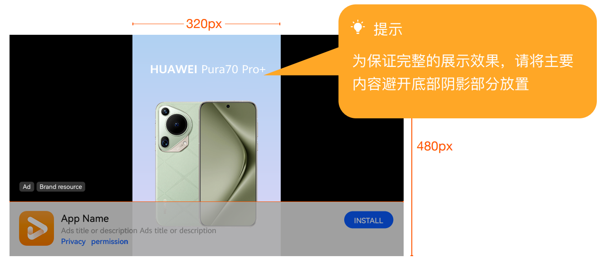

## 480×320（图片）

|  |  |
| --- | --- |
| <strong>广告样式</strong> | Interstitial |
| <strong>版位名称</strong> | Global 3rd-Party Interstitial Inventory |
| <strong>展示样式</strong> | Image |
| <strong>分辨率</strong> | 480×320 |
| <strong>格式</strong> | JPG, JPEG, PNG，or GIF |
| <strong>素材大小</strong> | GIF &lt;=1 MB ，Others &lt;= 500 KB |
| <strong>文本字符</strong> | &lt;= 90, Optional |

广告位置尺寸标注：

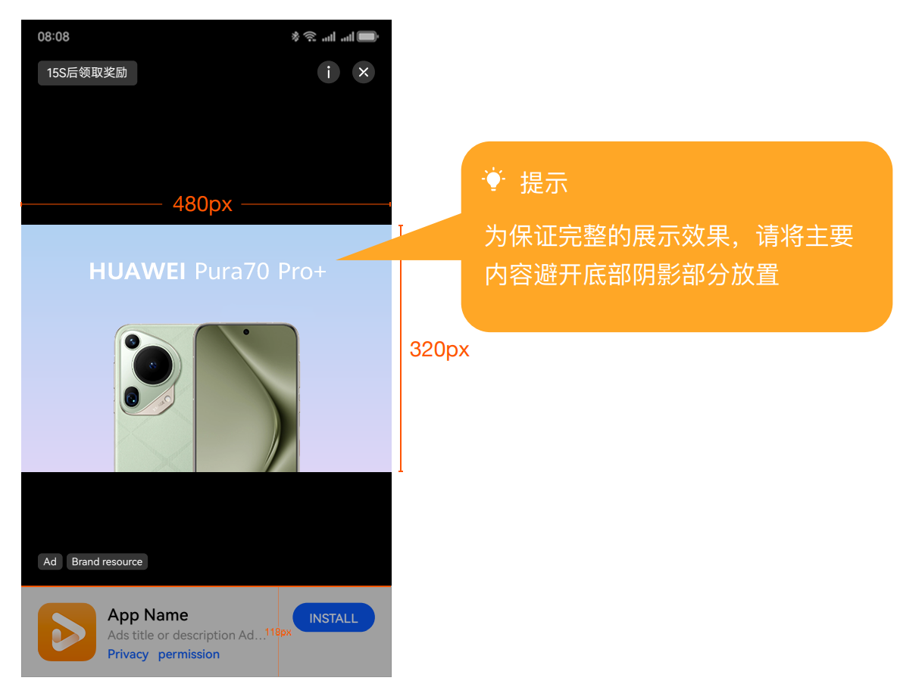

## 768×1024（图片）

|  |  |
| --- | --- |
| <strong>广告样式</strong> | Interstitial |
| <strong>版位名称</strong> | Global 3rd-Party Interstitial Inventory |
| <strong>展示样式</strong> | Image |
| <strong>分辨率</strong> | 768×1024 |
| <strong>格式</strong> | JPG, JPEG, PNG，or GIF |
| <strong>素材大小</strong> | GIF &lt;=1 MB ，Others &lt;= 500 KB |
| <strong>文本字符</strong> | &lt;= 90, Optional |

广告位置尺寸标注：

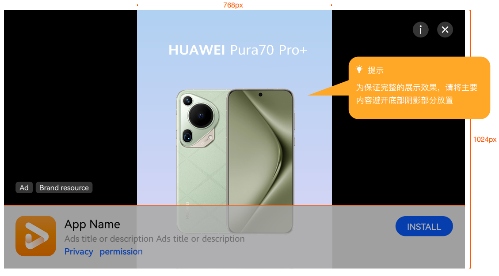

## 1024×768（图片）

|  |  |
| --- | --- |
| <strong>广告样式</strong> | Interstitial |
| <strong>版位名称</strong> | Global 3rd-Party Interstitial Inventory |
| <strong>展示样式</strong> | Image |
| <strong>分辨率</strong> | 1024×768 |
| <strong>格式</strong> | JPG, JPEG, PNG，or GIF |
| <strong>素材大小</strong> | GIF &lt;=1 MB ，Others &lt;= 500 KB |
| <strong>文本字符</strong> | &lt;= 90, Optional |

广告位置尺寸标注：

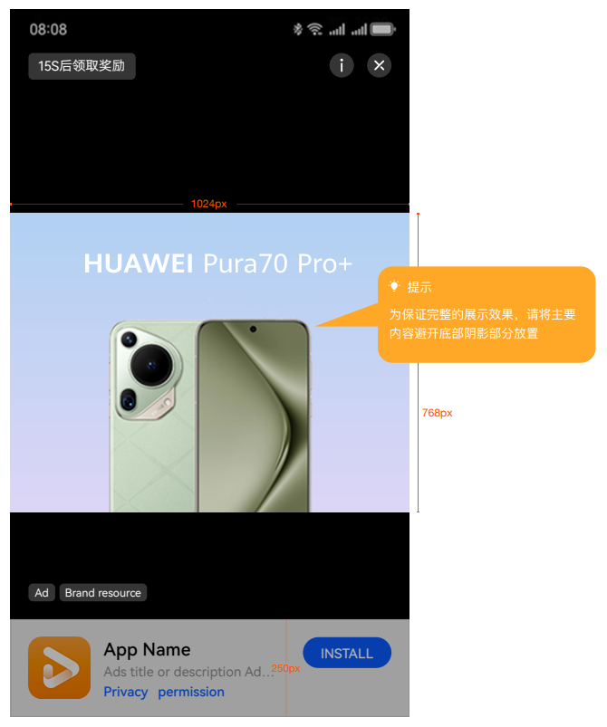

## 1080×1620（图片）

|  |  |
| --- | --- |
| <strong>广告样式</strong> | Interstitial |
| <strong>版位名称</strong> | Global 3rd-Party Interstitial Inventory |
| Interstitial & Rewarded & Splash Eco |
| <strong>展示样式</strong> | Image |
| <strong>分辨率</strong> | 1080×1620 |
| <strong>格式</strong> | JPG, JPEG, PNG，or GIF |
| <strong>素材大小</strong> | GIF &lt;=1 MB ，Others &lt;= 500 KB |
| <strong>文本字符</strong> | &lt;= 90, Optional |

广告位置尺寸标注：

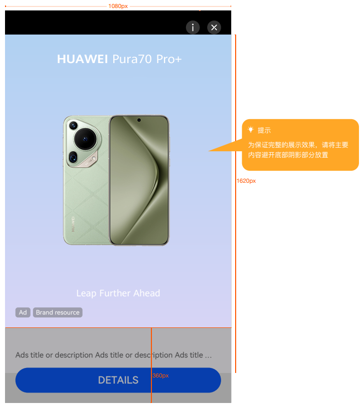

## 1920×1080（图片）

|  |  |
| --- | --- |
| <strong>广告样式</strong> | Interstitial |
| <strong>版位名称</strong> | Global 3rd-Party Interstitial Inventory |
| Interstitial & Rewarded & Splash Eco |
| <strong>展示样式</strong> | Image |
| <strong>分辨率</strong> | 1920×1080 |
| <strong>格式</strong> | JPG, JPEG, PNG，or GIF |
| <strong>素材大小</strong> | GIF &lt;=1 MB ，Others &lt;= 500 KB |
| <strong>文本字符</strong> | &lt;= 90, Optional |

广告位置尺寸标注：

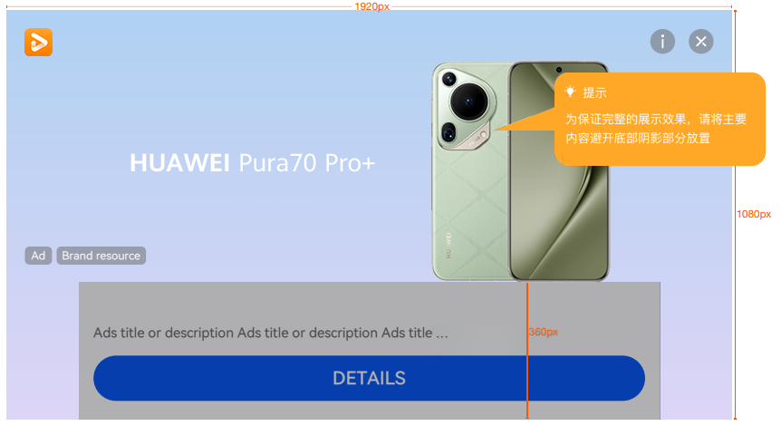

## 320×480（视频）

|  |  |
| --- | --- |
| <strong>广告样式</strong> | Interstitial |
| <strong>版位名称</strong> | Global 3rd-Party Interstitial Inventory |
| <strong>展示样式</strong> | Video |
| <strong>分辨率</strong> | 320×480 |
| <strong>格式</strong> | MP4 |
| <strong>视频时长</strong> | 15s ~ 60s |
| <strong>素材大小</strong> | &lt;= 50MB |
| <strong>文本字符</strong> | &lt;= 90, Optional |

广告位置尺寸标注：

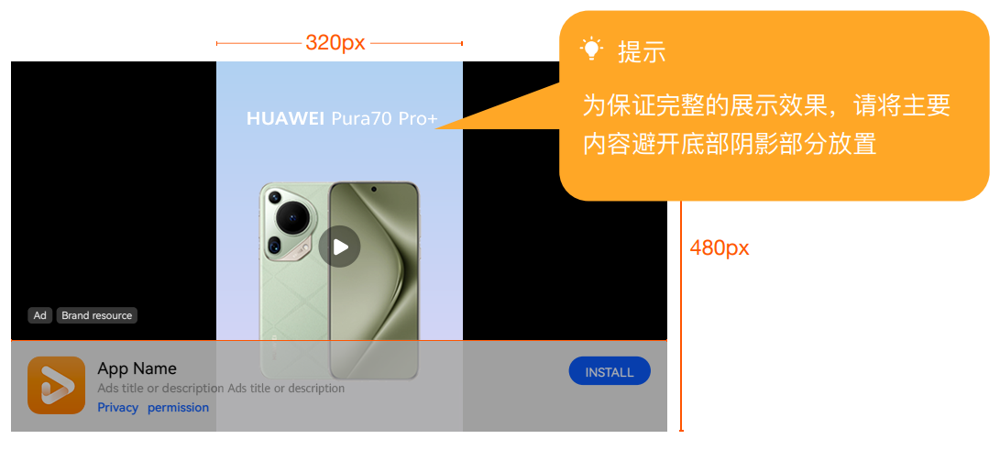

## 480×320（视频）

|  |  |
| --- | --- |
| <strong>广告样式</strong> | Interstitial |
| <strong>版位名称</strong> | Global 3rd-Party Interstitial Inventory |
| <strong>展示样式</strong> | Video |
| <strong>分辨率</strong> | 480×320 |
| <strong>格式</strong> | MP4 |
| <strong>视频时长</strong> | 15s ~ 60s |
| <strong>素材大小</strong> | &lt;= 50MB |
| <strong>文本字符</strong> | &lt;= 90, Optional |

广告位置尺寸标注：

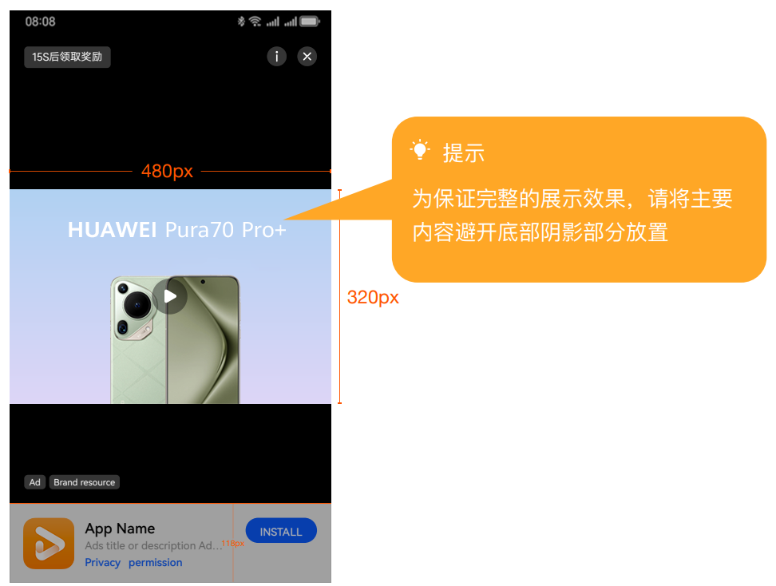

## 480×640（视频）

|  |  |
| --- | --- |
| <strong>广告样式</strong> | Interstitial |
| <strong>版位名称</strong> | Global 3rd-Party Interstitial Inventory |
| <strong>展示样式</strong> | Video |
| <strong>分辨率</strong> | 480×640 |
| <strong>格式</strong> | MP4 |
| <strong>视频时长</strong> | 15s ~ 60s |
| <strong>素材大小</strong> | &lt;= 50MB |
| <strong>文本字符</strong> | &lt;= 90, Optional |

广告位置尺寸标注：

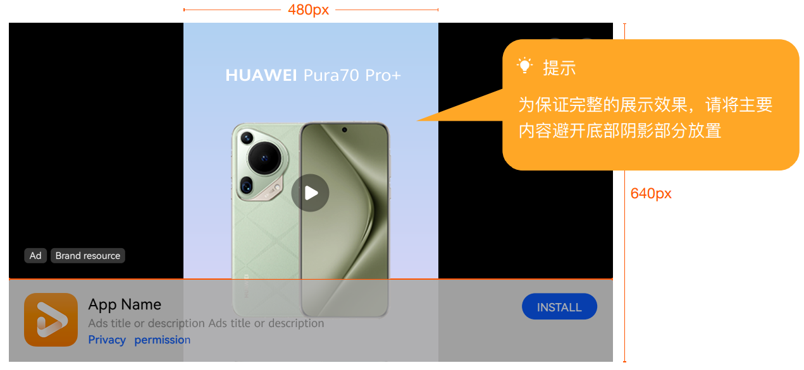

## 640×480（视频）

|  |  |
| --- | --- |
| <strong>广告样式</strong> | Interstitial |
| <strong>版位名称</strong> | Global 3rd-Party Interstitial Inventory |
| <strong>展示样式</strong> | Video |
| <strong>分辨率</strong> | 640×480 |
| <strong>格式</strong> | MP4 |
| <strong>视频时长</strong> | 15s ~ 60s |
| <strong>素材大小</strong> | &lt;= 50MB |
| <strong>文本字符</strong> | &lt;= 90, Optional |

广告位置尺寸标注：

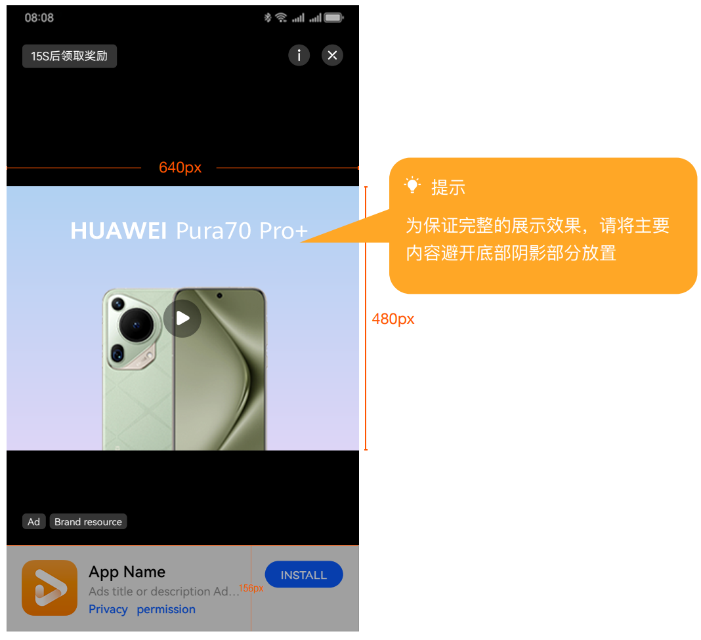

## 720×1080（视频）

|  |  |
| --- | --- |
| <strong>广告样式</strong> | Interstitial |
| <strong>版位名称</strong> | Global 3rd-Party Interstitial Inventory |
| Interstitial & Rewarded & Splash Eco |
| 3rd-Party\_SSP\_Interstitial\_Video\_720\*1280 |
| <strong>展示样式</strong> | Video |
| <strong>分辨率</strong> | 720×1080 |
| <strong>格式</strong> | MP4 |
| <strong>视频时长</strong> | 15s ~ 60s |
| <strong>素材大小</strong> | &lt;= 50MB |
| <strong>文本字符</strong> | &lt;= 90, Optional |

广告位置尺寸标注：

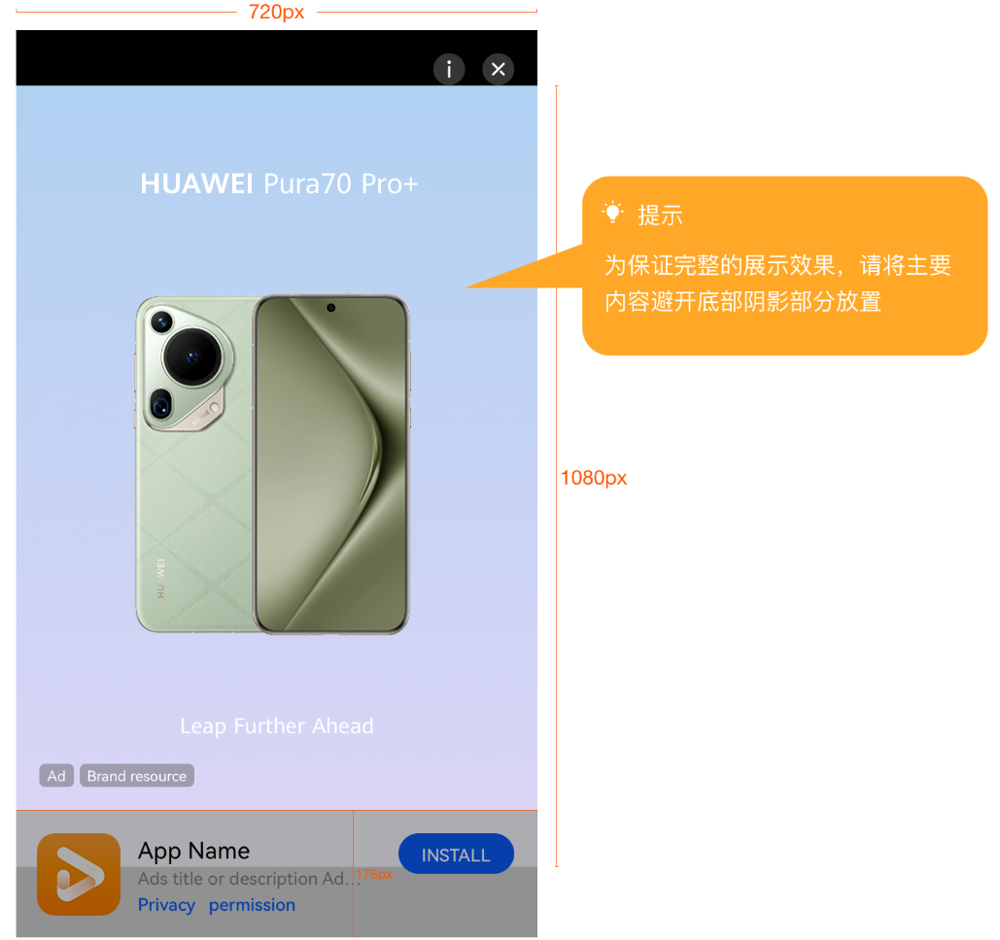

## 640×360（视频）

|  |  |
| --- | --- |
| <strong>广告样式</strong> | Interstitial |
| <strong>版位名称</strong> | Global 3rd-Party Interstitial Inventory |
| Interstitial & Rewarded & Splash Eco |
| 3rd-Party\_SSP\_Interstitial\_Video\_640\*360 |
| <strong>展示样式</strong> | Video |
| <strong>分辨率</strong> | 640×360 |
| <strong>格式</strong> | MP4 |
| <strong>视频时长</strong> | 15s ~ 60s |
| <strong>素材大小</strong> | &lt;= 50MB |
| <strong>文本字符</strong> | &lt;= 90, Optional |

广告位置尺寸标注：

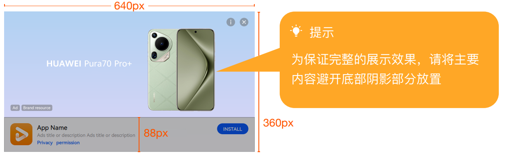
