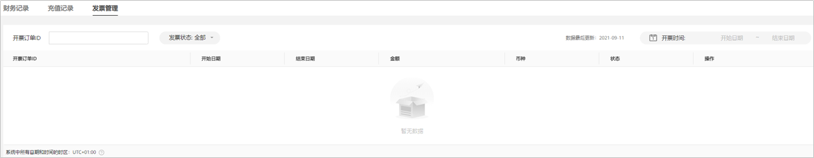
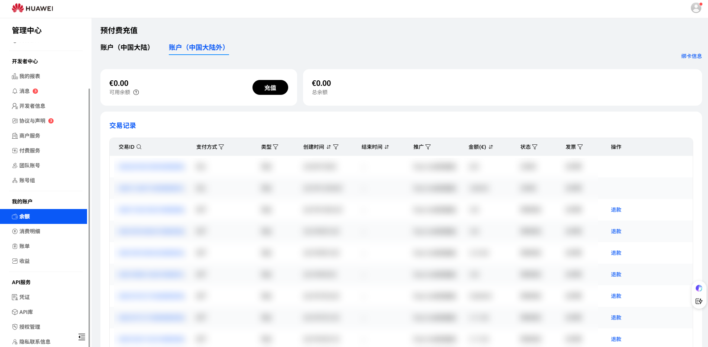
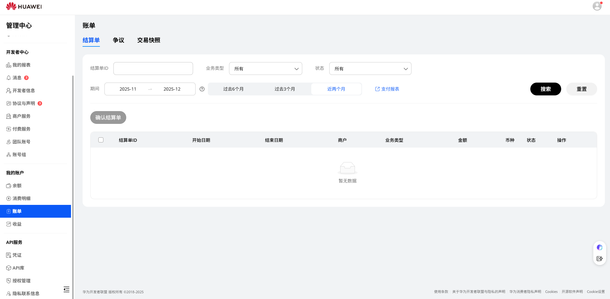
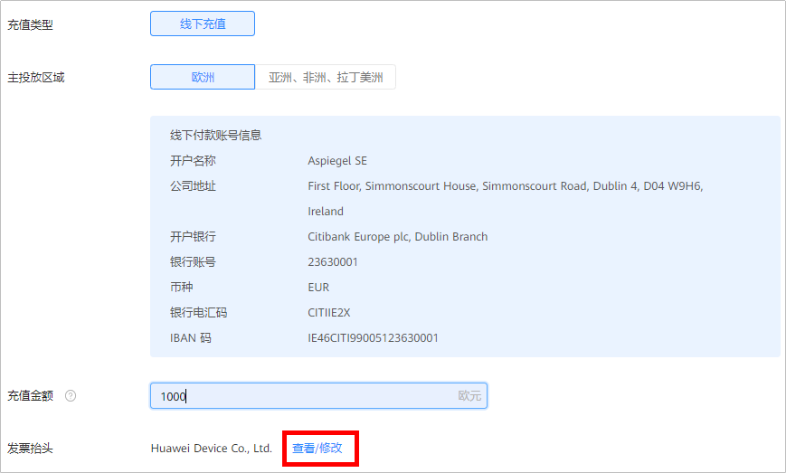
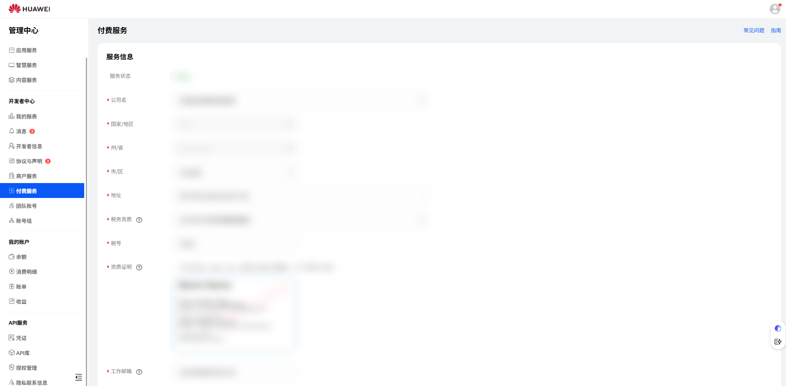
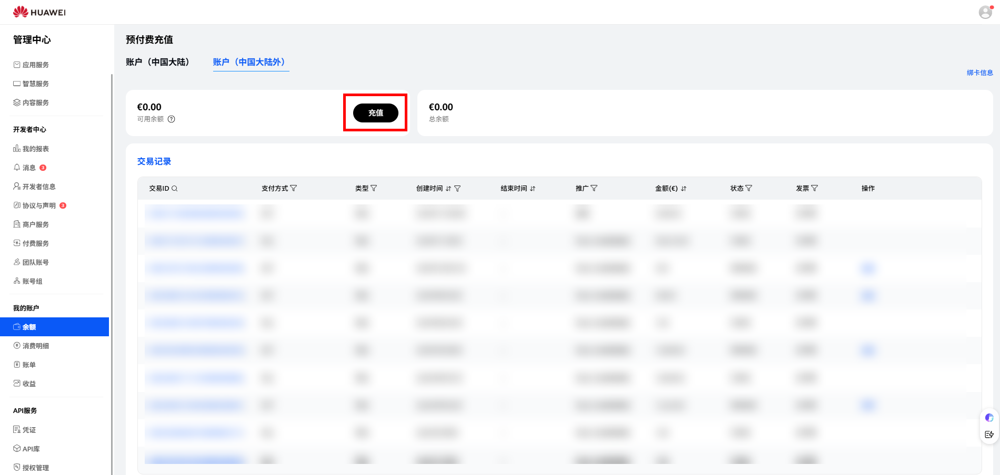
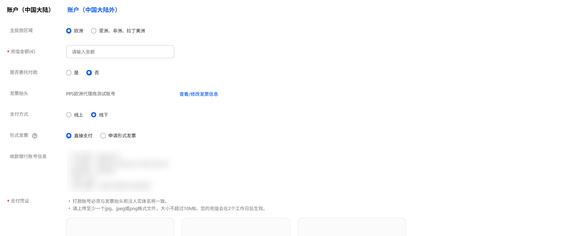

# 直客获取发票

本章节为直客财务结算，服务商财务结算请参考[服务商财务管理](https://developer.huawei.com/consumer/cn/doc/promotion/finance-0000001058604140)。

## 概述

您在充值之后，鲸鸿动能广告将根据您账户的注册国家/地区不同，按照[充值金额](#section786763210170)或[月消耗金额](#section17441839181011)为您开具发票，用于入账或者计税等用途，具体请参见[《华为合作伙伴付费服务协议》](https://developer.huawei.com/consumer/cn/doc/start/partnerpaidserviceagreement-0000001052728251)。如果在获取发票过程中有问题请通过[在线提单](https://developer.huawei.com/consumer/cn/support/feedback/#/)咨询，并附上企业名称和鲸鸿动能广告账户ID以及具体问题描述。

| 开票形式 | 账户注册地 | 开票时间 | 收款银行账户 | 税号 |
| --- | --- | --- | --- | --- |
| <strong>充值开票</strong>  （在您手动申请开票后，我们会按照开票时间完成开票；  如果您在充值后的15天内没有手动申请开票，我们将会在一周内给您开具发票。） | 欧盟、瑞士、塞尔维亚、阿尔巴尼亚、列支敦士登、沙特阿拉伯、加拿大、波黑（未来可能根据税法变动或纳税身份变动而新增）。 | 充值完成后7天内 | Aspiegel SE | IE3344831TH |
| 俄罗斯、马来西亚、沙特阿拉伯、阿联酋、南非、摩洛哥、墨西哥、智利、欧盟、哥伦比亚、阿曼、瑞士、泰国、格鲁吉亚（未来可能根据税法变动或纳税身份变动而新增）。 | 充值完成后14天内 | 华为服务（香港）有限公司 | 52194704 |
| <strong>月消耗金额开票</strong> | 除上述匹配场景外的其他区域。 | 消耗完成后次月15号（按照每月实际消耗金额开票） | Aspiegel SE/华为服务(香港)有限公司 | IE3344831TH/52194704 |
| <strong>形式发票</strong> | 全部 | 申请后2-3个工作日内 | - | - |

## 按照充值金额开具发票

- <strong>在鲸鸿动能广告平台操作。</strong>
  - 充值发票申请：使用您鲸鸿动能广告的主账号登录鲸鸿动能广告平台，单击-&gt;“<strong>查看财务信息</strong>”，选择“<strong>充值记录</strong>”，在“<strong>操作</strong>”列申请开具充值开票。
  - 充值发票下载：使用您鲸鸿动能广告的主账号登录鲸鸿动能广告平台，单击-&gt;“<strong>查看财务信息</strong>”，选择“<strong>发票管理</strong>”，进行发票下载。

    
- <strong>在华为开发者联盟管理中心操作。</strong>
  - 充值发票申请：使用您鲸鸿动能广告的主账号登录[华为开发者联盟管理中心](https://developer.huawei.com/consumer/cn/console#/serviceCards/)-&gt;“<strong>我的账户</strong>”-&gt;“<strong>余额</strong>”，单击“申请发票”。

    
  - 充值发票下载：使用您鲸鸿动能广告的主账号登录[华为开发者联盟管理中心](https://developer.huawei.com/consumer/cn/console#/serviceCards/)-&gt;“<strong>我的账户</strong>”-&gt;“<strong>账单</strong>”，单击对应的发票，下载充值发票。

## 按照账户月消耗金额开具发票

- <strong>在鲸鸿动能广告平台进行下载</strong>：使用您鲸鸿动能广告的主账号登录鲸鸿动能广告平台，单击-&gt;“<strong>查看财务信息</strong>”-&gt;“<strong>发票管理</strong>”，进行发票下载。
- <strong>在华为开发者联盟管理中心下载</strong>：使用您鲸鸿动能广告的主账号登录[华为开发者联盟管理中心](https://developer.huawei.com/consumer/cn/console#/serviceCards/)-&gt;“<strong>我的账户</strong>”-&gt;“<strong>账单</strong>”，单击对应的发票，下载消耗发票。

  

   

  消耗发票的开票金额与财务报表数据一致，因投放报表与财务报表数据存在差异，建议参考财务报表统计的数据。

  财务报表查询路径：单击-&gt;“<strong>查看财务信息</strong>”，单击“<strong>财务记录</strong>”进行查看。

## 查看&修改发票信息

- <strong>在鲸鸿动能广告平台查看&修改发票信息</strong>：使用鲸鸿动能广告的主账号登录鲸鸿动能广告平台，单击-&gt;”<strong>充值</strong>”，单击“<strong>查看</strong>/<strong>修改</strong>”；

  
- <strong>在华为开发者联盟管理中心查看&修改发票信息</strong>：使用鲸鸿动能广告的主账号登录[华为开发者联盟管理中心](https://developer.huawei.com/consumer/cn/console)-&gt;“<strong>管理中心</strong>”-&gt;“<strong>设置</strong>”-&gt;“<strong>付费服务</strong>”中，维护税务信息，鲸鸿动能广告平台根据此处的税务信息为您开具发票。

  

## 形式发票申请

如果您尚未充值，需要在充值前申请开具发票支撑充值转账，您可以申请形式发票，形式发票不可替代正式发票，不具备正式发票的法律效益，充值成功后，您也可根据开票类型再申请正式发票。

形式发票有效期：有效期为发票开具日起15天内，请尽快下载。

 

注册地为中国大陆地区的账户暂不支持自助申请形式发票，如有需求请联系华为运营人员。

1. 登录[开发者联盟](https://developer.huawei.com/consumer/en/console#/myaccount/mainbalance/1/mainbalance-bill/1)，选择“我的账户”-&gt;"余额"-&gt;"账户（中国大陆外）"，单击“充值”。

   
2. 设置充值信息。

   
   - 主要投放区域：鲸鸿动能广告平台提供阿斯比格和华为服务（香港）两个银行收款账户，您需要根据主要投放区域选择阿斯比格或华为服务（香港）充值。
   - 充值金额：填写您形式发票所需金额。
   - 是否委托付款：请选择是否委托付款。
   - 发票抬头：默认拉取您账户的发票抬头，您也可以查看/修改发票信息。
   - 支付方式：形式发票仅支持线下。
   - 形式发票：可以选择“直接支付”或“申请形式发票”
3. 信息设置完成后，提交，返回界面单击“确认支付”提交支付凭证。
4. 审核通过后，单击“申请形式发票”，查看形式发票状态，鲸鸿动能广告平台在2-3个工作日内完成审批，此时您可下载形式发票。
