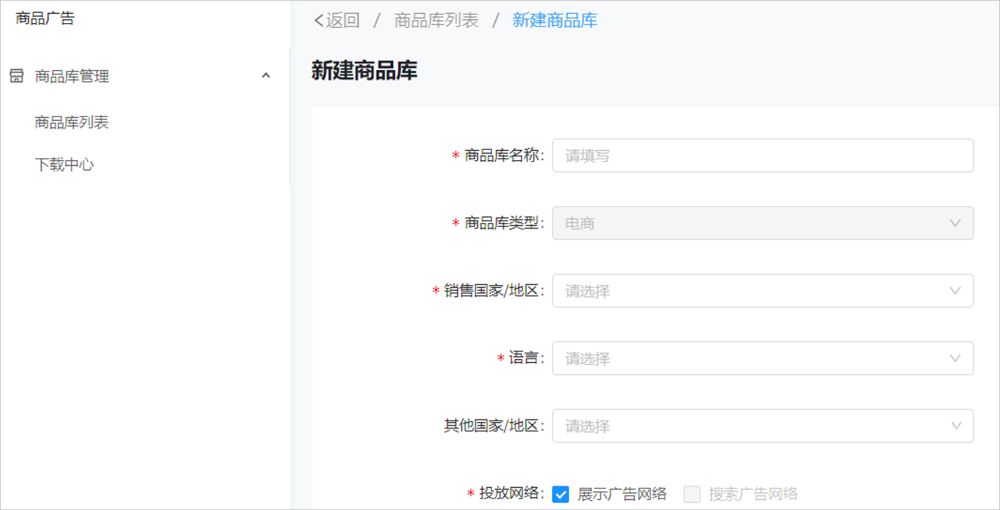
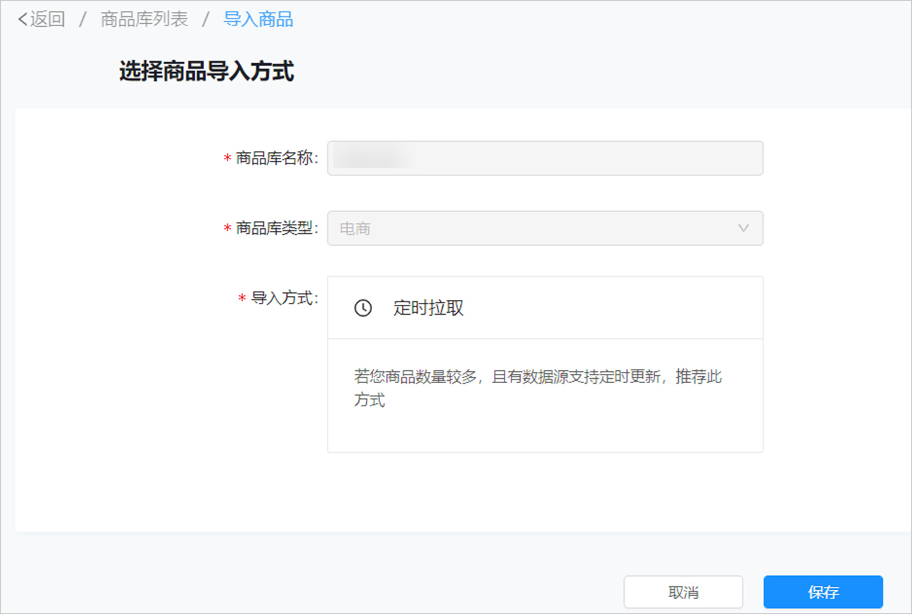
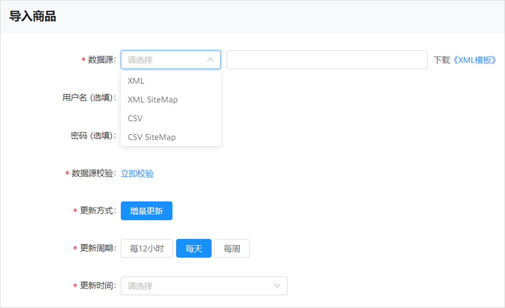
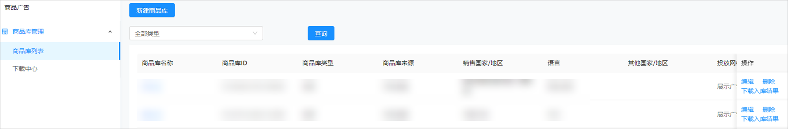

# 商品中心

## 概述

您在投放展示商品广告前，您可以通过<strong>“</strong>商品中心”创建商品，单击后，即可跳转至商品库，商品库是一系列商品的合集，帮助您给每个商品指定属性，并入库存储，如商品图片、url地址、价格等信息。商品广告将使用“商品库”中商品信息作为创意制作、商品推荐、筛选投放的依据。

 

如果您需要使用此功能，需要申请[特性通行名单](/docs/monetize/promotion/addtongxing-0000001128278195#ZH-CN_TOPIC_0000001128278195__li515214172115)。

## 创建商品库操作步骤

1. 新建商品库。

   登录鲸鸿动能广告平台，单击“<strong>工具</strong>”-&gt;“<strong>商品中心</strong>”，进入后单击“<strong>新建商品库</strong>"，编辑商品信息，成功后单击“保存”，商品信息内容如下：

   

   - 商品库名称：设置一个清晰易懂的商品库名称，方便您在商品库中轻松找到这个商品库，例如：商品类型+销售区域+投放网络。
   - 商品库类型：仅支持电商。
   - 销售国家/地区（单选）：每个商品库必须选择一个目标商品销售国家/地区（单选），您可以指定您的商品在哪个国家/地区进行销售。
   - 语言（单选）：销售国家/地区指定后，语言自动默认目标国家对应官方语言，每个商品库仅支持选择一种语言。
   - 其他国家/地区（多选）：商品库可选多个国家/地区，如若商品同时销往多个国家/地区，您需要确保多个国家/地区语言都为同样语言，此时您的商品才能投放多个国家/地区，且必须符合所有所选国家的审核政策。
   - 投放网络：仅支持“展示广告网络”。

   点击保存后，商品库创建成功并跳转至商品库基础信息页面。
2. 导入商品。

   在商品库基础信息页面，单击右上角的“”，进入商品库导入页面，导入的商品信息内容如下：

   

   - 商品库名称：默认拉取您在上一步骤中编辑的名称。
   - 商品库类型：默认拉取您在上一步骤中选择的类型。
   - 导入方式：目前支持定时拉取方式对接您商品库，通过读取数据源地址信息，解析更新海量商品信息。选择后，导入商品：

     
     - 数据源：支持选择XML、XML SiteMap、CSV、CSV SiteMap（CSV SiteMap方式支持多个商品文件队列），然后补充上传数据源链接，您也可以下载XML、CSV模板进行参考。文件示例：https://ads.alibaba.com/feed/download\_feed\_link.do?fileName=huawei/icbu\_feed\_2\_huawei.csv
     - 用户名、密码（选填）：如果您设置了用户名密码，则拉取XML、CSV文件时会在header中填入鉴权信息。
   - 数据源校验：数据源链接上传完毕后，可以点击立即校验，若校验结果有问题，请按照提示进行修改。
   - 更新方式：默认增量更新。
   - 更新周期：支持按照每12小时、每天、每周进行更新数据源。
   - 更新时间：支持0时-23时整点更新。

   保存后跳转至商品库信息页面，在此页面可单击“修改设置”对数据源配置进行修改，同时可控制“自动更新”按钮状态，自动更新按钮默认为开启状态,关停后则不再进行定时拉取任务，可重新开启。
3. 审核商品。

   商品上传成功后，系统将会进行审核，审核通过后即可推广，审核时间、审核结果通知、审核结果查看请参考[广告审核](/docs/monetize/promotion/review-0000001052064324)。

## 编辑商品库

您可以对商品库进行编辑、删除、下载等操作：

- 编辑：单击“编辑”，即可进入基础信息界面进行修改。
- 删除：单击“删除”即删除该商品库，不可恢复。
- 下载入库结果：若此商品无成功入库记录，无需下载。
