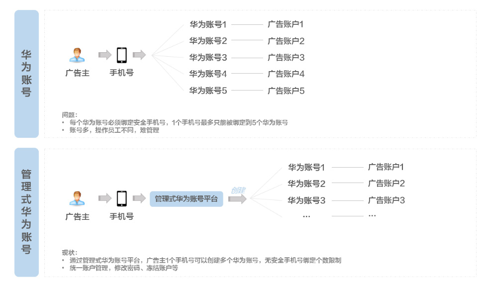
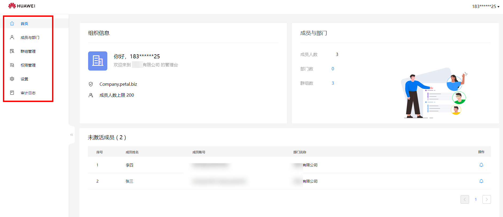
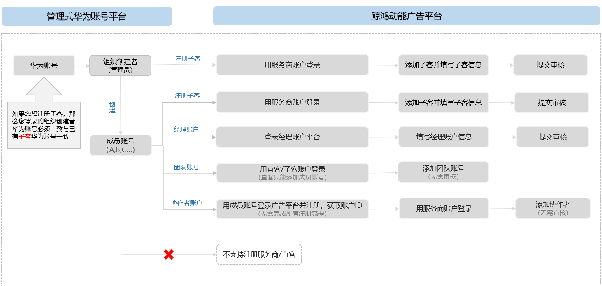
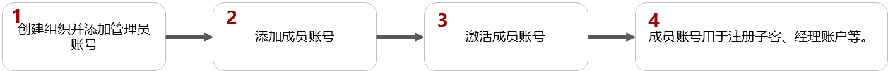
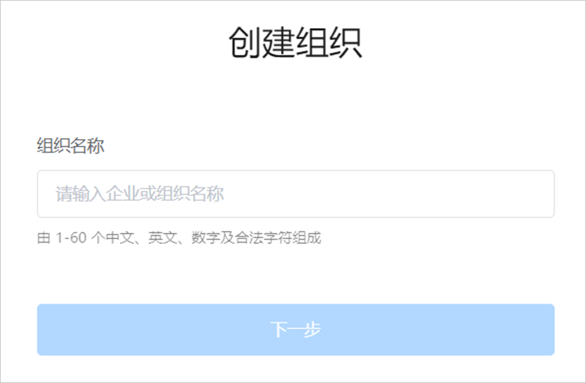
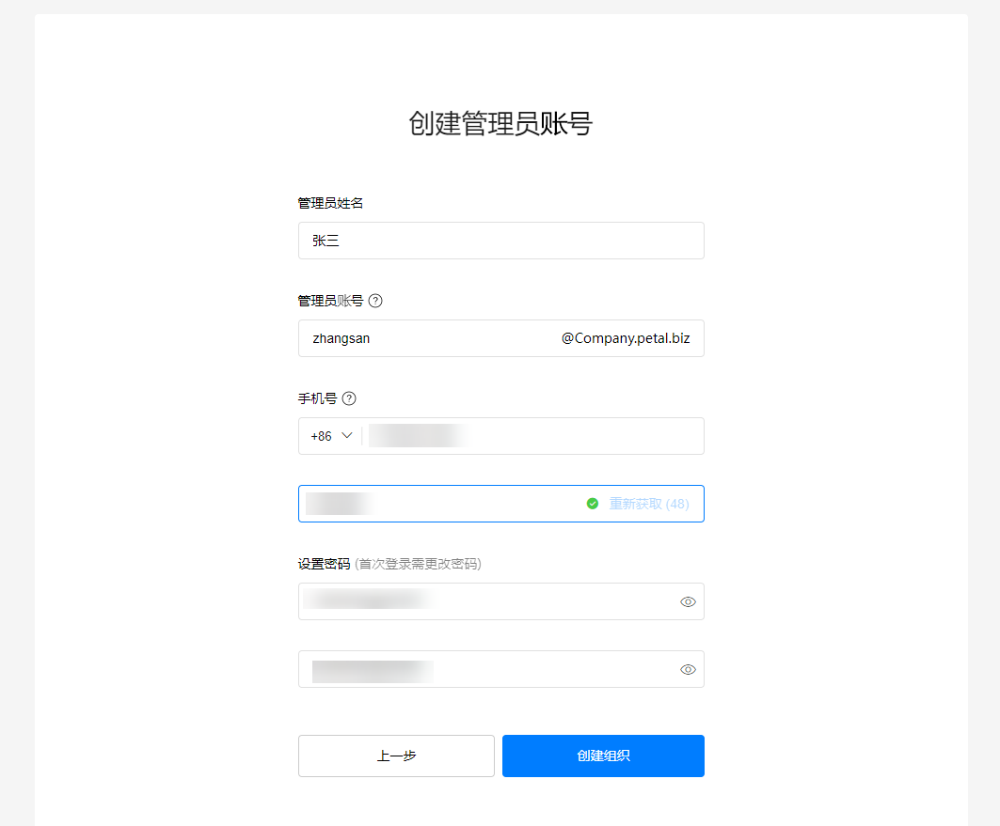
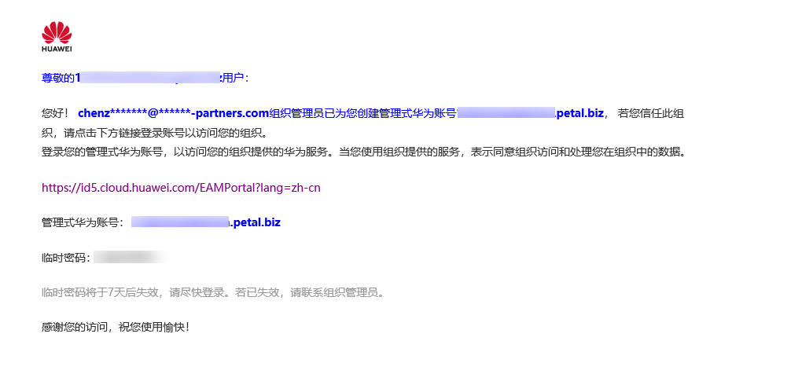

# 管理式华为账号

## 概述

管理式华为账号是面向合作伙伴提供的账号生命周期管理服务，管理员可以创建多个成员账号，对成员账号进行管理、冻结等操作。成员账号可用于注册鲸鸿动能广告账户，以此突破1个安全手机号只能绑定5个华为账号的限制。

 

注册地为俄罗斯的华为账号，暂时不支持使用管理式华为账号功能。

## 界面与功能介绍

- <strong>首页：</strong>您可以查看组织信息、成员与部门信息、未激活成员。
- <strong>成员与部门：</strong>支持创建成员、添加部门、对成员和部门进行管理。
  - 管理员支持批量添加、删除成员账号，支持修改成员账号信息，支持重置密码、修改成员角色权限。
  - 创建成功的成员账号可用于开通鲸鸿动能广告平台的子客账户、经理账户、团队账号以及协作者账号。

    账户注册国家/地区不同，账户开通流程也不同，如下图：

    - 企业注册地为中国大陆区域时：

      
    - 企业注册地为非中国大陆区域时：

      
- <strong>群组管理：</strong>管理员可创建群组，用于跨部门权限管理。
- <strong>权限管理</strong>：提供按角色分配权限能力，角色包括：超级管理员、组织管理员、部门管理员、群组管理员、普通成员。
- <strong>设置</strong>：可以修改组织信息，或者解散组织（如果您选择解散当前组织，解散组织后所有部门、群组、成员都将会被永久删除，且该选择无法撤销，请谨慎操作！）。
- <strong>审计日志</strong>：可查看跟组织相关的操作记录。

## 操作流程

## 操作步骤

1. 创建组织并添加管理员账号。
   1. 使用华为账号登录[管理式华为账号平台](https://id.cloud.huawei.com/EAMPortal/portal/eam/index.html#/organization/orgList)，登录后创建新组织并设置组织名称，输入您的企业名称或者自定义名称。

       

      - 当您想用成员账号注册子客账户时，

        如果您登录的华为账号注册地为中国大陆时，那么您登录的华为账号需要与已注册子客的华为账号保持一致。

        如果您登录的华为账号注册地为非中国大陆时，那么您登录的华为账号需要与已注册服务商的华为账号保持一致。
      - 如果您用直客的华为账号去注册管理式华为账号，并且创建了成员，那么创建的成员只能用于注册经理账户、协作者账户、团队成员账号。

      
   2. 设置组织域名：可选择使用默认免费域名或自有域名。（域名是指网址如: www.example.com中“www”之后的内容，以及电子邮件地址如: 用户名@example.com中“@”之后的内容。）
      - 若您使用鲸鸿动能广告提供的免费域名，该组织最多容纳账户数量上限为200个。
      - 若您使用自有域名，该组织最多容纳账户数量上限为5000个，详情可参考[常见问题](https://consumer-tkb.huawei.com/weknow/servlet/show/knowContextServlet?knowId=zh-cn15866659)。

      
   3. 创建管理员账号，填写管理员信息。

      

      - 管理员姓名：设置管理员真实姓名。
      - 管理员账号：您可使用此账号进行企业管理。
      - 手机号：可用于安全验证，也可在您的账号有可疑活动时与您联系。
      - 设置密码：首次登录时需要更改密码。
   4. 单击“创建组织”并同意服务协议，组织创建成功。

      
2. 添加成员账号。
   1. 管理员账号登录后，“成员与部门”中选择“创建成员”，添加成员账号信息。

      

      - 成员姓名：必填，填写您的成员姓名。
      - 成员账号：必填，默认成员账号格式为：XXX.组织名.petal.biz。
      - 手机号和邮箱地址择一必填，仅用于接收成员账号与密码，以及登录验证码，如果您创建多个成员，也可以用同一个邮箱或者手机号。
      - 成员工号：选填。
      - 部门：选填，默认显示[组织名称](#ZH-CN_TOPIC_0000001337931828__li156991251144112)。
      - 角色：选填，默认选择成员，您也可以设置为组织管理员。
      - 设置密码：可选择自动生成密码或手动输入密码。
3. 激活成员账号。

   创建成功后，成员将在手机短信或邮箱中收到账号信息，点击收到的网址，并用收到的华为账号、密码进行登录，成员账号初次登录时需要修改密码并签署协议。

   
4. 创建成功的成员账号可用于开通鲸鸿动能广告平台的[子客注册](/docs/monetize/promotion/addadvertiser-0000001059081952#section1767613343218)、[经理账户](/docs/monetize/promotion/manager-add-0000001172442767)、[团队账号](/docs/monetize/promotion/addtuandui-0000001079312694)以及[协作者账号](/docs/monetize/promotion/collaborator-0000001059241934)。

## FAQ

<strong>Q1：</strong> <strong>成员账号可以用来开通服务商账户/子客服务商/直客账户吗？</strong>

<strong>A：</strong>不可以，成员账号可用于注册鲸鸿动能广告平台的子客、团队账号、协作者、经理账户，不可注册成为一级服务商、子客服务商、直客。

<strong>Q3</strong> <strong>：</strong> <strong>成员账号开户时提示“不支持此账户角色开户”是什么原因？</strong>

<strong>A：</strong>是因为成员账号不支持注册一级服务商、子客服务商或直客账户。
