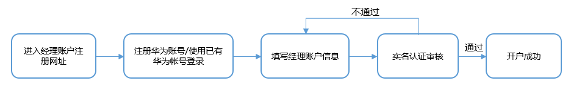
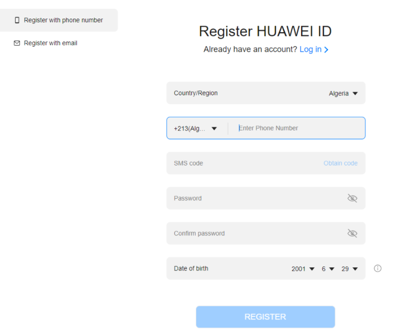
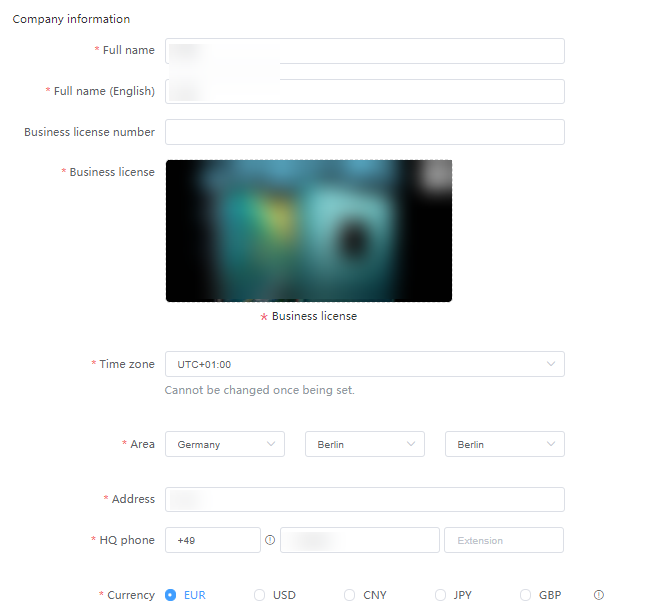
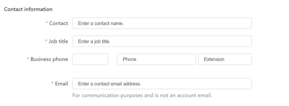
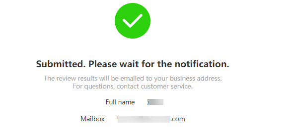

# 注册指引

## 概述

您可以为经理账户申请一个新的华为账号或者使用已有的华为账号注册鲸鸿动能广告平台的经理账户，已经注册过鲸鸿动能广告账户（包括直客广告、服务商、L2服务商、子客）的华为账号不能用于注册鲸鸿动能广告经理账户。注册过程中，需要提供您公司的DUNS或Business License，用于账户的认证审核。

## 注册流程

## 注册步骤

1. <strong>登录[经理账户网址](https://ads.huawei.com/usermgtportal/html/index.html#/managerAccount/SignUp)进行注册</strong>。
2. <strong>注册华为账号</strong> <strong>或登录已有的华为账号</strong>。
   - 您可以使用邮件或手机号注册一个新的华为账号，注册时的国家/地区需要与您要管理的直客或者子客国家/地区一致，同时需要与您公司的注册地一致，当您的注册地为中国时，时区默认填入东八区，不可修改；其他国家和地区支持自定义。
   - 如果您已经有一个华为账号，可以单击“Log in”登录，使用已有的华为账号完成经理账户的注册。注意：已经注册鲸鸿动能广告账户的华为账号不能用于经理账户注册。

   
3. <strong>填写经理账户信息</strong>。

   <strong>公司信息：</strong>
   - <strong>Full name:</strong> 请填写您公司营业执照上的企业名称；
   - <strong>Full name （English）</strong> <strong>：</strong>请填写与营业执照上的英文名称，或与企业银行的流水单（或开户函）英文名称一致。若两者名字不一致，此处请填写营业资质的名称。
   - <strong>Verify DUNS number：</strong>您可以使用邓白氏码完成账户的真实性认证。若您没有邓白氏码，请选择 NO，通过营业执照完成认证。
   - <strong>Time Zone:</strong> 系统会按照您在此处选择的时区进行报表统计，时区选择后不能更改。
   - <strong>Area：</strong>请按照您营业执照的国家填写。
   - <strong>Adress：</strong>请按照您营业执照的地址填写。
   - <strong>HQ phone</strong> <strong>number</strong>：您需要补充您的公司电话。
   - <strong>Currency：</strong>币种需要与您要管理的直客或者子客币种一致。

     

   <strong>联系人信息：</strong>在必要时鲸鸿动能广告可能会联系您在此处维护的接口人，例如：账户审核结果通知。此处的邮箱和电话不作为账号登录凭证。

   - <strong>Contact：</strong>请补充联系人名称。
   - <strong>Job title：</strong>请补充联系人职业。
   - <strong>Business phone</strong>：请补充联系人电话。
   - <strong>Email：</strong>请补充联系人邮件。

   
4. <strong>经理账户审核</strong>。

   信息补充完成后点击提交，系统将会进行审核，审核结果将以邮件形式通知。经理账户填写的开户信息审核通过后无法再次修改。

   
5. <strong>登录经理账户</strong>。

   使用审核通过的经理账户，登录鲸鸿动能广告平台，成功进入后即可关联广告账户。
