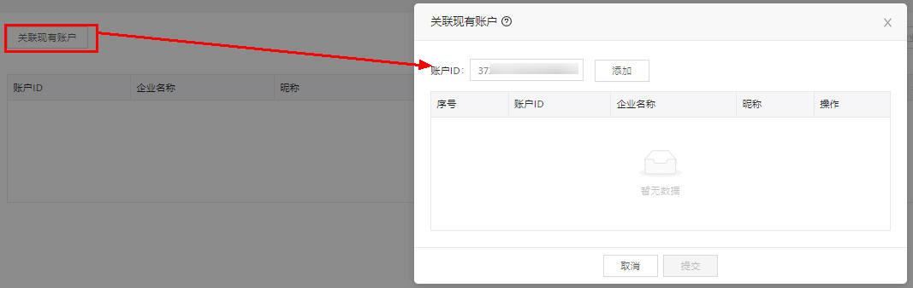
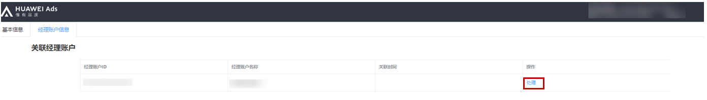

# 关联广告账户

1. <strong>在经理账户中关联现有广告账户</strong>。

   输入账户ID，关联现有的广告账户（子客/直客），已关联的广告账户列表将按关联时间倒序排列。

   账户ID获取方式：登录鲸鸿动能广告平台，呈现在账户右上角的就是账户ID，例如账户ID373071649546699\*\*\*。

   
2. <strong>登录被关联的</strong> <strong>广告账户处理关联请求</strong>。

   在“工具”-&gt;“广告账号管理”中，单击“处理”并“同意”，即完成关联。

   
