# 经理账户管理

## 进入广告账户

完成经理账户的注册、关联后，您可以登录经理账户平台，选择你想要进入的广告账户，点击进入后，经理账户拥有该广告主的所有操作权限。

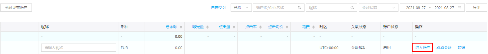

## 切换广告账户

您可以在经理账户界面，点击界面顶部三角形，即可看到关联的广告账户，点击名称可对关联的账号进行自由切换。

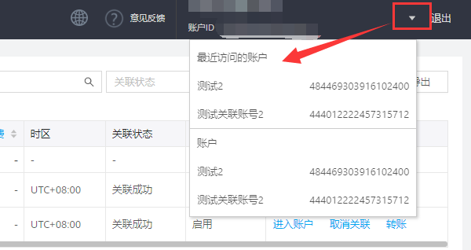

## 取消关联

可对关联账户进行操作管理。如果您将经理账户下的所有广告主账户全部取消关联后，您可以重新选择关联的广告主身份。例如：您起初关联的都是直客，全部取消关联后，您可以关联子客。取消关联后，在经理账户中此广告账户状态显示为停用

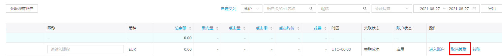

## 操作日志

经理账户中的操作日志可以查看到<strong>谁</strong>在哪个广告账户做了哪些动作及变更项。

1. 登录经理账户平台，单击界面左侧“操作日志”。

   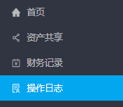
2. 单击界面中“操作内容”的“+”号可展开查看具体操作变更项。

   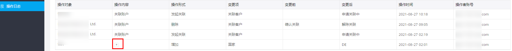

## 共享落地页

### 功能简介

为提高广告主创建落地页的效率，节省审核时间，经理账户目前新增落地页资产管理，可以对账户经理下的所有关联账户的维纳斯落地页进行共享和预览。

- 经理账户平台资产内新增落地页资产管理。页面内展示已关联账户下创建的所有落地页内容，支持落地页直接预览、手机扫码预览以及复制链接打开。
- 可单击缩略图或操作栏的“预览”展示落地页预览效果。

### 操作步骤

<strong>功能入口：</strong>“经理账户”-&gt;“资产”-&gt;“落地页”-&gt;“共享范围”

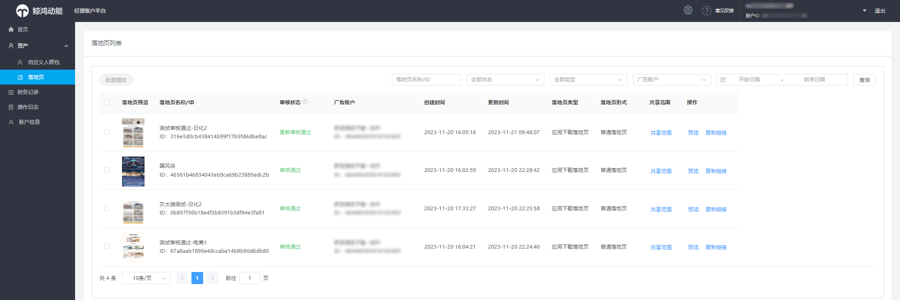

1. 选中落地页进行配置共享范围

   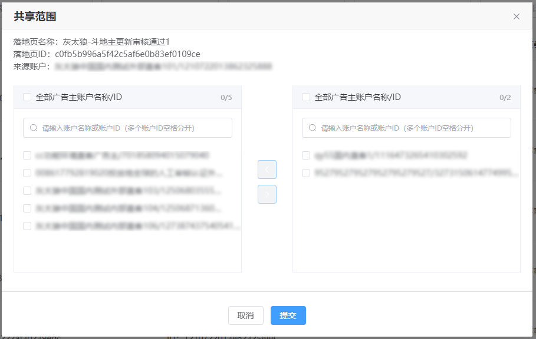

    

   （1）可共享落地页范围包含审核通过、更新审核通过、更新审核不通过的落地页；

   （2）当前仅支持应用推广类落地页共享；

   （3）共享范围页面左侧为本次可选择共享的广告主账户，选择添加至右侧列表中，提交后即完成共享，可在被共享账户中看到该落地页。
2. 选中多个落地页进行批量配置共享范围

   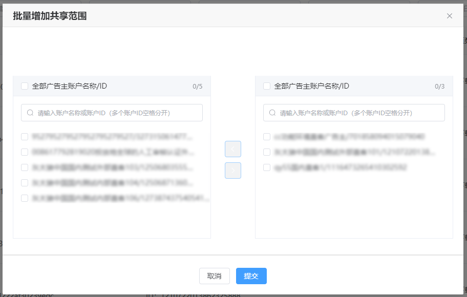

    

   （1）单次最多选中20个落地页进行批量共享；

   （2）可选择的共享账户个数和经理账户可关联账户个数一致。

被共享的账户在投放平台-&gt;创意上传页面可直接使用共享的落地页创建任务投放。

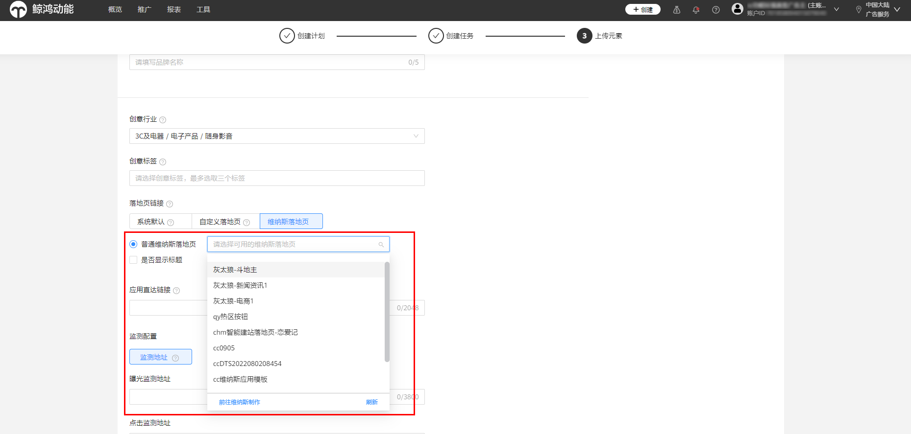

被共享账户可以在投放平台-&gt;“创意中心”-&gt;“我的落地页”中查看共享的落地页详情。

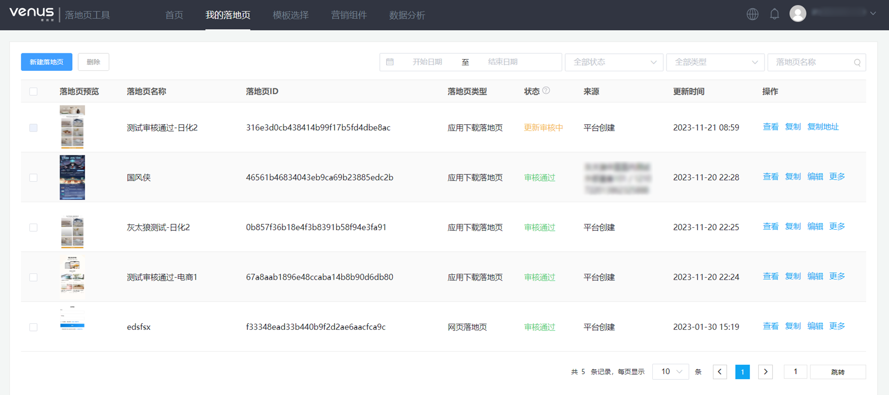

 

（1）被共享账户不支持修改共享落地页，仅支持在创建落地页的账户中修改，如有需要可在被共享账户中复制落地页后新建修改；

（2）来源账户修改落地页后，被共享账户中的落地页会自动同步更新。

### 查看数据详情

广告主可按照使用者账户进行详情数据区分统计，如账户A创建了落地页1，共享落地页1至账户B用于投放，那么账户A中看到的落地页数据仅为账户A投放的数据，账户B看到的为账户B投放的数据。

<strong>功能入口：</strong>投放平台-&gt;“工具”-&gt;“落地页工具”-&gt;“我的落地页”详情数据，按照使用者账户进行区分统计。

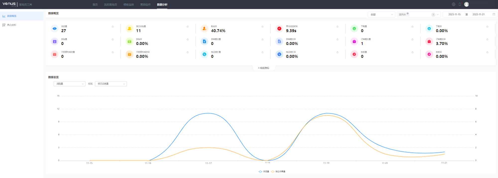
