# 投放管理

## 复制

您可以复制所有的资源类型下的广告计划。每次仅支持复制一条，不能批量复制计划。

单击“<strong>推广</strong>”，选择您想要复制的计划，复制成功后，则生成一条与原计划结构、设置一模一样的广告计划，包含：任务、创意、定向、投放时间及日期、计划日限额、出价策略、版位、推广产品、创意文案及图片、监测链接、商品组等。

成功复制后的计划默认开启，仍需重新审核，审核通过后即可投放。如果您不希望立马投放，您可以在复制计划时勾选“复制后暂停新的副本广告计划”。

 

单个计划下最多可复制50条任务。

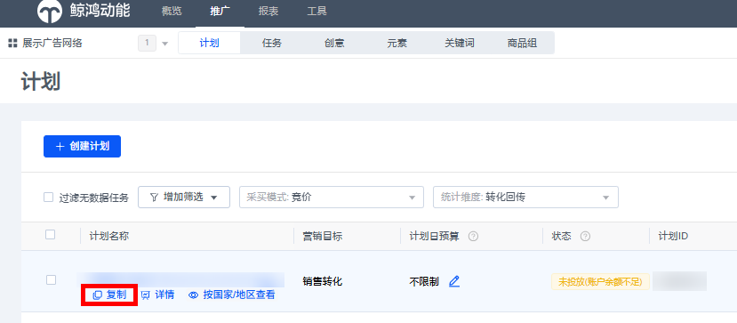

## 筛选

单击“<strong>推广</strong>”，选择“<strong>计划或者任务或者创意</strong>”，通过筛选目标对广告进行筛选。

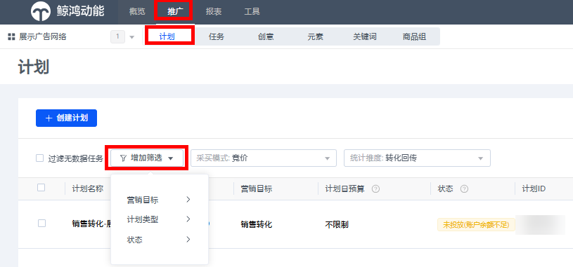

## 删除

单击<strong>“推广”，</strong>选择<strong>“计划</strong>或者<strong>任务</strong>或者<strong>创意</strong> <strong>”，</strong>勾选需要删除的“<strong>计划</strong>或者<strong>任务</strong>或者<strong>创意</strong>”，单击“<strong>删除”</strong>；跳出确认删除弹框后，单击“<strong>OK”</strong>完成操作。

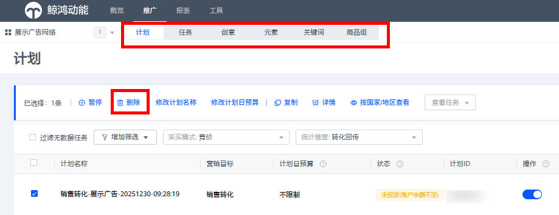

 

- 未开始投放的任务可立即删除；
- 投放结束且90天及以上无广告效果数据变化的任务可删除；
- 不限制日期任务90天以上无广告效果数据的任务，需要先设置结束时间，结束后第二天才可删除。

## 暂停

单击<strong>“推广”，</strong>选择<strong>“计划</strong>或者<strong>任务</strong>或者<strong>创意</strong> <strong>”，</strong>勾选需要暂停的“<strong>计划</strong>或者<strong>任务</strong>或者<strong>创意</strong>”，单击“<strong>暂停”</strong>或者“<strong>”</strong>完成操作。

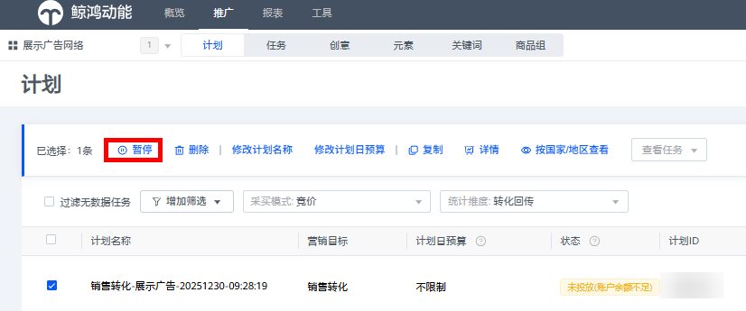

## 修改

- 修改计划名称、计划日预算。

  单击<strong>“推广“，</strong>选择<strong>”计划”，</strong> 勾选需要修改的计划，进行对应操作。

  修改计划日预算支持当日生效和次日生效，每条计划日预算每天可修改10次。

- 修改广告任务名称、日期、时间、出价、修改落地页链接。

  单击<strong>“推广“，</strong>选择<strong>”任务”，</strong> 勾选需要修改的任务，进行对应操作，修改后直接生效。

  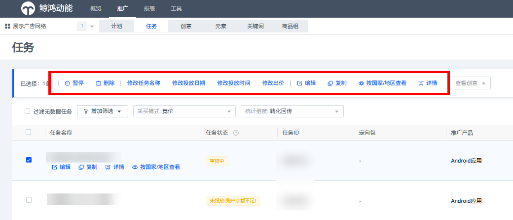

  落地页链接支持批量修改：

  仅支持网页任务批量修改落地页，如果修改列表存在报错的任务时，将无法修改成功，您需要将所有报错任务取消勾选后再重新修改。自定义落地页与维纳斯落地页不支持混合修改。

  - 自定义落地页：请输入以http:// 或```https://开头的落地页链`接``。
  - 维纳斯落地页：维纳斯落地页仅支持下拉选择，不可直接输入链接。
- 修改广告定向

  单击<strong>“推广”</strong>，选择<strong>“任务”，</strong> 勾选需要修改的任务，或者鼠标移至任务，单击“<strong>编辑</strong>”即可修改。

   

  - 如需要修改任务关联的定向包，具体修改详情请看[定向包管理](https://developer.huawei.com/consumer/cn/doc/promotion/adddingxiang-0000001082374774)。
- 修改广告创意名称、修改文案、修改落地页链接。

  单击<strong>“推广”</strong>，选择<strong>“创意”，</strong> 勾选需要修改的创意，进行对应操作，修改后直接生效；单击创意图片，可查看创意素材。

   

  - 智能应用广告（UAC广告）暂不支持创意层级界面直接进行编辑；您可勾选对应的智能应用广告创意，进行暂停、删除、修改创意名称、修改文案、复制和查看详情等操作。

  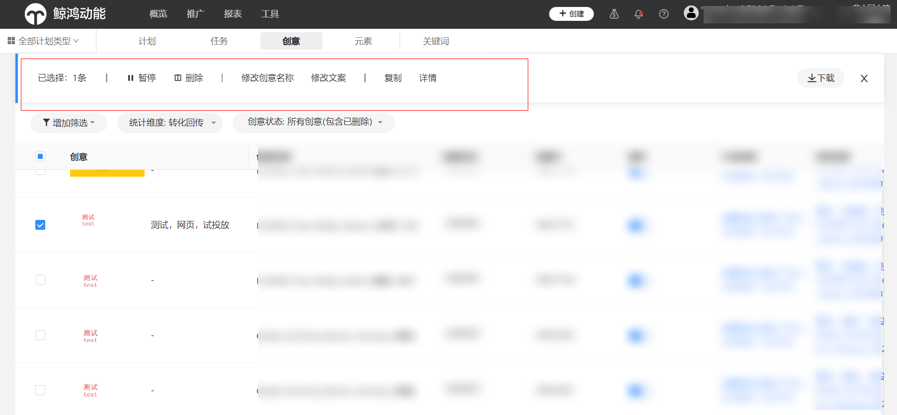

  落地页链接支持批量修改：

  仅支持网页任务的创意批量修改落地页，如果修改列表存在报错的创意时，将无法修改成功，您需要将所有报错创意取消勾选后再重新修改。自定义落地页与维纳斯落地页不支持混合修改。

  - 自定义落地页：请输入以http:// 或```https://开头的落地页链`接``。
  - 维纳斯落地页：维纳斯落地页仅支持下拉选择，不可直接输入链接。

## 商品广告管理

商品组统一管理所有商品任务下的商品，您每创建一条任务，系统随之自动创建一个商品组。如果您在此页面修改了商品组信息，广告投放将以你修改后的商品组生效。您在商品组所有的修改都在广告主时区次日生效。

1. <strong>入口</strong>：单击“推广”，单击“商品组”，进入商品组页面。

   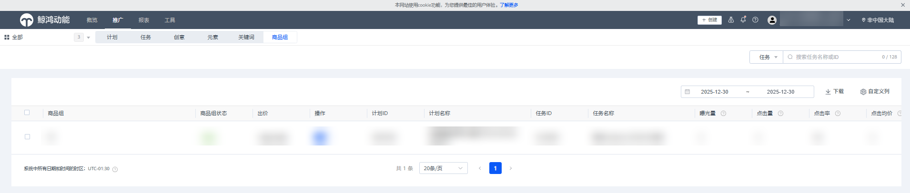
2. <strong>修改商品组出价：</strong>

   当您初次制作搜索shopping广告时，您其中一个广告任务将包含一个名为“所有商品”的商品组，您的整个商品目录都包括在里面，此时广告任务的出价是所有商品的出价。我们建议您将商品目录细分为更小的商品组，以便更具体地为不同的商品设定不同的出价，更好地达成您的广告目标。

   您可以按任意顺序将每个商品组按照<strong>细分维度</strong>分为5个层级。请注意，您不能为经过细分的商品组设置出价，而只能为未经细分的商品组设置出价。

   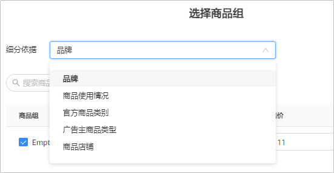

   细分维度分为：品牌、官方商品类别、广告主商品类型、商品使用情况、商品店铺等。

   - 品牌：指的是您产品制造商的名称（如华为）。
   - 商品使用情况：产品的状态（例如全新、二手和翻新）。
   - 官方商品类别：根据华为商品类目定义的属性。类别字符串示例：服饰与配饰 &gt; 服装 &gt; 女式服装。在商品数据中，“&gt;”符号定义了商品类别中的层级，您可以利用这些层级来对产品组进行细分。如果您未提交类别，我们可能会为您分配一个类别。
   - 广告主商品类型：您根据自己的分类分配的属性。商品类型字符串示例：家居与园艺 &gt; 厨房与餐馆 &gt; 厨房设备 &gt; 微波炉。在商品数据中，“&gt;”字符定义了产品类型中的层级，您可以利用这些层级来对商品组进行细分。
   - 商品店铺：管理一系列商品的店铺。

   举例：您进入鲸鸿动能广告平台后，您单击商品组旁边的“<strong>+号</strong>”，通过“品牌”细分，细分后页面展现为“华为”与“others”，您可以对细分的“华为”单独设置出价，“others”也可以单独出价，此时任务的出价失效，广告按照您商品出价后的为准。

   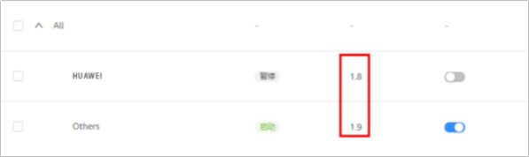

   每个细分维度只能细分一次，此时您已经不能再使用“品牌”进行细分，只能细分“官方商品类别”等，以此类推。您按照细分维度完成细分后，商品组剩下的商品归为“Others”。
3. <strong>修改广告投放商品：</strong>

   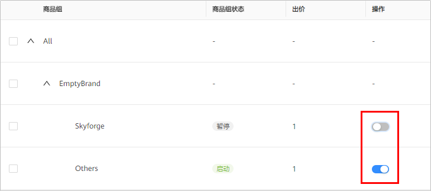

   任务中的商品默认全选，如果您只想投放一部分商品，您需要在商品组的页面进行暂停其他的商品，商品列表中开启的商品为投放商品。
4. <strong>修改商品组细分维度</strong>

   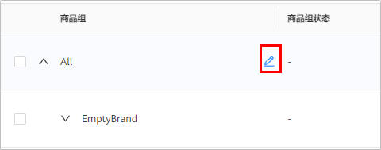

   当您的商品组按照细分维度细分后，您可以再次对此商品组重新进行修改，此时历史细分后的商品将会被覆盖，广告将会以您修改后的商品组进行投放。
5. <strong>复制商品广告任务</strong>

   如果您需要多复制几条商品广告一起投放，任务投放国家、投放时间及日期、默认出价将会一起复制，但是商品组无法复制。您每复制一条广告任务，商品组页面随之创建一个商品组。

   <strong>入口</strong>：单击“推广”，选择“任务”，鼠标移至对应的商品广告任务名称栏，单击“复制”即可。

   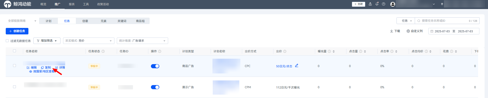

   复制的广告任务默认选择所有商品，您可以使用商品目录过滤条件来确定符合条件的商品组，鲸鸿动能广告平台将仅展示您所选择的商品组进行广告投放，当前仅支持根据<strong>商品店铺</strong>过滤。

   您可以在复制成功后，在商品组页面修改商品，修改完成后提交审核，修改后的信息将会在广告主时区次日生效。

## 智能应用广告元素管理

您也可以单击“<strong>推广</strong>”-&gt;”<strong>任务</strong>”，选择您创建的智能应用广告任务后，您需要单击“<strong>任务名称</strong>”，进入修改元素页面，可以查看数据并对元素进行修改、暂停、删除等操作。

- <strong>修改元素</strong>：如果您想要修改元素，选中您想要修改的元素后，点击编辑进入元素编辑页。
  - 如果您只修改了某些元素，将会重新审核您修改的元素。
  - 如果您同时修改了该任务中的地域、语言，任务以及元素将会重新审核。
- <strong>暂停元素</strong>：如果您看到某个元素的投放数据不理想，您可以选中该元素并单击列表上方的“暂停”或点击操作的开关，暂停投放该元素。
- <strong>删除元素</strong>：该删除操作不可撤销！请谨慎操作，该元素删除后将不会再展示在您的广告中。

如果当前的元素不能满足您的投放需求，您可以增加新元素，单击“创建”-&gt;“添加创意”，在已创建的应用广告下，进入到元素界面进行新增，新增的元素审核通过后才能投放。
