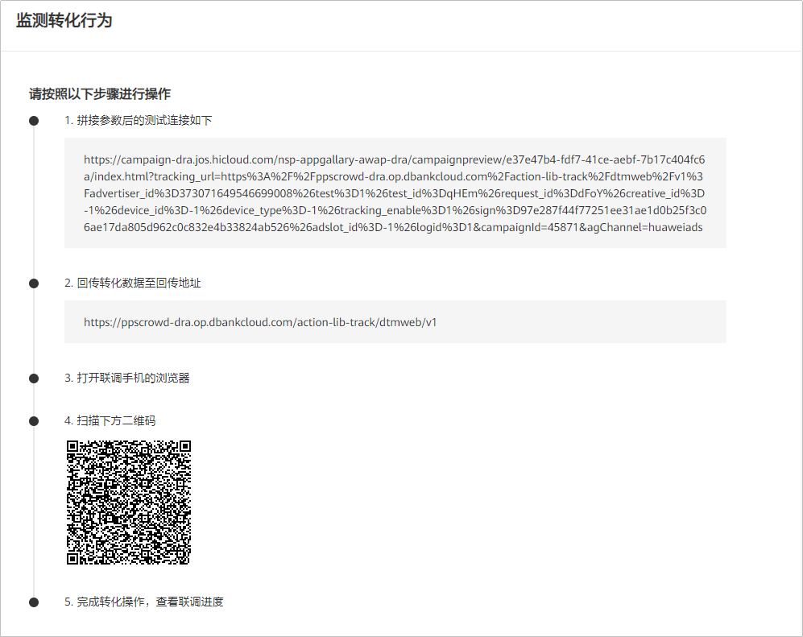

# 概述

## 概述

如果您投放的产品是网页，想要跟踪用户在您网站上的购买、注册、按钮点击或网站的其他操作，您可以使用线索跟踪（网页跟踪）中的任何一种跟踪方式跟踪您网页的转化情况。

| 转化跟踪平台 |
| --- |
| [Pixel智能跟踪](/docs/monetize/promotion/dtm-pixel-0000001175770900) |
| [DTM跟踪](/docs/monetize/promotion/tracking-js-0000001140151431) |
| [维纳斯网页跟踪](/docs/monetize/promotion/tracking-venus-0000001202117526) |
| [自有分析工具](/docs/monetize/promotion/tracking-own-analytics-0000001138842000) |

## 网页测试

为确保鲸鸿动能广告平台能正确接收到转化数据，您需要手动进行转化指标测试。测试成功后转化的状态会变更为“已激活”，您才能在鲸鸿动能广告报表中查看到相关数据。

1. 单击"工具”-&gt;”事件资产管理“，单击“测试”，进入测试页面。
2. 扫描二维码后进入网页，您需要在网页上进行相应的转化事件测试。例如：您创建了“注册”指标，您需要在网页上点击注册，完成测试。

   
3. 检测回传数据。

   完成测试后您可以在界面上查看测试状态，或者您在<strong>关联列表</strong>查看数据回传状态。仅“测试状态”为“已激活”的转化，您才能在鲸鸿动能广告报表中查看到相关数据。
