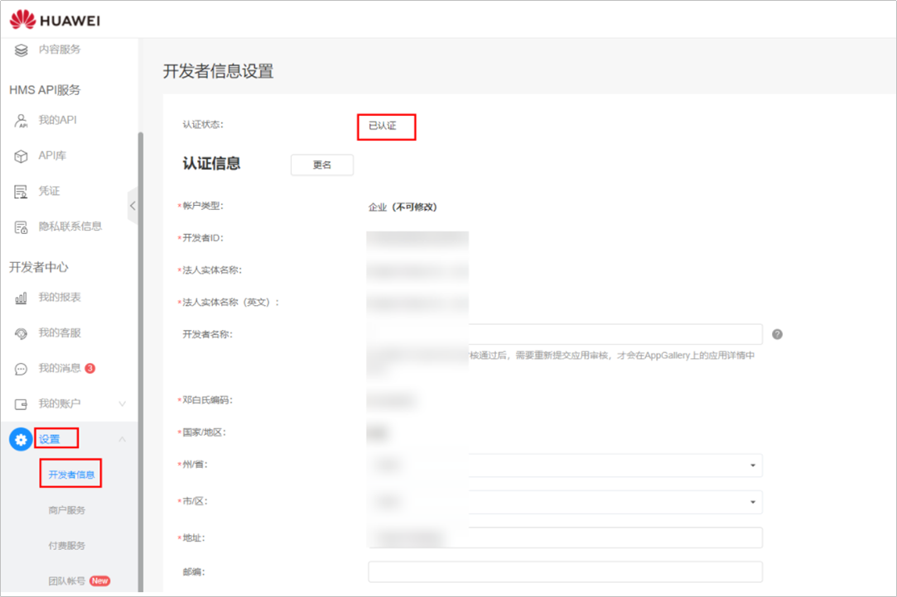

# 在华为开发者联盟完成实名认证

在使用Marketing API前，需要先使用已经完成[实名认证](https://developer.huawei.com/consumer/cn/doc/start/itrna-0000001076878172)的华为开发者账号获取OAuth2.0授权令牌（access\_token）。您可以使用任意已完成实名认证的华为账号，包括您的鲸鸿动能广告的华为账号或者其它华为账号。

如果您的华为账号已经完成了实名认证，请跳过此步骤。

如果您的华为账号尚未完成实名认证，您需要到华为联盟官网完成[企业实名认证](https://developer.huawei.com/consumer/cn/doc/start/atpopb-0000001062836624)。

 

如果您的华为账号是开发者联盟的团队成员账号，请使用团队主账号登录并确认实名认证状态。

华为开发者联盟限制每个企业只能有一个认证完成的华为账号，如果您的企业已经有了这样一个账号，请使用这个账号访问。

<strong>实名认证状态查询方式：</strong>登录[华为开发者联盟](https://developer.huawei.com/consumer/en/console#/serviceCards/)，选择管理中心，单击“设置”-&gt;“开发者信息”，查看认证状态。

