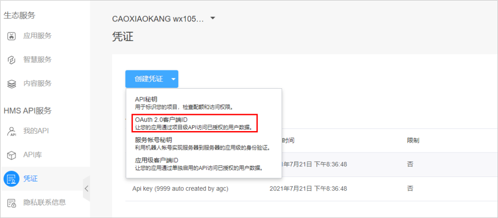
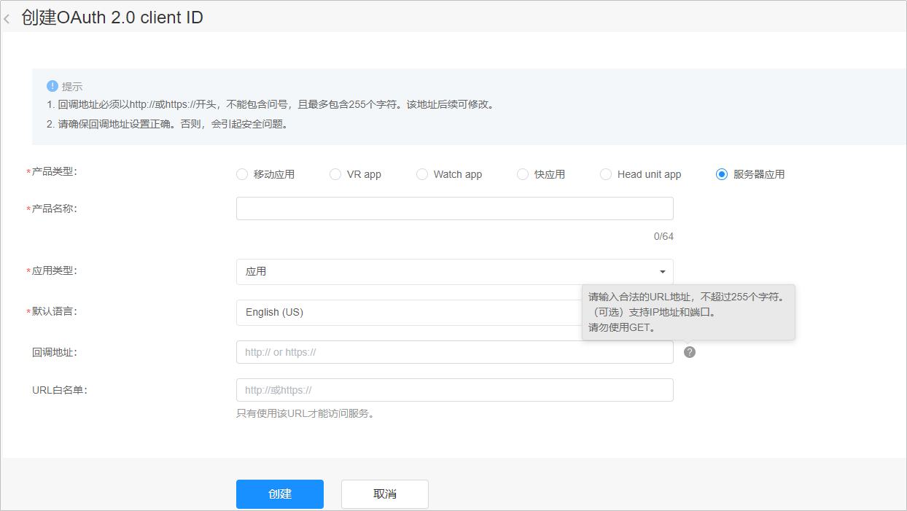
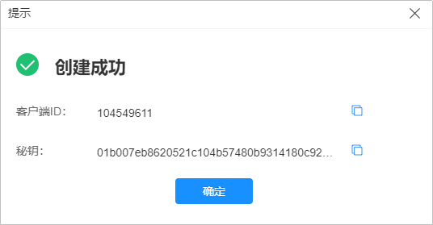

# 申请客户端ID

Marketing API 采用OAuth2.0授权码模式（authorization code）进行授权认证，所有接口均通过请求头中传递的授权令牌（access\_token）来进行身份认证和鉴权。

## 操作步骤

1. 使用<strong>通过[实名认证](https://developer.huawei.com/consumer/cn/doc/start/itrna-0000001076878172)</strong>的华为团队主账号登录[华为开发者联盟](https://developer.huawei.com/consumer/en/console#/serviceCards/)，请不要使用团队账号。
2. 选择“管理中心”-&gt;“HMS API服务” -&gt; “凭证”，单击“创建凭证”-&gt;“OAuth2.0 客户端ID”。

   
3. 各字段填写方式如下：
   - 产品类型：服务器应用（只能选这个，其他MAPI不可用，默认值）
   - 产品名称：客户端名称
   - 应用类型：应用
   - 默认语言： 英文
   - 回调地址：必填，且必须是https协议类型网址。

     
4. 单击“创建”，创建凭证成功，复制“客户端ID”和“秘钥”即可。

   
