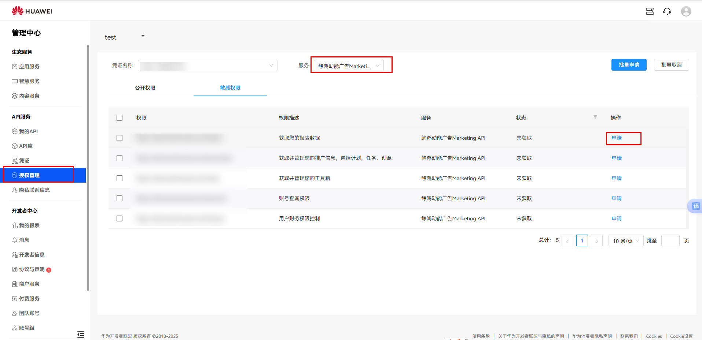
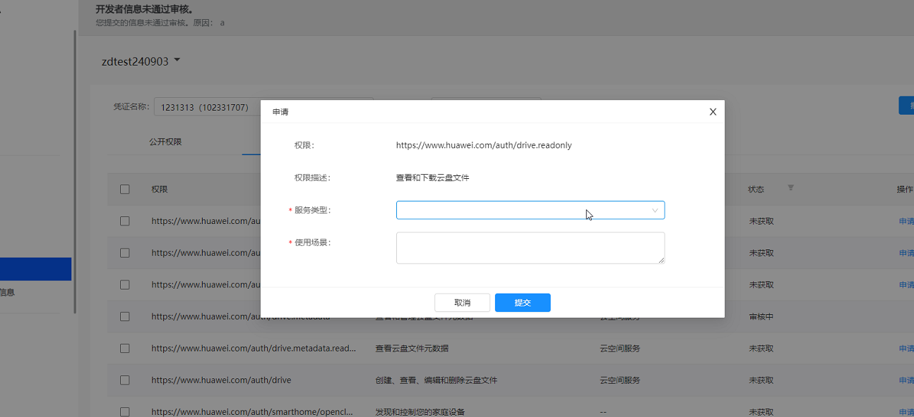
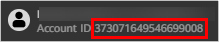
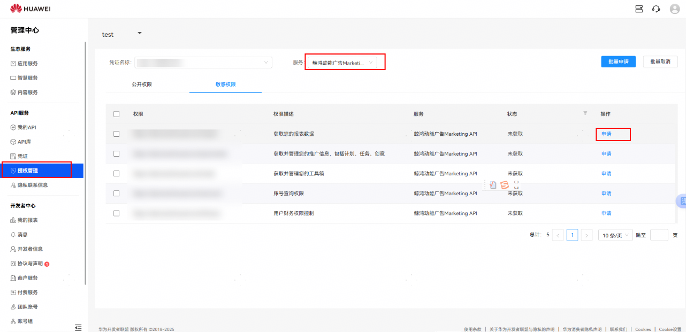

# 客户端申请Marketing API权限

 

如果您之前已经申请了Marketing API的报表权限，您想用其他广告投放等接口时，您需要重新申请。

## 申请方式

1. 使用通过[实名认证](https://developer.huawei.com/consumer/cn/doc/start/itrna-0000001076878172)的华为团队主账号登录[华为开发者联盟](https://developer.huawei.com/consumer/en/console#/serviceCards/)，请不要使用团队账号。
2. 选择“API服务”-&gt;“授权管理”如果存在多个凭证，选择自己需要的授权的对应项目下的凭证名称、公开权限非鲸鸿动能业务，无需关注。
3. 申请需要调用的scope权限

   服务类型：(固定填写)鲸鸿动能

   使用场景：(固定填写) 进行广告推广的创编查，包括广告计划、任务、创意的创建、编辑查询，广告工具的使用，广告账户信息查询，广告财务信息查询，以及详细的推广数据报表等。

   
4. 请通过邮箱申请权限，主送对应行业运营邮箱。

## 邮件模板

<strong>标题：</strong>申请开通非中国大陆地区<strong>鲸鸿动能广告</strong>Marketing API服务

<strong>正文：</strong>

1. <strong>开发者联盟上的华为账号：</strong>在华为开发者联盟[实名认证](https://developer.huawei.com/consumer/cn/doc/start/itrna-0000001076878172)的手机号或者邮箱，如果您是服务商/子客服务商，请填写<strong>服务商</strong>的华为账号。
2. <strong>开发者联盟上的企业名称：</strong>在开发者联盟实名认证的企业名称，如果您是服务商/子客服务商，请填写<strong>服务商</strong>的企业名称。
3. <strong>客户端ID：</strong>[客户端ID](/docs/monetize/promotion/marketing-api-process-2-0000001174597583#ZH-CN_TOPIC_0000001174597583__li12921111894610)。
4. <strong>访问数据的鲸鸿动能广告账户ID</strong>：

   鲸鸿动能广告账户ID获取方式：登录鲸鸿动能广告平台后，复制右上角的账户ID。

   

   - 如果您是直客或子客，此处填写您的鲸鸿动能广告账户ID。
   - 如果您是服务商/子客服务商，想要通过Marketing API访问您账户下的子客数据，此处填写您的服务商/子客服务商的鲸鸿动能广告账户ID。
5. <strong>访问数据的鲸鸿动能广告账户名称：</strong>填写您的鲸鸿动能广告账户对应的企业名称，获取方式：登录鲸鸿动能广告平台后，复制您账户右上角的企业名称。
6. <strong>鲸鸿动能广告账户对应的华为账号：</strong>此处的华为账号是注册时使用的手机号或者邮箱。获取方式：登录鲸鸿动能广告平台，单击“工具”&gt;”广告账号管理”，找到“账号与安全”，复制手机号或者邮箱。
   - 如果您是直客或子客，请填写您鲸鸿动能广告团队主账号的华为账号，请不要填写团队成员的华为账号。
   - 如果您是服务商/子客服务商，请填写您的华为账号，请不要填写协作者的华为账号。
7. <strong>回调地址：</strong>用于接收Authorization Code或者token后的跳转url。
8. <strong>截图：</strong>邮件中需提供以下截图，截图中客户端ID与申请ID保持一致。

   
