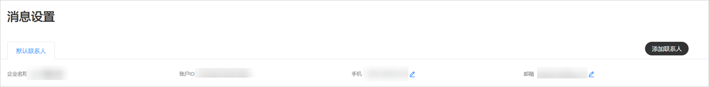
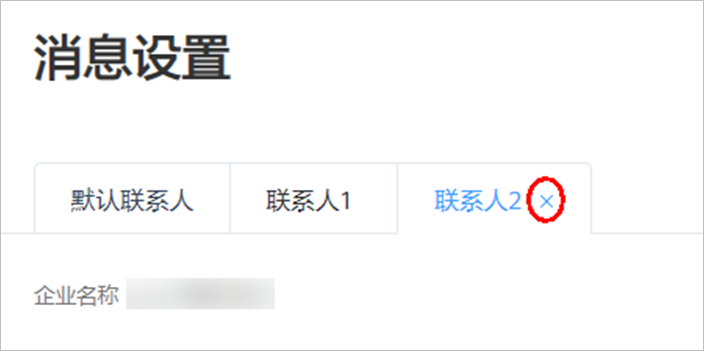
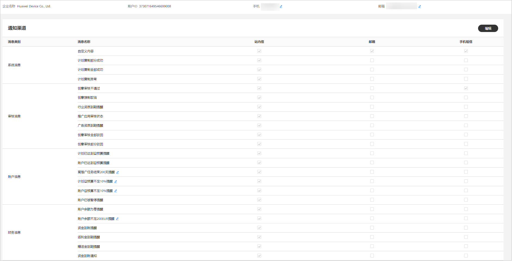

# 消息设置

## 概述

鲸鸿动能广告投放平台根据您设置的消息接收渠道给您发送系统消息、审核消息、账户消息、财务消息等通知。

## 添加联系人

目前平台支持三位联系人接收消息，您可根据实际需求手动添加两位联系人。单击广告账户右上角-&gt;“<strong>消息设置</strong>“-&gt;”添加联系人”，添加接收消息的联系人。您可以设置哪位联系人接收哪个类别的消息。

- 不同联系人支持接收消息的渠道：

  |  | 站内信 | 邮箱 | 手机短信 |
  | --- | --- | --- | --- |
  | 联系人1 | √ | √ | √ |
  | 联系人2 | - | √ | √ |
  | 联系人3 | - | √ | √ |
- 联系人1：系统默认拉取您在注册时填写的联系人信息，不可删除。
- 联系人2：手动添加联系人。您可删除和设置接收消息的类别。
- 联系人3：手动添加联系人。您可删除和设置接收消息的类别。

## 删除联系人

联系人添加后，支持删除。将鼠标置于联系人2和联系人3右上角，即可删除联系人。

## 通知渠道管理

您可以通过修改消息通知方式，选择您想要接收的广告信息。单击“<strong>工具</strong>“-&gt;“<strong>消息设置</strong>“，支持查看、修改接收消息的手机号和邮箱号，单击“<strong>编辑</strong>”支持自定义勾选消息通知渠道。消息通知渠道分为站内信、邮箱、手机短信：

- 站内信：站内信默认全部勾选，站内信通知会出现在广告账户右上角的中，您也可以自主勾选是否接受鲸鸿动能广告平台的站内信通知。
- 邮箱、手机短信：您可以自主勾选是否接受鲸鸿动能广告平台的邮箱、手机短信通知。邮箱、手机短信支持修改：
  - 修改手机号：系统的通知短信会发送到此电话，请确保号码可以正常接收短信。此处的电话不作为鲸鸿动能广告账户登录凭证。
  - 修改邮箱：系统的通知邮件会发送到此邮箱，请确保邮箱可以正常接收邮件。此处的邮箱不作为鲸鸿动能广告账户登录凭证。

## 通知类别管理

消息类别带””的均支持修改通知规则。单击””输入您需要的数值。

- 系统消息中，可设置线索消息提醒：

  即时：用户提交表单线索后即时给您推送通知。

  每小时：用户提交表单线索后整点给您推送通知。

- 账户消息、财务消息中，您可以自主修改部分消息通知的规则：
  - 离推广任务结束200天提醒 ：数值修改区间为1~1000。
  - 计划日预算不足10%提醒 ：数值修改区间为1~100。
  - 账户日预算不足10%提醒 ：数值修改区间为1~100。
  - 账户余额不足200EUR提醒：数值修改区间为1~10000000。
